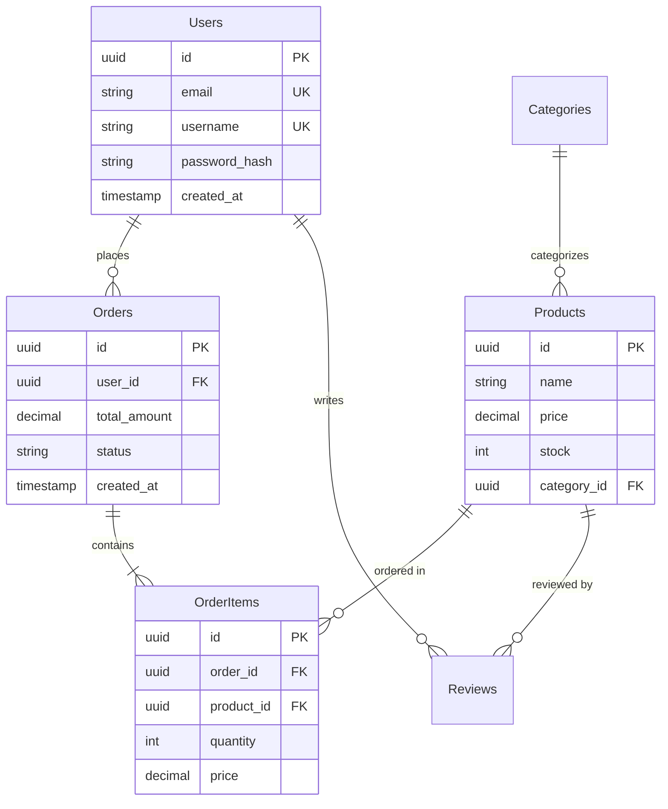

# Database Schema Design

## 목적 (Purpose)

효율적이고 확장 가능한 데이터베이스 스키마를 설계하고 최적화합니다.

이 스킬은 다음을 도와줍니다:
- 정규화/비정규화된 스키마 설계
- 관계형 및 NoSQL 데이터베이스 모델링
- 인덱스 전략 수립
- 마이그레이션 스크립트 작성
- 성능 최적화

## 사용 시점 (When to Use)

이 스킬을 트리거해야 하는 구체적인 상황을 나열합니다:

- **신규 프로젝트**: 새 애플리케이션의 데이터베이스 스키마 설계
- **스키마 리팩토링**: 기존 스키마를 성능이나 확장성을 위해 재설계
- **관계 정의**: 테이블 간 1:1, 1:N, N:M 관계 구현
- **마이그레이션**: 스키마 변경사항을 안전하게 적용
- **성능 문제**: 느린 쿼리를 해결하기 위한 인덱스 및 스키마 최적화

## 입력 형식 (Input Format)

사용자로부터 받아야 할 입력의 형식과 필수/선택 정보:

### 필수 정보
- **데이터베이스 종류**: PostgreSQL, MySQL, MongoDB, SQLite 등
- **도메인 설명**: 어떤 데이터를 저장할 것인지 (예: 전자상거래, 블로그, SNS)
- **주요 엔티티**: 핵심 데이터 객체들 (예: User, Product, Order)

### 선택 정보
- **예상 데이터량**: 작음(<10K rows), 중간(10K-1M), 대용량(>1M) (기본값: 중간)
- **읽기/쓰기 비율**: Read-heavy, Write-heavy, Balanced (기본값: Balanced)
- **트랜잭션 요구사항**: ACID 필요 여부 (기본값: true)
- **샤딩/파티셔닝**: 대용량 데이터 분산 필요 여부 (기본값: false)

### 입력 예시

```
전자상거래 플랫폼의 데이터베이스를 설계해줘:
- DB: PostgreSQL
- 엔티티: User(사용자), Product(상품), Order(주문), Review(리뷰)
- 관계:
  - User는 여러 Order를 가질 수 있음
  - Order는 여러 Product를 포함 (N:M)
  - Review는 User와 Product에 연결
- 예상 데이터: 10만 사용자, 1만 상품
- 읽기 중심 (상품 조회 빈번)
```

## 작업 절차 (Procedure)

단계별로 정확하게 따라야 할 작업 순서를 명시합니다.

### 1단계: 엔티티 및 속성 정의

핵심 데이터 객체와 그 속성을 식별합니다.

**작업 내용**:
- 비즈니스 요구사항에서 명사 추출 → 엔티티
- 각 엔티티의 속성(칼럼) 나열
- 데이터 타입 결정 (VARCHAR, INTEGER, TIMESTAMP, JSON 등)
- Primary Key 지정 (UUID vs Auto-increment ID)

**예시** (전자상거래):
```
Users (사용자)
- id: UUID PRIMARY KEY
- email: VARCHAR(255) UNIQUE NOT NULL
- username: VARCHAR(50) UNIQUE NOT NULL
- password_hash: VARCHAR(255) NOT NULL
- created_at: TIMESTAMP DEFAULT NOW()
- updated_at: TIMESTAMP DEFAULT NOW()

Products (상품)
- id: UUID PRIMARY KEY
- name: VARCHAR(255) NOT NULL
- description: TEXT
- price: DECIMAL(10, 2) NOT NULL
- stock: INTEGER DEFAULT 0
- category_id: UUID REFERENCES Categories(id)
- created_at: TIMESTAMP DEFAULT NOW()

Orders (주문)
- id: UUID PRIMARY KEY
- user_id: UUID REFERENCES Users(id)
- total_amount: DECIMAL(10, 2) NOT NULL
- status: VARCHAR(20) DEFAULT 'pending'
- created_at: TIMESTAMP DEFAULT NOW()

OrderItems (주문 상품 - 중간 테이블)
- id: UUID PRIMARY KEY
- order_id: UUID REFERENCES Orders(id) ON DELETE CASCADE
- product_id: UUID REFERENCES Products(id)
- quantity: INTEGER NOT NULL
- price: DECIMAL(10, 2) NOT NULL
```

### 2단계: 관계 설계 및 정규화

테이블 간의 관계를 정의하고 정규화를 적용합니다.

**작업 내용**:
- 1:1 관계: Foreign Key + UNIQUE 제약
- 1:N 관계: Foreign Key
- N:M 관계: 중간(Junction) 테이블 생성
- 정규화 레벨 결정 (1NF ~ 3NF)

**판단 기준**:
- OLTP 시스템 → 3NF까지 정규화 (데이터 무결성)
- OLAP/분석 시스템 → 비정규화 허용 (쿼리 성능)
- 읽기 중심 → 일부 비정규화로 JOIN 최소화
- 쓰기 중심 → 완전 정규화로 중복 제거

**예시** (ERD Mermaid):


### 3단계: 인덱스 전략 수립

쿼리 성능을 위한 인덱스를 설계합니다.

**작업 내용**:
- Primary Key는 자동으로 인덱스 생성됨
- WHERE 절에 자주 사용되는 칼럼 → 인덱스 추가
- JOIN에 사용되는 Foreign Key → 인덱스
- 복합 인덱스 고려 (WHERE col1 = ? AND col2 = ?)
- UNIQUE 인덱스 (email, username 등)

**확인 사항**:
- [x] 자주 조회되는 칼럼에 인덱스
- [x] Foreign Key 칼럼에 인덱스
- [x] 복합 인덱스 순서 최적화 (선택도 높은 칼럼 먼저)
- [x] 과도한 인덱스 지양 (INSERT/UPDATE 성능 저하)

**예시** (PostgreSQL):
```sql
-- Primary Keys (자동 인덱스)
CREATE TABLE users (
    id UUID PRIMARY KEY DEFAULT gen_random_uuid(),
    email VARCHAR(255) UNIQUE NOT NULL,  -- UNIQUE = 자동 인덱스
    username VARCHAR(50) UNIQUE NOT NULL,
    password_hash VARCHAR(255) NOT NULL,
    created_at TIMESTAMP DEFAULT NOW(),
    updated_at TIMESTAMP DEFAULT NOW()
);

-- Foreign Keys + 명시적 인덱스
CREATE TABLE orders (
    id UUID PRIMARY KEY DEFAULT gen_random_uuid(),
    user_id UUID NOT NULL REFERENCES users(id) ON DELETE CASCADE,
    total_amount DECIMAL(10, 2) NOT NULL,
    status VARCHAR(20) DEFAULT 'pending',
    created_at TIMESTAMP DEFAULT NOW()
);

CREATE INDEX idx_orders_user_id ON orders(user_id);
CREATE INDEX idx_orders_status ON orders(status);
CREATE INDEX idx_orders_created_at ON orders(created_at);

-- 복합 인덱스 (status와 created_at 함께 조회 빈번)
CREATE INDEX idx_orders_status_created ON orders(status, created_at DESC);

-- Products 테이블
CREATE TABLE products (
    id UUID PRIMARY KEY DEFAULT gen_random_uuid(),
    name VARCHAR(255) NOT NULL,
    description TEXT,
    price DECIMAL(10, 2) NOT NULL CHECK (price >= 0),
    stock INTEGER DEFAULT 0 CHECK (stock >= 0),
    category_id UUID REFERENCES categories(id),
    created_at TIMESTAMP DEFAULT NOW()
);

CREATE INDEX idx_products_category ON products(category_id);
CREATE INDEX idx_products_price ON products(price);  -- 가격 범위 검색
CREATE INDEX idx_products_name ON products(name);    -- 상품명 검색

-- Full-text search (PostgreSQL)
CREATE INDEX idx_products_name_fts ON products USING GIN(to_tsvector('english', name));
CREATE INDEX idx_products_description_fts ON products USING GIN(to_tsvector('english', description));
```

### 4단계: 제약조건 및 트리거 설정

데이터 무결성을 위한 제약조건을 추가합니다.

**작업 내용**:
- NOT NULL: 필수 칼럼
- UNIQUE: 중복 불가 칼럼
- CHECK: 값 범위 제한 (예: price >= 0)
- Foreign Key + CASCADE 옵션
- Default 값 설정

**예시**:
```sql
CREATE TABLE products (
    id UUID PRIMARY KEY DEFAULT gen_random_uuid(),
    name VARCHAR(255) NOT NULL,
    price DECIMAL(10, 2) NOT NULL CHECK (price >= 0),
    stock INTEGER DEFAULT 0 CHECK (stock >= 0),
    discount_percent INTEGER CHECK (discount_percent >= 0 AND discount_percent <= 100),
    category_id UUID REFERENCES categories(id) ON DELETE SET NULL,
    created_at TIMESTAMP DEFAULT NOW(),
    updated_at TIMESTAMP DEFAULT NOW()
);

-- Trigger: updated_at 자동 갱신
CREATE OR REPLACE FUNCTION update_updated_at_column()
RETURNS TRIGGER AS $$
BEGIN
    NEW.updated_at = NOW();
    RETURN NEW;
END;
$$ LANGUAGE plpgsql;

CREATE TRIGGER update_products_updated_at
BEFORE UPDATE ON products
FOR EACH ROW
EXECUTE FUNCTION update_updated_at_column();
```

### 5단계: 마이그레이션 스크립트 작성

스키마 변경사항을 안전하게 적용하는 마이그레이션을 작성합니다.

**작업 내용**:
- UP 마이그레이션: 변경 적용
- DOWN 마이그레이션: 롤백
- 트랜잭션으로 래핑
- 데이터 손실 방지 (ALTER TABLE 신중히)

**예시** (SQL 마이그레이션):
```sql
-- migrations/001_create_initial_schema.up.sql
BEGIN;

CREATE EXTENSION IF NOT EXISTS "uuid-ossp";

CREATE TABLE users (
    id UUID PRIMARY KEY DEFAULT gen_random_uuid(),
    email VARCHAR(255) UNIQUE NOT NULL,
    username VARCHAR(50) UNIQUE NOT NULL,
    password_hash VARCHAR(255) NOT NULL,
    created_at TIMESTAMP DEFAULT NOW(),
    updated_at TIMESTAMP DEFAULT NOW()
);

CREATE TABLE categories (
    id UUID PRIMARY KEY DEFAULT gen_random_uuid(),
    name VARCHAR(100) UNIQUE NOT NULL,
    parent_id UUID REFERENCES categories(id)
);

CREATE TABLE products (
    id UUID PRIMARY KEY DEFAULT gen_random_uuid(),
    name VARCHAR(255) NOT NULL,
    description TEXT,
    price DECIMAL(10, 2) NOT NULL CHECK (price >= 0),
    stock INTEGER DEFAULT 0 CHECK (stock >= 0),
    category_id UUID REFERENCES categories(id),
    created_at TIMESTAMP DEFAULT NOW(),
    updated_at TIMESTAMP DEFAULT NOW()
);

CREATE INDEX idx_products_category ON products(category_id);
CREATE INDEX idx_products_price ON products(price);

COMMIT;

-- migrations/001_create_initial_schema.down.sql
BEGIN;

DROP TABLE IF EXISTS products CASCADE;
DROP TABLE IF EXISTS categories CASCADE;
DROP TABLE IF EXISTS users CASCADE;

COMMIT;
```

## 출력 포맷 (Output Format)

결과물이 따라야 할 정확한 형식을 정의합니다.

### 기본 구조

```
프로젝트/
├── database/
│   ├── schema.sql                    # 전체 스키마
│   ├── migrations/
│   │   ├── 001_create_users.up.sql
│   │   ├── 001_create_users.down.sql
│   │   ├── 002_create_products.up.sql
│   │   └── 002_create_products.down.sql
│   ├── seeds/
│   │   └── sample_data.sql           # 테스트 데이터
│   └── docs/
│       ├── ERD.md                     # Mermaid ERD 다이어그램
│       └── SCHEMA.md                  # 스키마 설명 문서
└── README.md
```

### ERD 다이어그램 (Mermaid 형식)

```markdown
# Database Schema

## Entity Relationship Diagram

\`\`\`mermaid
erDiagram
    Users ||--o{ Orders : places
    Orders ||--|{ OrderItems : contains
    Products ||--o{ OrderItems : "ordered in"

    Users {
        uuid id PK
        string email UK
        string username UK
    }

    Products {
        uuid id PK
        string name
        decimal price
    }
\`\`\`

## Table Descriptions

### users
- **Purpose**: Store user account information
- **Indexes**: email, username
- **Estimated rows**: 100,000

### products
- **Purpose**: Product catalog
- **Indexes**: category_id, price, name
- **Estimated rows**: 10,000
```

## 제약사항 (Constraints)

반드시 지켜야 할 규칙과 금지 사항을 명시합니다.

### 필수 규칙 (MUST)

1. **Primary Key 필수**: 모든 테이블에 Primary Key 정의
   - 레코드 고유 식별
   - 참조 무결성 보장

2. **Foreign Key 명시**: 관계가 있는 테이블은 반드시 Foreign Key 설정
   - ON DELETE CASCADE/SET NULL 옵션 명시
   - Orphan 레코드 방지

3. **NOT NULL 적절히 사용**: 필수 칼럼은 NOT NULL
   - NULL 허용 여부 명확히
   - 기본값 제공 권장

### 금지 사항 (MUST NOT)

1. **EAV 패턴 남용**: Entity-Attribute-Value 패턴은 특별한 경우에만
   - 쿼리 복잡도 급증
   - 성능 저하

2. **과도한 비정규화**: 성능을 위한 비정규화는 신중히
   - 데이터 일관성 문제
   - 업데이트 이상 발생 위험

3. **민감정보 평문 저장**: 비밀번호, 카드번호 등은 절대 평문 저장 금지
   - 해싱/암호화 필수
   - 법적 책임 문제

### 보안 규칙

- **최소 권한 원칙**: 애플리케이션 DB 계정은 필요한 권한만 부여
- **SQL Injection 방지**: Prepared Statements/Parameterized Queries 사용
- **민감 칼럼 암호화**: 개인정보는 암호화 저장 고려

## 작업 예시 (Examples)

실제 사용 사례를 통해 스킬의 적용 방법을 보여줍니다.

### 예시 1: 블로그 플랫폼 스키마

**상황**: Medium 스타일의 블로그 플랫폼 데이터베이스 설계

**사용자 요청**:
```
블로그 플랫폼을 위한 PostgreSQL 스키마를 설계해줘:
- 사용자는 여러 포스트를 작성
- 포스트는 여러 태그를 가짐 (N:M)
- 사용자는 포스트에 좋아요, 북마크 가능
- 댓글 기능 (대댓글 지원)
```

**최종 결과**:
```sql
-- Users
CREATE TABLE users (
    id UUID PRIMARY KEY DEFAULT gen_random_uuid(),
    email VARCHAR(255) UNIQUE NOT NULL,
    username VARCHAR(50) UNIQUE NOT NULL,
    bio TEXT,
    avatar_url VARCHAR(500),
    created_at TIMESTAMP DEFAULT NOW()
);

-- Posts
CREATE TABLE posts (
    id UUID PRIMARY KEY DEFAULT gen_random_uuid(),
    author_id UUID NOT NULL REFERENCES users(id) ON DELETE CASCADE,
    title VARCHAR(255) NOT NULL,
    slug VARCHAR(255) UNIQUE NOT NULL,
    content TEXT NOT NULL,
    published_at TIMESTAMP,
    created_at TIMESTAMP DEFAULT NOW(),
    updated_at TIMESTAMP DEFAULT NOW()
);

CREATE INDEX idx_posts_author ON posts(author_id);
CREATE INDEX idx_posts_published ON posts(published_at);
CREATE INDEX idx_posts_slug ON posts(slug);

-- Tags
CREATE TABLE tags (
    id UUID PRIMARY KEY DEFAULT gen_random_uuid(),
    name VARCHAR(50) UNIQUE NOT NULL,
    slug VARCHAR(50) UNIQUE NOT NULL
);

-- Post-Tag relationship (N:M)
CREATE TABLE post_tags (
    post_id UUID REFERENCES posts(id) ON DELETE CASCADE,
    tag_id UUID REFERENCES tags(id) ON DELETE CASCADE,
    PRIMARY KEY (post_id, tag_id)
);

CREATE INDEX idx_post_tags_post ON post_tags(post_id);
CREATE INDEX idx_post_tags_tag ON post_tags(tag_id);

-- Likes
CREATE TABLE post_likes (
    user_id UUID REFERENCES users(id) ON DELETE CASCADE,
    post_id UUID REFERENCES posts(id) ON DELETE CASCADE,
    created_at TIMESTAMP DEFAULT NOW(),
    PRIMARY KEY (user_id, post_id)
);

-- Bookmarks
CREATE TABLE post_bookmarks (
    user_id UUID REFERENCES users(id) ON DELETE CASCADE,
    post_id UUID REFERENCES posts(id) ON DELETE CASCADE,
    created_at TIMESTAMP DEFAULT NOW(),
    PRIMARY KEY (user_id, post_id)
);

-- Comments (self-referencing for nested comments)
CREATE TABLE comments (
    id UUID PRIMARY KEY DEFAULT gen_random_uuid(),
    post_id UUID NOT NULL REFERENCES posts(id) ON DELETE CASCADE,
    author_id UUID NOT NULL REFERENCES users(id) ON DELETE CASCADE,
    parent_comment_id UUID REFERENCES comments(id) ON DELETE CASCADE,
    content TEXT NOT NULL,
    created_at TIMESTAMP DEFAULT NOW(),
    updated_at TIMESTAMP DEFAULT NOW()
);

CREATE INDEX idx_comments_post ON comments(post_id);
CREATE INDEX idx_comments_author ON comments(author_id);
CREATE INDEX idx_comments_parent ON comments(parent_comment_id);
```

### 예시 2: MongoDB 스키마 (NoSQL)

**상황**: 실시간 채팅 앱을 위한 MongoDB 스키마

**사용자 요청**:
```
실시간 채팅 앱의 MongoDB 스키마를 설계해줘.
읽기가 매우 빈번하고, 메시지 히스토리를 빠르게 조회해야 해.
```

**최종 결과**:
```javascript
// users collection
{
  _id: ObjectId,
  username: String,  // indexed, unique
  email: String,     // indexed, unique
  avatar_url: String,
  status: String,    // 'online', 'offline', 'away'
  last_seen: Date,
  created_at: Date
}

// conversations collection (비정규화 - 읽기 최적화)
{
  _id: ObjectId,
  participants: [    // indexed
    {
      user_id: ObjectId,
      username: String,
      avatar_url: String
    }
  ],
  last_message: {    // 비정규화로 최근 메시지 빠른 조회
    content: String,
    sender_id: ObjectId,
    sent_at: Date
  },
  unread_counts: {   // 각 참여자별 읽지 않은 메시지 수
    "user_id_1": 5,
    "user_id_2": 0
  },
  created_at: Date,
  updated_at: Date
}

// messages collection
{
  _id: ObjectId,
  conversation_id: ObjectId,  // indexed
  sender_id: ObjectId,
  content: String,
  attachments: [
    {
      type: String,  // 'image', 'file', 'video'
      url: String,
      filename: String
    }
  ],
  read_by: [ObjectId],  // 읽은 사용자 ID 배열
  sent_at: Date,        // indexed
  edited_at: Date
}

// Indexes
db.users.createIndex({ username: 1 }, { unique: true });
db.users.createIndex({ email: 1 }, { unique: true });

db.conversations.createIndex({ "participants.user_id": 1 });
db.conversations.createIndex({ updated_at: -1 });

db.messages.createIndex({ conversation_id: 1, sent_at: -1 });
db.messages.createIndex({ sender_id: 1 });
```

**설계 특징**:
- 읽기 최적화를 위한 비정규화 (last_message 임베딩)
- 자주 조회되는 필드에 인덱스
- 배열 필드 활용 (participants, read_by)

## 베스트 프랙티스 (Best Practices)

### 품질 향상

1. **명명 규칙 일관성**: 테이블/칼럼 이름은 snake_case 사용
   - users, post_tags, created_at
   - 복수형/단수형 일관되게 (테이블은 복수, 칼럼은 단수 등)

2. **Soft Delete 고려**: 중요 데이터는 물리 삭제 대신 논리 삭제
   - deleted_at TIMESTAMP (NULL이면 활성, NOT NULL이면 삭제됨)
   - 실수로 삭제한 데이터 복구 가능
   - 감사(Audit) 추적

3. **Timestamp 필수**: created_at, updated_at은 대부분 테이블에 포함
   - 데이터 추적 및 디버깅
   - 시계열 분석

### 효율성 개선

- **Partial Indexes**: 조건부 인덱스로 인덱스 크기 최소화
  ```sql
  CREATE INDEX idx_posts_published ON posts(published_at) WHERE published_at IS NOT NULL;
  ```
- **Materialized Views**: 복잡한 집계 쿼리는 Materialized View로 캐싱
- **Partitioning**: 대용량 테이블은 날짜/범위 기준 파티셔닝

## 자주 발생하는 문제 (Common Issues)

### 문제 1: N+1 쿼리 문제

**증상**: 한 쿼리로 충분한데 여러 번 DB 호출

**원인**: JOIN 없이 반복문에서 개별 조회

**해결방법**:
```sql
-- ❌ 나쁜 예: N+1 queries
SELECT * FROM posts;  -- 1번
-- 각 post마다
SELECT * FROM users WHERE id = ?;  -- N번

-- ✅ 좋은 예: 1 query
SELECT posts.*, users.username, users.avatar_url
FROM posts
JOIN users ON posts.author_id = users.id;
```

### 문제 2: 인덱스 없는 Foreign Key로 인한 느린 JOIN

**증상**: JOIN 쿼리가 매우 느림

**원인**: Foreign Key 칼럼에 인덱스 누락

**해결방법**:
```sql
CREATE INDEX idx_orders_user_id ON orders(user_id);
CREATE INDEX idx_order_items_order_id ON order_items(order_id);
CREATE INDEX idx_order_items_product_id ON order_items(product_id);
```

### 문제 3: UUID vs Auto-increment 성능

**증상**: UUID Primary Key 사용 시 삽입 성능 저하

**원인**: UUID는 랜덤하여 인덱스 조각화

**해결방법**:
- PostgreSQL: `uuid_generate_v7()` 사용 (시간 순서 UUID)
- MySQL: `UUID_TO_BIN(UUID(), 1)` 사용
- 또는 Auto-increment BIGINT 사용 고려

## 참고 자료 (References)

### 공식 문서
- [PostgreSQL Documentation](https://www.postgresql.org/docs/)
- [MySQL Documentation](https://dev.mysql.com/doc/)
- [MongoDB Schema Design Best Practices](https://www.mongodb.com/docs/manual/core/data-modeling-introduction/)

### 도구
- [dbdiagram.io](https://dbdiagram.io/) - ERD 다이어그램 작성
- [PgModeler](https://pgmodeler.io/) - PostgreSQL 모델링 도구
- [Prisma](https://www.prisma.io/) - ORM + 마이그레이션

### 학습 자료
- [Database Design Course (freecodecamp)](https://www.youtube.com/watch?v=ztHopE5Wnpc)
- [Use The Index, Luke](https://use-the-index-luke.com/) - SQL 인덱싱 가이드

## 메타데이터

### 버전
- **현재 버전**: 1.0.0
- **최종 업데이트**: 2025-01-01
- **호환 플랫폼**: Claude, ChatGPT, Gemini

### 관련 스킬
- [api-design](../api-design/SKILL.md): API와 함께 스키마 설계
- [performance-optimization](../../code-quality/performance-optimization/SKILL.md): 쿼리 성능 최적화

### 태그
`#database` `#schema` `#PostgreSQL` `#MySQL` `#MongoDB` `#SQL` `#NoSQL` `#migration` `#ERD`
