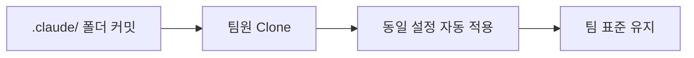

# Claude Code 설정 정책 (Configuration & Security)

## When to use this skill

- 새 프로젝트에 Claude Code 환경 구축
- CLAUDE.md 파일 작성 및 최적화
- Hooks/Skills/Plugins 설정
- 보안 정책 수립
- 팀 설정 공유

---

## 1. CLAUDE.md 작성 정책

### 개요
CLAUDE.md는 **AI를 위한 프로젝트 설명서**입니다. Claude는 이 파일을 최우선으로 참고합니다.

### 자동 생성
```bash
/init  # Claude가 코드베이스 분석 후 초안 생성
```

### 필수 섹션 구조

```markdown
# Project: [프로젝트명]

## Tech Stack
- **Frontend**: React + TypeScript
- **Backend**: Node.js + Express
- **Database**: PostgreSQL
- **ORM**: Drizzle

## Coding Standards
- Use TypeScript strict mode
- Prefer server components over client components
- Use `async/await` instead of `.then()`
- Always validate user input with Zod

## DO NOT
- Never commit `.env` files
- Never use `any` type in TypeScript
- Never bypass authentication checks
- Never expose API keys in client code

## Common Commands
- `npm run dev`: Start development server
- `npm run build`: Build for production
- `npm run test`: Run tests
```

### 작성 원칙: 간결함의 미학

**❌ 나쁜 예 (장황함):**
```markdown
Our authentication system is built using NextAuth.js, which is a 
complete authentication solution for Next.js applications. It provides
a flexible and secure way to add authentication to your app...
(5줄 이상의 설명)
```

**✅ 좋은 예 (간결함):**
```markdown
## Authentication
- NextAuth.js with Credentials provider
- JWT session strategy
- **DO NOT**: Bypass auth checks, expose session secrets
```

### 점진적 추가 원칙
> "처음에는 CLAUDE.md 없이 시작하세요. 같은 말을 반복하게 되면 그때 추가하세요."

---

## 2. Hooks 설정 정책

### 개요
Hooks는 특정 이벤트에 자동으로 실행되는 셸 명령어입니다. AI의 **가드레일** 역할.

### Hook 이벤트 종류

| Hook | 실행 시점 | 사용 사례 |
|------|----------|----------|
| `PreToolUse` | 도구 실행 전 | 위험한 명령어 차단 |
| `PostToolUse` | 도구 실행 후 | 로그 기록, 알림 전송 |
| `PermissionRequest` | 권한 요청 시 | 자동 승인/거부 |
| `Notification` | Claude 알림 시 | 외부 시스템 통합 |
| `SubagentStart` | 서브에이전트 시작 | 모니터링 |
| `SubagentStop` | 서브에이전트 종료 | 결과 수집 |

### 보안 Hooks 설정

```json
// ~/.claude/settings.json
{
  "hooks": {
    "PreToolUse": [
      {
        "pattern": "rm -rf /",
        "action": "block",
        "message": "⚠️ 루트 디렉토리 삭제 차단"
      },
      {
        "pattern": "rm -rf /*",
        "action": "block",
        "message": "⚠️ 위험한 삭제 명령어 차단"
      },
      {
        "pattern": "sudo rm",
        "action": "warn",
        "message": "⚠️ sudo 삭제 명령어 주의"
      },
      {
        "pattern": "curl * | sh",
        "action": "block",
        "message": "⚠️ 파이프 실행 스크립트 차단"
      },
      {
        "pattern": "chmod 777",
        "action": "warn",
        "message": "⚠️ 과도한 권한 설정 주의"
      }
    ]
  }
}
```

### tmux 없이 장시간 명령어 경고

```json
{
  "hooks": {
    "PreToolUse": {
      "command": "bash",
      "args": ["-c", "if [[ $TOOL_NAME == 'Bash' ]] && [[ ! $TMUX ]]; then echo '⚠ Warning: Long-running command without tmux'; fi"]
    }
  }
}
```

---

## 3. Skills 설정 정책

### Skills vs Slash Commands vs Plugins

| 기능 | 로딩 시점 | 주요 사용자 | 토큰 효율성 |
|------|----------|------------|------------|
| **CLAUDE.md** | 항상 로드 | 프로젝트 팀 | 낮음 (항상 로드) |
| **Skills** | 필요 시 로드 | Claude 자동 | 높음 (온디맨드) |
| **Slash Commands** | 사용자 호출 시 | 개발자 | 중간 |
| **Plugins** | 설치 시 | 팀/커뮤니티 | 다양함 |

### 선택 가이드
```
항상 적용되어야 하는 규칙 → CLAUDE.md
특정 작업에만 필요한 지식 → Skills (토큰 효율적)
자주 쓰는 명령어 → Slash Commands
외부 서비스 연동 → Plugins / MCP
```

### 커스텀 Skill 생성

```bash
# 스킬 디렉토리 생성
mkdir -p ~/.claude/skills/my-skill

# SKILL.md 작성
cat > ~/.claude/skills/my-skill/SKILL.md << 'EOF'
---
name: my-skill
description: 나의 커스텀 스킬
---

# My Skill

## When to use
- 특정 작업에 필요할 때

## Instructions
1. 첫 번째 단계
2. 두 번째 단계
EOF
```

---

## 4. 보안 정책

### 금지 사항 (DO NOT)

#### 절대 금지
- ❌ 호스트 시스템에서 YOLO 모드 (`--dangerously-skip-permissions`)
- ❌ 루트 디렉토리 삭제 명령어 자동 승인
- ❌ `.env`, `credentials.json` 등 시크릿 파일 커밋
- ❌ API 키 하드코딩

#### 주의 필요
- ⚠️ `sudo` 명령어 무분별한 승인
- ⚠️ `curl | sh` 형태의 스크립트 실행
- ⚠️ `chmod 777` 과도한 권한 설정
- ⚠️ 알 수 없는 MCP 서버 연결

### 승인된 명령어 감사

```bash
# cc-safe 도구로 위험한 명령어 검사
npx cc-safe .
npx cc-safe ~/projects

# 감지 대상:
# - sudo, rm -rf, chmod 777
# - curl | sh, wget | bash
# - git reset --hard, git push --force
# - npm publish, docker run --privileged
```

### /sandbox 안전한 자동 승인

```bash
# 안전한 명령어만 자동 승인
/sandbox "npm test"
/sandbox "npm run lint"
/sandbox "git status"
/sandbox "git diff"

# 패턴 승인
/sandbox "git *"       # git 명령어 전체
/sandbox "npm test *"  # npm test 관련

# MCP 도구 패턴
/sandbox "mcp__server__*"
```

---

## 5. 팀 설정 공유

### 프로젝트 설정 구조

```
project/
├── .claude/
│   ├── team-settings.json    # 팀 공용 설정
│   ├── hooks/                # 공용 훅 스크립트
│   └── skills/               # 공용 스킬
├── CLAUDE.md                 # AI용 프로젝트 설명서
└── ...
```

### team-settings.json 예시

```json
{
  "permissions": {
    "allow": [
      "Read(src/)",
      "Write(src/)",
      "Bash(npm test)",
      "Bash(npm run lint)"
    ],
    "deny": [
      "Bash(rm -rf /)",
      "Bash(sudo *)"
    ]
  },
  "hooks": {
    "PreToolUse": {
      "command": "bash",
      "args": ["-c", "echo 'Team hook: validating...'"]
    }
  },
  "mcpServers": {
    "company-db": {
      "command": "npx",
      "args": ["@company/db-mcp"]
    }
  }
}
```

### 팀 공유 워크플로우



---

## 6. Extended Thinking 설정

### ultrathink 키워드
```
"ultrathink: 이 아키텍처 결정의 장단점을 깊이 분석해줘"
```
- Claude가 응답 전 **최대 32k 토큰**을 내부 추론에 할당
- 복잡한 아키텍처 결정, 까다로운 디버깅에 유용

### settings.json 설정

```json
{
  "thinking": {
    "maxTokens": 5000
  }
}
```

---

## 7. 환경 설정 체크리스트

### 초기 설정

- [ ] CLAUDE.md 파일 생성 (`/init`)
- [ ] 터미널 별칭 설정 (`c`, `cc`, `cr`)
- [ ] 외부 에디터 설정 (`export EDITOR=vim`)
- [ ] MCP 서버 연결 (필요 시)

### 보안 설정

- [ ] 위험한 명령어 Hooks 설정
- [ ] 승인된 명령어 목록 점검 (`cc-safe`)
- [ ] .env 파일 .gitignore 확인
- [ ] 컨테이너 환경 준비 (YOLO 모드용)

### 팀 설정

- [ ] .claude/ 폴더 Git 커밋
- [ ] team-settings.json 작성
- [ ] 팀 표준 CLAUDE.md 템플릿

---

## Quick Reference

### 설정 파일 위치
```
~/.claude/settings.json     # 글로벌 설정
~/.claude/skills/           # 글로벌 스킬
.claude/settings.json       # 프로젝트 설정
.claude/skills/             # 프로젝트 스킬
CLAUDE.md                   # 프로젝트 AI 설명서
```

### 보안 우선순위
```
1. Hooks로 위험 명령어 차단
2. /sandbox로 안전한 명령어만 자동 승인
3. cc-safe로 정기 감사
4. YOLO 모드는 컨테이너에서만
```

### 토큰 효율성
```
CLAUDE.md: 항상 로드 (간결하게 유지)
Skills: 필요 시 로드 (토큰 효율적)
.toon 모드: 95% 토큰 절감
```
