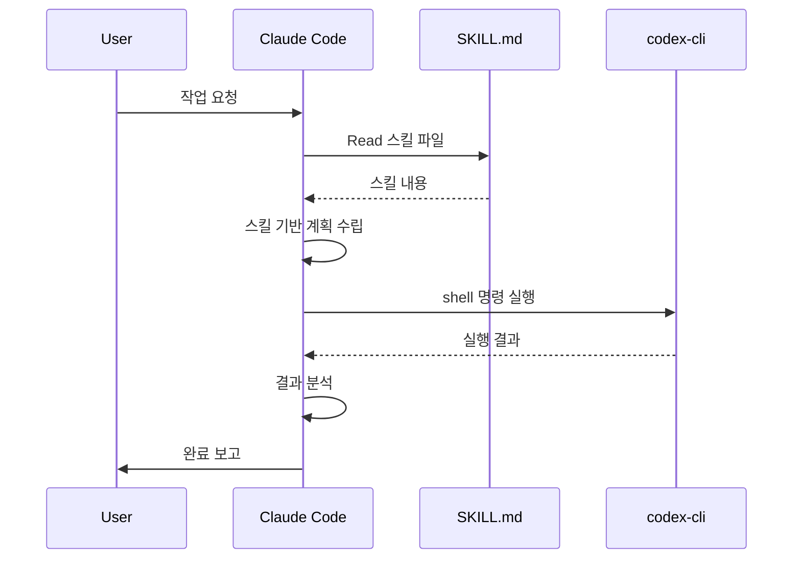

# MCP Codex-CLI Integration

## 목적 (Purpose)

codex-cli MCP 서버를 Claude Code에서 효과적으로 활용하기 위한 통합 스킬입니다.

### codex-cli란?

```
codex-cli (@openai/codex-shell-tool-mcp)
├── Type: Shell Execution Tool (NOT AI Model)
├── Function: mcp__codex-cli__shell
├── Capability: Execute shell commands
└── Limitation: No AI prompting capability
```

### 핵심 이해

| 구분 | gemini-cli | codex-cli |
|------|-----------|-----------|
| **타입** | AI Model MCP | Shell Tool MCP |
| **AI 응답** | ✅ 가능 | ❌ 불가능 |
| **스킬 처리** | 자체 처리 | Claude가 처리 |
| **용도** | AI 질의 | 명령 실행 |

## 사용 시점 (When to Use)

- **명령 실행**: 빌드, 테스트, 배포 스크립트 실행
- **파일 조작**: 파일 읽기/쓰기, 디렉토리 생성
- **환경 확인**: 시스템 상태, 의존성 확인
- **스킬 기반 작업**: 스킬 로드 후 codex-cli로 실행

## 작업 절차 (Procedure)

### 1단계: 스킬 + codex-cli 통합 패턴

**패턴 A: 스킬 읽기 → Claude 처리 → codex-cli 실행**

```
1. Claude가 스킬 파일 읽기 (Read tool)
2. 스킬 내용 기반으로 작업 계획 수립
3. codex-cli로 명령 실행
4. 결과 분석 및 다음 단계 진행
```

**예시**:
```
사용자: "api-design 스킬을 참조해서 새 API 엔드포인트 생성해줘"

Claude 처리:
1. Read: .agent-skills/backend/api-design/SKILL.md
2. 스킬 내용 분석 및 코드 생성
3. codex-cli: 파일 생성 및 테스트 실행
```

### 2단계: codex-cli 명령 실행

**기본 사용법**:
```typescript
// MCP 도구 호출
mcp__codex-cli__shell({
  command: "npm run build",
  workdir: "/path/to/project"
})
```

**응답 형식**:
```json
{
  "exit_code": 0,
  "output": "Build successful",
  "duration": {"secs": 5, "nanos": 123456789},
  "timed_out": false
}
```

### 3단계: 스킬 기반 작업 실행

**Infrastructure 스킬 예시**:
```
1. 스킬 로드: infrastructure/system-environment-setup
2. Claude가 스킬 분석
3. codex-cli로 Docker Compose 실행:
   - docker-compose up -d
   - docker-compose logs
   - docker-compose ps
```

**Code Quality 스킬 예시**:
```
1. 스킬 로드: code-quality/code-review
2. Claude가 리뷰 기준 확인
3. codex-cli로 린트/테스트 실행:
   - npm run lint
   - npm run test
   - npm run type-check
```

### 4단계: 결과 처리 패턴

```
codex-cli 실행
    ↓
exit_code 확인
    ↓
├── 0 (성공): 다음 단계 진행
├── 1 (실패): 오류 분석 후 수정
└── timeout: 명령 최적화 또는 분할
```

## 통합 워크플로우



## 실전 예제

### 예제 1: 스킬 기반 프로젝트 초기화

```
사용자: "infrastructure 스킬을 참조해서 Docker 환경 세팅해줘"

Claude 작업:
1. Read: .agent-skills/infrastructure/system-environment-setup/SKILL.md
2. 스킬의 docker-compose.yml 템플릿 활용
3. Write: docker-compose.yml 생성
4. codex-cli: docker-compose up -d
5. codex-cli: docker-compose ps (상태 확인)
```

### 예제 2: 스킬 기반 코드 리뷰

```
사용자: "code-review 스킬로 이 PR 체크해줘"

Claude 작업:
1. Read: .agent-skills/code-quality/code-review/SKILL.md
2. 리뷰 체크리스트 확인
3. codex-cli: git diff --name-only
4. Read: 변경된 파일들
5. 스킬 기준으로 리뷰 수행
6. codex-cli: npm run lint (자동 검사)
```

### 예제 3: 스킬 기반 배포

```
사용자: "deployment 스킬로 스테이징 배포해줘"

Claude 작업:
1. Read: .agent-skills/infrastructure/deployment-automation/SKILL.md
2. 배포 절차 확인
3. codex-cli: npm run build
4. codex-cli: npm run test
5. codex-cli: ./deploy.sh staging
6. 결과 보고
```

## 제약사항 (Constraints)

### 필수 규칙 (MUST)

1. **스킬은 Claude가 처리**: codex-cli는 AI 응답 불가, 스킬 해석은 Claude가 담당
2. **workdir 명시**: 모든 codex-cli 명령에 절대 경로 workdir 필수
3. **결과 확인**: exit_code 확인 후 다음 단계 진행

### 금지 사항 (MUST NOT)

1. **codex-cli에 프롬프트 전달 금지**: AI 응답 기대하지 않음
2. **무한 루프 금지**: 실패 시 3회 이상 재시도 금지
3. **민감 정보 출력 금지**: 환경변수, 비밀키 로깅 주의

## 베스트 프랙티스

### 1. 스킬 로드 → Claude 처리 → codex 실행
```
# 올바른 패턴
1. Claude: Read 스킬 파일
2. Claude: 작업 계획 수립
3. codex-cli: 명령 실행
```

### 2. 명령 체이닝
```bash
# codex-cli에서 && 사용
npm install && npm run build && npm run test
```

### 3. 타임아웃 설정
```typescript
mcp__codex-cli__shell({
  command: "npm run build",
  workdir: "/path",
  timeout_ms: 60000  // 60초
})
```

## gemini-cli vs codex-cli 사용 가이드

| 작업 유형 | 권장 도구 | 이유 |
|----------|----------|------|
| AI 질의/분석 | gemini-cli | AI 응답 필요 |
| 창의적 아이디어 | gemini-cli (brainstorm) | 평가 점수 포함 |
| 명령 실행 | codex-cli | 빠른 shell 실행 |
| 파일 조작 | codex-cli 또는 Bash | 직접 실행 |
| 스킬 기반 작업 | Claude + codex-cli | 스킬은 Claude, 실행은 codex |

## 메타데이터

### 버전
- **현재 버전**: 1.0.0
- **최종 업데이트**: 2026-01-05
- **호환 플랫폼**: Claude Code

### 관련 스킬
- [git-workflow](../git-workflow/SKILL.md)
- [workflow-automation](../workflow-automation/SKILL.md)

### 태그
`#mcp` `#codex-cli` `#shell` `#automation` `#integration`
