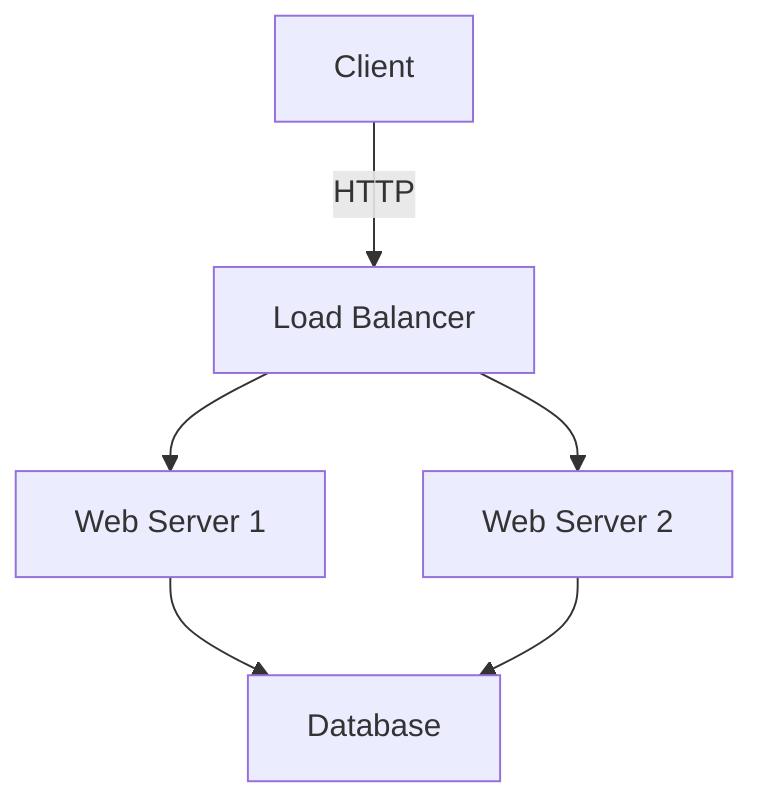
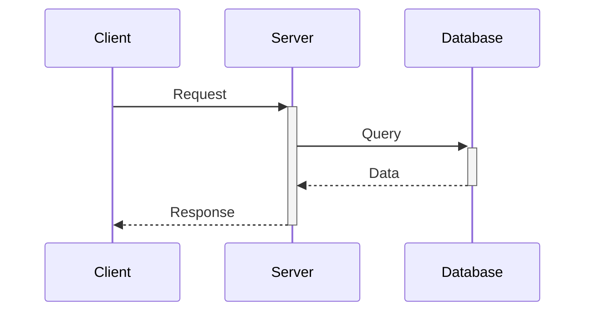
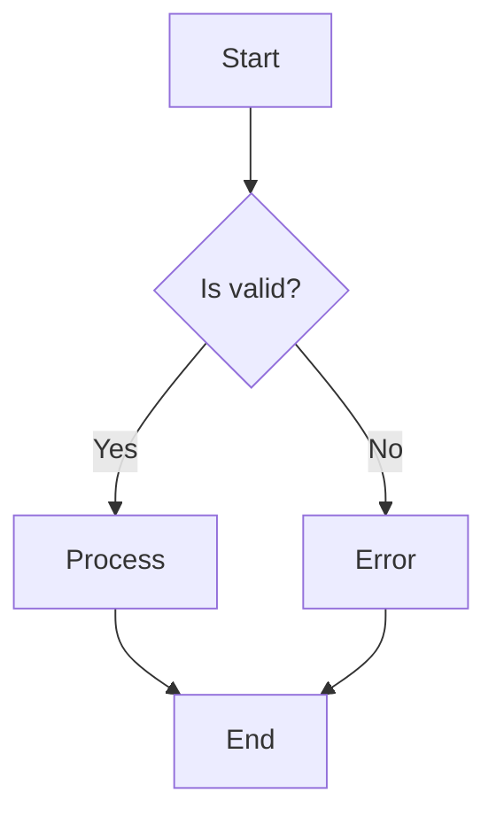

# Technical Writing

## When to use this skill
- Writing technical specifications
- Creating architecture documentation
- Documenting system designs
- Writing runbooks and operational guides
- Creating developer documentation
- API documentation
- User manuals and guides
- Release notes and changelogs

## Instructions

### Step 1: Understand your audience

**Developer audience**:
- Focus on implementation details
- Include code examples
- Technical terminology is okay
- Show how, not just what

**DevOps/Operations audience**:
- Focus on deployment and maintenance
- Include configuration examples
- Emphasize monitoring and troubleshooting
- Provide runbooks

**Manager/Stakeholder audience**:
- High-level overview
- Business impact
- Minimal technical jargon
- Focus on outcomes

**End user audience**:
- Simple, clear language
- Step-by-step instructions
- Visual aids (screenshots, videos)
- FAQ section

### Step 2: Choose the right document type

**Technical Specification**:
```markdown
# [Feature Name] Technical Specification

## Overview
Brief description of what this spec covers

## Problem Statement
What problem are we solving?

## Goals and Non-Goals
### Goals
- Goal 1
- Goal 2

### Non-Goals
- What we're explicitly not doing

## Solution Design
### High-Level Architecture
### Data Models
### API Contracts
### User Interface

## Implementation Plan
### Phase 1
### Phase 2

## Testing Strategy

## Security Considerations

## Performance Considerations

## Monitoring and Alerting

## Rollout Plan

## Rollback Plan

## Open Questions

## References
```

**Architecture Document**:
```markdown
# System Architecture

## Overview
High-level system description

## Architecture Diagram
[Insert diagram]

## Components
### Component 1
- Responsibility
- Technology stack
- Interfaces

### Component 2
...

## Data Flow
How data moves through the system

## Key Design Decisions
### Decision 1
- Context
- Options considered
- Decision made
- Rationale

## Technology Stack
- Frontend: React, TypeScript
- Backend: Python, FastAPI
- Database: PostgreSQL
- Infrastructure: AWS, Docker, Kubernetes

## Scalability
How the system scales

## Security
Authentication, authorization, data protection

## Monitoring and Observability
Metrics, logs, tracing

## Disaster Recovery
Backup and recovery procedures

## Future Considerations
```

**Runbook**:
```markdown
# [Service Name] Runbook

## Service Overview
What this service does

## Dependencies
- Service A
- Service B
- Database X

## Deployment
### How to deploy
```bash
./deploy.sh production
```

### Rollback
```bash
./rollback.sh
```

## Monitoring
### Key Metrics
- Request rate
- Error rate
- Latency

### Dashboards
- [Production Dashboard](link)
- [Alerts](link)

## Common Issues
### Issue 1: High latency
**Symptoms**: Response time > 1s
**Diagnosis**: Check database connection pool
**Resolution**: Restart service or scale up

### Issue 2: Memory leak
**Symptoms**: Memory usage growing over time
**Diagnosis**: Check heap dump
**Resolution**: Restart service, investigate in staging

## Troubleshooting
### How to check logs
```bash
kubectl logs -f deployment/service-name
```

### How to access metrics
```bash
curl https://api/metrics
```

## Emergency Contacts
- On-call: [PagerDuty](link)
- Team Slack: #team-name
```

**API Documentation**:
```markdown
# API Documentation

## Authentication
All requests require authentication:
```bash
curl -H "Authorization: Bearer YOUR_TOKEN" \
  https://api.example.com/endpoint
```

## Endpoints

### List Users
```
GET /api/v1/users
```

**Parameters**:
| Name | Type | Required | Description |
|------|------|----------|-------------|
| page | integer | No | Page number (default: 1) |
| limit | integer | No | Items per page (default: 20) |

**Example Request**:
```bash
curl -X GET "https://api.example.com/api/v1/users?page=1&limit=20" \
  -H "Authorization: Bearer YOUR_TOKEN"
```

**Example Response**:
```json
{
  "data": [
    {
      "id": 1,
      "name": "John Doe",
      "email": "john@example.com"
    }
  ],
  "pagination": {
    "page": 1,
    "limit": 20,
    "total": 100
  }
}
```

**Error Responses**:
| Status | Description |
|--------|-------------|
| 400 | Bad Request |
| 401 | Unauthorized |
| 500 | Server Error |
```

### Step 3: Writing guidelines

**Clarity**:
- Use simple, direct language
- One idea per sentence
- Short paragraphs (3-5 sentences)
- Define technical terms
- Avoid jargon when possible

**Structure**:
- Use hierarchical headings (H1, H2, H3)
- Break content into sections
- Use lists for multiple items
- Use tables for structured data
- Add table of contents for long docs

**Examples**:
- Include code examples
- Provide diagrams
- Show before/after comparisons
- Real-world scenarios

**Completeness**:
- Cover prerequisites
- Include error handling
- Document edge cases
- Explain why, not just how
- Link to related docs

**Consistency**:
- Consistent terminology
- Consistent formatting
- Consistent code style
- Consistent structure

### Step 4: Visual aids

**Architecture diagrams** (Mermaid):


**Sequence diagrams**:


**Flowcharts**:


**Code blocks** with syntax highlighting:
```python
def calculate_total(items: List[Item]) -> Decimal:
    """Calculate total price of items."""
    return sum(item.price for item in items)
```

**Screenshots**:
- Use for UI documentation
- Annotate important parts
- Keep up-to-date with UI changes

**Tables**:
| Parameter | Type | Default | Description |
|-----------|------|---------|-------------|
| timeout | int | 30 | Request timeout in seconds |
| retries | int | 3 | Number of retry attempts |

### Step 5: Review and refine

**Self-review checklist**:
- [ ] Clear purpose stated upfront
- [ ] Logical flow of information
- [ ] All terms defined
- [ ] Code examples tested
- [ ] Links work
- [ ] Diagrams are clear
- [ ] No typos or grammar errors
- [ ] Consistent formatting
- [ ] Table of contents (if needed)
- [ ] Last updated date

**Get feedback**:
- Have someone from target audience review
- Test instructions (can they follow them?)
- Check for missing information
- Verify accuracy

**Maintain documentation**:
- Update with code changes
- Version your docs
- Archive outdated docs
- Regular review cycle

## Document templates

### Technical Spec Template
```markdown
# [Feature Name] Technical Spec

**Author**: [Your Name]
**Date**: [Date]
**Status**: [Draft/Review/Approved]

## Overview
[1-2 paragraphs describing what this document covers]

## Background
[Context and motivation]

## Goals
- Goal 1
- Goal 2

## Non-Goals
- What we're not doing

## Detailed Design
[Technical details]

## Alternatives Considered
[Other approaches and why we didn't choose them]

## Timeline
- Week 1: ...
- Week 2: ...

## Open Questions
- Question 1
- Question 2

## References
- [Link 1]
- [Link 2]
```

### README Template
```markdown
# Project Name

Brief description of the project

## Features
- Feature 1
- Feature 2

## Installation

### Prerequisites
- Node.js >= 14
- npm >= 6

### Setup
```bash
git clone https://github.com/user/project.git
cd project
npm install
```

## Usage
```bash
npm start
```

## Configuration
Environment variables:
- `API_KEY`: Your API key
- `PORT`: Server port (default: 3000)

## Development
```bash
npm run dev
npm test
```

## Deployment
[Deployment instructions]

## Contributing
[Contributing guidelines]

## License
MIT
```

### Changelog Template
```markdown
# Changelog

## [1.2.0] - 2024-01-15

### Added
- New feature X
- Support for Y

### Changed
- Improved performance of Z
- Updated dependency A to v2.0

### Fixed
- Bug where user couldn't login
- Memory leak in background task

### Deprecated
- Old API endpoint /v1/users (use /v2/users)

### Removed
- Legacy authentication method

### Security
- Fixed XSS vulnerability in comments

## [1.1.0] - 2024-01-01
...
```

## Writing tips

### Use active voice
```
✅ Good: "The system sends a notification"
❌ Bad: "A notification is sent by the system"
```

### Be concise
```
✅ Good: "Click Save to save changes"
❌ Bad: "In order to save your changes, you should click on the Save button"
```

### Use examples
```
✅ Good: 
"Set the timeout in seconds:
```yaml
timeout: 30
```

❌ Bad:
"Configure the timeout parameter appropriately"
```

### Break down complexity
```
✅ Good:
"To deploy:
1. Build the image
2. Push to registry
3. Update deployment
4. Verify rollout"

❌ Bad:
"Deploy by building and pushing the image to the registry, then update 
the deployment and verify the rollout succeeded"
```

## Common mistakes to avoid

1. **Assuming knowledge**: Define terms, explain context
2. **Outdated docs**: Keep in sync with code
3. **Missing examples**: Always include examples
4. **No visuals**: Use diagrams for complex concepts
5. **Poor structure**: Use headings and sections
6. **Passive voice**: Use active voice
7. **Too much jargon**: Write for your audience
8. **No version info**: Date docs, note versions
9. **Missing error cases**: Document what can go wrong
10. **No maintenance**: Update regularly

## Best practices

1. **Write for your audience**: Match their knowledge level
2. **Start with why**: Explain the purpose
3. **Show, don't just tell**: Use examples
4. **Be consistent**: Terminology, style, structure
5. **Test your docs**: Can someone follow them?
6. **Version your docs**: Track with code versions
7. **Use templates**: Consistency across docs
8. **Link related docs**: Help readers find more info
9. **Update with code**: Docs are part of the code
10. **Review regularly**: Quarterly doc review

## Tools

**Diagram tools**:
- Mermaid (markdown-based)
- Draw.io
- Lucidchart
- PlantUML

**Documentation platforms**:
- GitBook
- Docusaurus
- MkDocs
- Sphinx

**Style checkers**:
- Grammarly
- Hemingway Editor
- Vale

**Screenshot tools**:
- Snagit
- CloudApp
- Loom (for videos)

## References

- [Google Developer Documentation Style Guide](https://developers.google.com/style)
- [Microsoft Writing Style Guide](https://learn.microsoft.com/en-us/style-guide/welcome/)
- [Write the Docs](https://www.writethedocs.org/)
- [Mermaid Documentation](https://mermaid.js.org/)

