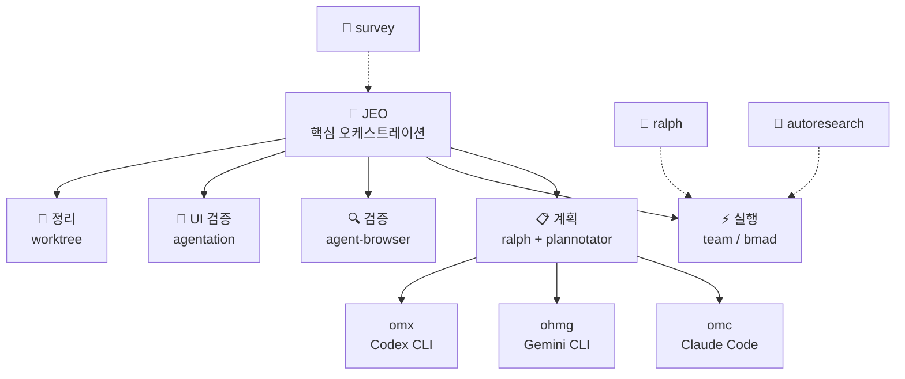

# Agent Skills

<div align="center">

[](https://github.com/supercent-io/skills-template)
[](https://github.com/supercent-io/skills-template)
[](LICENSE)
[](docs/bmad/README.md)
[](https://www.buymeacoffee.com/akillness3q)

**80개 AI 에이전트 스킬 · TOON 포맷 · 멀티플랫폼**

[빠른 시작](#-빠른-시작) · [스킬 목록](#-스킬-목록-80개) · [설치](#-설치) · [English](README.md)

</div>

---

## 💡 Agent Skills란?

**80개 AI 에이전트 스킬 · TOON 포맷 · 멀티플랫폼**

Agent Skills는 LLM 기반 개발 워크플로우를 위한 80개 AI 에이전트 스킬 컬렉션입니다. `jeo` 오케스트레이션 프로토콜을 중심으로 구축되었으며 다음을 제공합니다:
- Claude Code, Gemini CLI, OpenAI Codex, OpenCode 전반에 걸친 통합 오케스트레이션
- 계획 → 실행 → 검증 → 정리 자동화 파이프라인
- 병렬 실행이 가능한 멀티 에이전트 팀 조율

---

## 🚀 빠른 시작

> **사전 준비**: `npx skills add` 명령을 실행하려면 먼저 `skills` CLI가 필요합니다.
>
> ```bash
> npm install -g skills
> ```

```bash
# LLM 에이전트에게 전달 — 읽고 자동으로 설치를 진행합니다
curl -s https://raw.githubusercontent.com/supercent-io/skills-template/main/setup-all-skills-prompt.md
```

| 플랫폼 | 첫 번째 명령 |
|--------|------------|
| Claude Code | `jeo "작업 설명"` 또는 `/omc:team "작업"` |
| Gemini CLI | `/jeo "작업 설명"` |
| Codex CLI | `/jeo "작업 설명"` |
| OpenCode | `/jeo "작업 설명"` |

---

## 🏗 아키텍처



---

## 🆕 v2026-03-11 업데이트

| 변경 | 내용 |
|------|------|
| **autoresearch: Karpathy 자율 ML 실험 스킬** | AI 에이전트가 `train.py`를 수정하고 5분 GPU 실험을 반복, `val_bpb`로 평가, git ratcheting으로 개선만 커밋합니다. `scripts/`와 `references/` 포함. 79 → **80개** |
| **jeo v1.2.3: plannotator-plan-loop.sh 전 플랫폼 강화** | 크로스 플랫폼 임시 디렉토리, 전용 포트 `PLANNOTATOR_PORT=47291`, `probe_plannotator_port()` + `wait_for_listen()`, 브라우저 강제종료 시 최대 3회 자동 재시작, 구조화 `jeo-blocked.json` 출력 |
| **survey: 전 플랫폼 문제공간 스캔 스킬** | 4개 병렬 조사 레인, 결과물을 `.survey/{slug}/`에 저장, Claude/Codex/Gemini 차이를 `settings/rules/hooks`로 정규화. 76 → **77개** |
| **presentation-builder: slides-grab 워크플로우** | HTML 슬라이드 작성, 시각 편집, PPTX/PDF export. 중복 스킬 `pptx-presentation-builder` 제거 |

---

## 📦 설치

### 0단계: `skills` CLI 설치

```bash
npm install -g skills
skills --version
```

### LLM 에이전트용

```bash
curl -s https://raw.githubusercontent.com/supercent-io/skills-template/main/setup-all-skills-prompt.md
```

### 플랫폼별 선택

#### Claude Code

```bash
npx skills add https://github.com/supercent-io/skills-template \
  --skill jeo --skill omc --skill plannotator --skill agentation \
  --skill ralph --skill ralphmode --skill vibe-kanban
```

#### Gemini CLI

```bash
npx skills add https://github.com/supercent-io/skills-template \
  --skill jeo --skill ohmg --skill ralph --skill ralphmode --skill vibe-kanban
gemini extensions install https://github.com/supercent-io/skills-template
```

#### Codex CLI

```bash
npx skills add https://github.com/supercent-io/skills-template \
  --skill jeo --skill omx --skill ralph --skill ralphmode
```

#### 플랫폼별 추가 설정

```bash
# Claude Code — jeo 훅 설정
bash ~/.agent-skills/jeo/scripts/setup-claude.sh

# Gemini CLI — jeo 훅 설정
bash ~/.agent-skills/jeo/scripts/setup-gemini.sh

# oh-my-claudecode
/plugin marketplace add https://github.com/Yeachan-Heo/oh-my-claudecode
/omc:omc-setup
```

---

## 📚 스킬 목록 (80개)

> 전체 매니페스트: `.agent-skills/skills.json` · 각 폴더의 `SKILL.md`

### 🎯 핵심 오케스트레이션 (10개)

| 스킬 | 키워드 | 플랫폼 | 설명 |
|------|--------|--------|------|
| `jeo` | `jeo`, `annotate` | 전체 | 통합 오케스트레이션: PLAN→EXECUTE→VERIFY→CLEANUP |
| `omc` | `omc`, `autopilot` | Claude | 32개 에이전트 오케스트레이션 레이어 |
| `omx` | `omx` | Codex | Codex CLI용 멀티에이전트 오케스트레이션 |
| `ohmg` | `ohmg` | Gemini | Antigravity 멀티에이전트 프레임워크 |
| `ralph` | `ralph`, `ooo` | 전체 | Ouroboros 스펙 우선 + 영구 완료 루프 |
| `ralphmode` | `ralphmode` | 전체 | 자동화 권한 프로파일 (샌드박스 우선, 저장소 경계) |
| `bmad-orchestrator` | `bmad` | Claude | 구조화 단계 기반 AI 개발 |
| `bmad-gds` | `bmad-gds` | 전체 | BMAD 게임 개발 스튜디오 (Unity · Unreal · Godot) |
| `bmad-idea` | `bmad-idea` | 전체 | 창의 지능 — 5개 전문 아이디에이션 에이전트 |
| `survey` | `survey` | 전체 | 사전 구현 문제공간 스캔 |

### 📋 계획 및 검토 (5개)

| 스킬 | 키워드 | 설명 |
|------|--------|------|
| `plannotator` | `plan` | 시각적 브라우저 계획/diff 검토 — 승인 또는 피드백 |
| `agentation` | `annotate` | UI 어노테이션 → 에이전트 코드 수정 |
| `agent-browser` | `agent-browser` | AI 에이전트용 헤드리스 브라우저 검증 |
| `playwriter` | `playwriter` | 실행 중인 브라우저에 연결하는 Playwright 자동화 |
| `vibe-kanban` | `kanbanview` | git worktree 격리가 있는 시각적 칸반 보드 |

### 🤖 에이전트 개발 (7개)

| 스킬 | 설명 | 플랫폼 |
|------|------|--------|
| `agent-configuration` | AI 에이전트 구성 및 보안 정책 | 전체 |
| `agent-evaluation` | AI 에이전트 평가 시스템 설계 | 전체 |
| `agentic-development-principles` | 에이전틱 개발 보편 원칙 | 전체 |
| `agentic-principles` | 핵심 AI 에이전트 원칙: 분할정복, 컨텍스트 관리, 자동화 철학 | 전체 |
| `agentic-workflow` | 일상 워크플로우 최적화: 단축키, Git, MCP, 세션 | 전체 |
| `prompt-repetition` | 프롬프트 반복 기법으로 LLM 정확도 향상 | 전체 |
| `skill-standardization` | Agent Skills 스펙 대비 SKILL.md 검증 | 전체 |

### ⚙️ 백엔드 (5개)

| 스킬 | 설명 | 플랫폼 |
|------|------|--------|
| `api-design` | REST/GraphQL API 설계 | 전체 |
| `api-documentation` | OpenAPI/Swagger 문서 생성 | 전체 |
| `authentication-setup` | JWT, OAuth, 세션 관리 | 전체 |
| `backend-testing` | 유닛/통합/API 테스트 전략 | 전체 |
| `database-schema-design` | SQL/NoSQL 스키마 설계 | 전체 |

### 🎨 프론트엔드 (9개)

| 스킬 | 설명 | 플랫폼 |
|------|------|--------|
| `design-system` | 디자인 토큰, 레이아웃 규칙, 모션, 접근성 | 전체 |
| `frontend-design-system` | 디자인 토큰과 접근성 기반 프로덕션 UI | 전체 |
| `react-best-practices` | React & Next.js 성능 최적화 | 전체 |
| `vercel-react-best-practices` | Vercel Engineering React & Next.js 가이드 | Claude · Gemini · Codex |
| `responsive-design` | 모바일 우선 레이아웃과 브레이크포인트 | 전체 |
| `state-management` | Redux, Context, Zustand 패턴 | 전체 |
| `ui-component-patterns` | 재사용 가능한 컴포넌트 라이브러리 | 전체 |
| `web-accessibility` | WCAG 2.1 준수 | 전체 |
| `web-design-guidelines` | 웹 인터페이스 가이드라인 준수 검토 | 전체 |

### 🔍 코드 품질 (5개)

| 스킬 | 설명 | 플랫폼 |
|------|------|--------|
| `code-refactoring` | 코드 단순화 및 리팩토링 | 전체 |
| `code-review` | API 계약 포함 종합 코드 리뷰 | 전체 |
| `debugging` | 근본 원인 분석, 회귀 격리 | 전체 |
| `performance-optimization` | 속도, 효율성, 확장성 최적화 | 전체 |
| `testing-strategies` | 테스트 피라미드, 커버리지, flaky 테스트 강화 | 전체 |

### 🏗 인프라 (10개)

| 스킬 | 설명 | 플랫폼 |
|------|------|--------|
| `ai-tool-compliance` | 내부 AI 툴 P0/P1 컴플라이언스 자동화 | 전체 |
| `deployment-automation` | CI/CD, Docker/Kubernetes, 클라우드 인프라 | 전체 |
| `environment-setup` | 개발/스테이징/프로덕션 환경 구성 | 전체 |
| `firebase-ai-logic` | Firebase AI Logic (Gemini) 통합 | Claude · Gemini |
| `genkit` | Firebase Genkit AI 플로우 및 RAG 파이프라인 | Claude · Gemini |
| `looker-studio-bigquery` | Looker Studio + BigQuery 대시보드 | 전체 |
| `monitoring-observability` | 헬스 체크, 메트릭, 로그 집계 | 전체 |
| `security-best-practices` | OWASP Top 10, RBAC, API 보안 | 전체 |
| `system-environment-setup` | 재현 가능한 환경 구성 | 전체 |
| `vercel-deploy` | Vercel 배포 자동화 | 전체 |

### 📝 문서화 (4개)

| 스킬 | 설명 | 플랫폼 |
|------|------|--------|
| `changelog-maintenance` | 변경 로그 관리 및 버전 관리 | 전체 |
| `presentation-builder` | slides-grab 기반 HTML 슬라이드, PPTX/PDF 내보내기 | 전체 |
| `technical-writing` | 기술 문서 및 스펙 | 전체 |
| `user-guide-writing` | 사용자 가이드 및 튜토리얼 | 전체 |

### 📊 프로젝트 관리 (4개)

| 스킬 | 설명 | 플랫폼 |
|------|------|--------|
| `sprint-retrospective` | 스프린트 회고 진행 | 전체 |
| `standup-meeting` | 일일 스탠드업 관리 | 전체 |
| `task-estimation` | 스토리 포인트, T셔츠 사이징, 플래닝 포커 | 전체 |
| `task-planning` | 작업 분해 및 사용자 스토리 | 전체 |

### 🔭 검색 및 분석 (5개)

| 스킬 | 설명 | 플랫폼 |
|------|------|--------|
| `autoresearch` | 자율 ML 실험 (Karpathy) — AI 에이전트가 야간 GPU 실험 실행, git ratcheting으로 개선 커밋 | 전체 |
| `codebase-search` | 코드베이스 검색 및 탐색 | 전체 |
| `data-analysis` | 데이터셋 분석, 시각화, 통계 | 전체 |
| `log-analysis` | 로그 분석 및 인시던트 디버깅 | 전체 |
| `pattern-detection` | 패턴 및 이상 탐지 | 전체 |

### 🎬 창의 미디어 (5개)

| 스킬 | 설명 | 플랫폼 |
|------|------|--------|
| `image-generation` | MCP를 통한 이미지 생성 (Gemini/호환) — 마케팅, UI, 프레젠테이션용 | 전체 |
| `image-generation-mcp` | MCP를 통한 이미지 생성 (Gemini/호환) | 전체 |
| `pollinations-ai` | Pollinations.ai 무료 이미지 생성 | 전체 |
| `remotion-video-production` | Remotion 기반 프로그래머블 비디오 제작 | 전체 |
| `video-production` | Remotion 기반 프로그래머블 비디오 — 씬 플래닝, 에셋 오케스트레이션 | 전체 |

### 📢 마케팅 (2개)

| 스킬 | 설명 | 플랫폼 |
|------|------|--------|
| `marketing-automation` | 23개 서브스킬: CRO, 카피라이팅, SEO, 애널리틱스, 그로스 | 전체 |
| `marketing-skills-collection` | 23개 서브스킬: CRO, 카피라이팅, SEO, 애널리틱스, 그로스 | 전체 |

### 🔧 유틸리티 (9개)

| 스킬 | 설명 | 플랫폼 |
|------|------|--------|
| `copilot-coding-agent` | GitHub Copilot 코딩 에이전트 — 이슈 → Draft PR 자동화 | Claude · Codex |
| `fabric` | AI 프롬프트 패턴 — YouTube 요약, 문서 분석 (200+ 패턴) | 전체 |
| `file-organization` | 파일 및 폴더 구성 | 전체 |
| `git-submodule` | Git 서브모듈 관리 | 전체 |
| `git-workflow` | 커밋, 브랜치, 머지, PR 워크플로우 | 전체 |
| `llm-monitoring-dashboard` | LLM 사용 모니터링 대시보드 (비용, 토큰, 레이턴시) | 전체 |
| `npm-git-install` | GitHub에서 npm 패키지 설치 | 전체 |
| `opencontext` | AI 에이전트용 영구 메모리 및 컨텍스트 관리 | 전체 |
| `workflow-automation` | 반복 개발 워크플로우 자동화 | 전체 |

---

## 🧬 TOON 포맷 주입

TOON(Token-Oriented Object Notation)은 스킬 카탈로그를 압축하여 모든 프롬프트에 자동 주입합니다. **JSON/Markdown 대비 40-50% 토큰 절감**.

| 플랫폼 | 파일 | 메커니즘 |
|--------|------|---------|
| Claude Code | `~/.claude/hooks/toon-inject.mjs` | `UserPromptSubmit` 훅 — 26-37ms |
| Gemini CLI | `~/.gemini/hooks/toon-skill-inject.sh` | `includeDirectories` 세션 로드 |
| Codex CLI | `~/.codex/skills-toon-catalog.toon` | 정적 카탈로그 |

- **Tier 1** (항상): 스킬 카탈로그 인덱스 (~875-3,500 토큰) — 이름 + 설명 + 태그
- **Tier 2** (온디맨드): 개별 SKILL.toon 전체 내용 (~292 토큰/스킬, 최대 3개)

---

## 🔮 주요 도구

### jeo — 통합 에이전트 오케스트레이션
> 키워드: `jeo` · `annotate` | 플랫폼: Claude · Codex · Gemini · OpenCode

계획(ralph+plannotator) → 실행(team/bmad) → 브라우저 검증(agent-browser) → UI 피드백(agentation) → 정리의 완전 자동화 파이프라인.

| 단계 | 도구 | 설명 |
|------|------|------|
| 계획 | ralph + plannotator | 시각적 계획 검토 → 승인/피드백 |
| 실행 | omc team / bmad | 병렬 에이전트 실행 |
| 검증 | agent-browser | 브라우저 동작 검증 |
| UI 검증 | agentation (`annotate`) | UI 어노테이션 → 수정 루프 |
| 정리 | worktree-cleanup.sh | 자동 worktree 정리 |

### plannotator — 시각적 계획 검토
> 키워드: `plan` | [문서](docs/plannotator/README.md) | [GitHub](https://github.com/backnotprop/plannotator)

AI 계획을 브라우저 UI에서 어노테이션. 클릭 한 번으로 승인 또는 구조화된 피드백 전송. Claude Code, OpenCode, Gemini CLI, Codex CLI 지원.

```bash
bash scripts/install.sh --all
```

### ralph — 스펙 우선 개발
> 키워드: `ralph`, `ooo` | [문서](docs/ralph/README.md) | [GitHub](https://github.com/Q00/ouroboros)

소크라테스식 인터뷰 → 불변 스펙 → Double Diamond 실행 → 3단계 검증 → 통과할 때까지 루프.

```bash
ooo interview "작업 관리 CLI를 만들고 싶어요"
ooo seed && ooo run && ooo evaluate <session_id>
ooo ralph "모든 실패 테스트 수정"
```

### vibe-kanban — AI 에이전트 칸반 보드
> 키워드: `kanbanview` | [문서](docs/vibe-kanban/README.md) | [GitHub](https://github.com/BloopAI/vibe-kanban)

git worktree로 격리된 병렬 AI 에이전트를 시각적 칸반 보드(할 일 → 진행 중 → 검토 → 완료)로 관리.

```bash
npx vibe-kanban
```

---

## 🌐 추천 Harness OSS

| 저장소 | 스타 | 설명 |
|-------|-----:|------|
| [AutoGPT](https://github.com/Significant-Gravitas/AutoGPT) | 182k | 지속적 에이전트를 위한 접근성 높은 AI 플랫폼 |
| [AutoGen](https://github.com/microsoft/autogen) | 55.4k | Microsoft 멀티에이전트 대화 프레임워크 |
| [CrewAI](https://github.com/crewAIInc/crewAI) | 45.7k | 역할 기반 자율 AI 에이전트 오케스트레이션 |
| [smolagents](https://github.com/huggingface/smolagents) | 25.9k | HuggingFace 코드 사고 경량 에이전트 라이브러리 |
| [agency-agents](https://github.com/msitarzewski/agency-agents) | 21.2k | 9개 부서의 61개 특화 AI 에이전트 |

> 설치 및 연동 가이드 → [docs/harness/README.ko.md](docs/harness/README.ko.md)

---

## 📁 구조

```text
.
├── .agent-skills/          ← 80개 스킬 폴더 (각각 SKILL.md + SKILL.toon)
├── docs/                   ← 상세 가이드 (bmad, omc, plannotator, ralph, ...)
├── install.sh
├── setup-all-skills-prompt.md
├── README.md               ← English
└── README.ko.md            ← 한국어 (이 파일)
```

---

## 📖 관련 문서

| 도구 | 키워드 | 문서 |
|------|--------|------|
| `jeo` | `jeo`, `annotate` | [.agent-skills/jeo/SKILL.md](.agent-skills/jeo/SKILL.md) |
| `plannotator` | `plan` | [docs/plannotator/README.md](docs/plannotator/README.md) |
| `vibe-kanban` | `kanbanview` | [docs/vibe-kanban/README.md](docs/vibe-kanban/README.md) |
| `ralph` | `ralph` | [docs/ralph/README.md](docs/ralph/README.md) |
| `omc` | `omc` | [docs/omc/README.md](docs/omc/README.md) |
| `bmad-orchestrator` | `bmad` | [docs/bmad/README.md](docs/bmad/README.md) |
| Harness OSS | — | [docs/harness/README.ko.md](docs/harness/README.ko.md) |

---

## 📎 참고 자료

| 컴포넌트 | 출처 | 라이선스 |
|----------|------|---------|
| `jeo` | Internal | MIT |
| `omc` | [Yeachan-Heo/oh-my-claudecode](https://github.com/Yeachan-Heo/oh-my-claudecode) | MIT |
| `ralph` | [Q00/ouroboros](https://github.com/Q00/ouroboros) | MIT |
| `plannotator` | [plannotator.ai](https://plannotator.ai) | MIT |
| `bmad` | [bmad-dev/BMAD-METHOD](https://github.com/bmad-dev/BMAD-METHOD) | MIT |
| `agentation` | [benjitaylor/agentation](https://github.com/benjitaylor/agentation) | MIT |
| `fabric` | [danielmiessler/fabric](https://github.com/danielmiessler/fabric) | MIT |
| `autoresearch` | Andrej Karpathy methodology | — |
| Agent Skills Spec | [agentskills.io](https://agentskills.io/specification) | — |

---

<div align="center">

[](https://www.buymeacoffee.com/akillness3q)

⭐ 도움이 됐다면 저장소에 스타를 눌러주세요!

```bash
gh api --silent --method PUT /user/starred/supercent-io/skills-template >/dev/null 2>&1 || true
```

</div>
