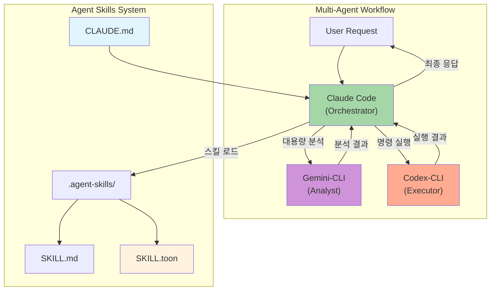
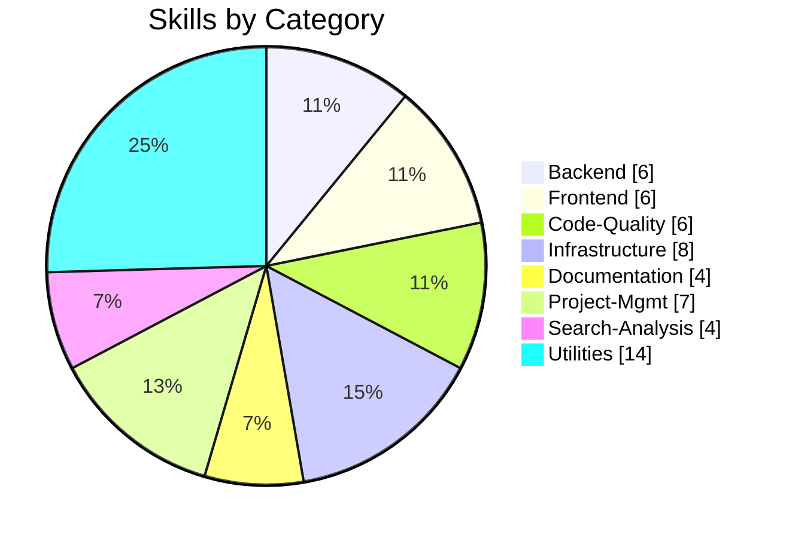

# Agent Skills

> Claude Code 중심의 Multi-Agent 워크플로우 시스템 (Gemini-CLI + Codex-CLI + OpenContext 통합)
> **Claude Code 완전 가이드 70가지 팁 적용** - 에이전틱 개발 정책 강화

[](LICENSE)
[](.agent-skills/)
[](CLAUDE.md)
[](.agent-skills/scripts/generate_compact_skills.py)
[](#-ai-agent-installation)


---

## Prerequisites (사전 요구사항)

> ⚠️ **중요**: 아래 요구사항이 충족되지 않으면 설치가 실패합니다.

### macOS (필수)

```bash
# 1. Xcode Command Line Tools (필수 - 없으면 npm/git 등이 동작하지 않음)
xcode-select --install

# 2. Node.js (Homebrew 권장)
brew install node

# 3. 설치 확인
node --version && npm --version
```

<details>
<summary><strong>❓ xcode-select 설치 실패 시</strong></summary>

**증상**: `xcode-select: error: command line tools are already installed` 또는 설치 창이 안 뜸

**해결 방법**:
```bash
# 방법 1: 기존 설치 제거 후 재설치
sudo rm -rf /Library/Developer/CommandLineTools
xcode-select --install

# 방법 2: Apple 개발자 사이트에서 직접 다운로드
open https://developer.apple.com/download/more/
# "Command Line Tools for Xcode" 검색 후 다운로드
```

</details>

<details>
<summary><strong>❓ Homebrew가 없는 경우</strong></summary>

```bash
# Homebrew 설치
/bin/bash -c "$(curl -fsSL https://raw.githubusercontent.com/Homebrew/install/HEAD/install.sh)"

# PATH 설정 (Apple Silicon Mac)
echo 'eval "$(/opt/homebrew/bin/brew shellenv)"' >> ~/.zshrc
source ~/.zshrc
```

</details>

### Linux (Debian/Ubuntu)

```bash
# 1. 빌드 도구 설치
sudo apt-get update
sudo apt-get install -y build-essential curl git

# 2. Node.js 20.x 설치
curl -fsSL https://deb.nodesource.com/setup_20.x | sudo -E bash -
sudo apt-get install -y nodejs

# 3. 설치 확인
node --version && npm --version
```

<details>
<summary><strong>❓ sudo 권한이 없는 경우 (nvm 사용)</strong></summary>

```bash
# nvm 설치
curl -o- https://raw.githubusercontent.com/nvm-sh/nvm/v0.40.1/install.sh | bash
source ~/.bashrc

# Node.js 설치
nvm install 20
nvm use 20
```

</details>

### Windows (WSL2 권장)

```powershell
# 1. WSL2 설치
wsl --install

# 2. Ubuntu 설치 후 재부팅
# 3. Ubuntu 터미널에서 Linux 가이드 따르기
```

<details>
<summary><strong>❓ WSL 없이 Windows에서 직접 사용</strong></summary>

```powershell
# Node.js 설치 (공식 사이트)
# https://nodejs.org/en/download/ 에서 LTS 버전 다운로드

# Git Bash 설치
# https://git-scm.com/download/win 에서 다운로드

# PowerShell에서 실행 정책 설정
Set-ExecutionPolicy -Scope CurrentUser -ExecutionPolicy RemoteSigned
```

> ⚠️ Windows 네이티브는 일부 스크립트가 호환되지 않을 수 있습니다. WSL2 사용을 권장합니다.

</details>

---

## 🚀 AI Agent Installation

> **LLM 기반 설치를 지원합니다.** 원라이너 명령 또는 AI 에이전트 프롬프트로 설치하세요.

### One-Liner 설치 (권장)

#### 글로벌 설치 (~/.agent-skills) - 기본값
```bash
curl -fsSL https://raw.githubusercontent.com/supercent-io/skills-template/main/install.sh | bash
```

> **설치 후 필수**: 
> ```bash
> echo 'source ~/.agent-skills/mcp-shell-config.sh' >> ~/.zshrc && source ~/.zshrc
> ```

#### 프로젝트 로컬 설치 (선택)
```bash
curl -fsSL https://raw.githubusercontent.com/supercent-io/skills-template/main/install.sh | INSTALL_GLOBAL=false bash
```

<details>
<summary><strong>❓ curl 명령이 실패하는 경우</strong></summary>

**증상**: `curl: (7) Failed to connect` 또는 `SSL certificate problem`

**해결 방법**:
```bash
# 방법 1: HTTPS 인증서 문제 우회 (임시)
curl -fsSLk https://raw.githubusercontent.com/... | bash

# 방법 2: 수동 다운로드 후 실행
wget https://raw.githubusercontent.com/supercent-io/skills-template/main/install.sh
chmod +x install.sh && ./install.sh
```

</details>

<details>
<summary><strong>❓ npm 권한 오류 (EACCES)</strong></summary>

**증상**: `npm ERR! Error: EACCES: permission denied`

**해결 방법**:
```bash
# npm 글로벌 디렉토리 변경
npm config set prefix '~/.npm-global'
echo 'export PATH=~/.npm-global/bin:$PATH' >> ~/.zshrc
source ~/.zshrc

# 다시 설치 시도
curl -fsSL https://raw.githubusercontent.com/supercent-io/skills-template/main/install.sh | bash
```

</details>

### 🤖 AI 에이전트용 프롬프트

Claude Code, Gemini, ChatGPT 등에게 아래 프롬프트를 **복사-붙여넣기**하세요:

#### 프로젝트 로컬 설치 프롬프트
```
https://github.com/supercent-io/skills-template 저장소를 임시로 클론하고, .agent-skills 폴더를 현재 디렉토리로 복사해. 그 후 setup.sh를 --silent --install-mcp 모드로 실행하고, 임시 클론 폴더는 삭제해.
```

#### 글로벌 설치 프롬프트
```
https://github.com/supercent-io/skills-template 저장소를 임시로 클론하고,
.agent-skills 폴더를 ~/.agent-skills 로 복사해줘.
그 후, ~/.agent-skills/setup.sh를 --silent --install-mcp 모드로 실행하고,
임시 클론 폴더는 삭제해.
설치가 완료되면, "source ~/.agent-skills/mcp-shell-config.sh" 명령을
~/.zshrc에 추가해야 한다고 안내해줘.
```

### ✅ 설치 후 검증 (LLM 프롬프트)

설치 완료 후, AI 에이전트에게 아래 프롬프트를 입력하여 설정을 확인하세요:

```
.agent-skills 폴더 설치를 확인해줘. 다음 항목을 검증하고 리포트해:

1. **스킬 시스템 확인**:
   - .agent-skills/skills/ 폴더에 스킬이 존재하는지
   - python3 .agent-skills/skill-query-handler.py stats 실행 결과

2. **MCP 서버 확인**:
   - claude mcp list 실행하여 등록된 MCP 서버 목록
   - gemini-cli, codex-cli, opencontext 중 설치된 것 표시

3. **서브에이전트 설정 확인**:
   - CLAUDE.md 파일이 존재하는지
   - model-config.env 설정 내용

4. **누락된 설정 자동 적용**:
   - 누락된 MCP 서버가 있다면 설치 명령 제안
   - 설정 파일이 없다면 기본 설정 생성

검증 결과를 표 형태로 요약하고, 해결이 필요한 항목이 있다면 수정해줘.
```

<details>
<summary><strong>📦 설치 모드별 옵션 (클릭하여 펼치기)</strong></summary>

| 모드 | 명령어 | 설명 |
|------|--------|------|
| **Silent + MCP (권장)** | `setup.sh --silent --install-mcp` | 완전 자동화, MCP 서버 자동 설치 |
| **Silent** | `setup.sh --silent` | 자동 감지, 기본값 적용 |
| **Auto** | `setup.sh --auto` | 대화형 없이 전체 설정 |
| **Quick** | `setup.sh --quick` | 토큰 최적화 파일만 생성 |
| **Interactive** | `setup.sh` | 단계별 대화형 설정 |

**환경 변수 옵션:**
```bash
# MCP 서버 자동 설치 비활성화
INSTALL_MCP=false curl -fsSL ... | bash

# 기존 폴더 백업 건너뛰기
SKIP_BACKUP=true curl -fsSL ... | bash
```

</details>

<details>
<summary><strong>🔒 보안 중시 설치 (2단계)</strong></summary>

스크립트를 먼저 확인한 후 실행하고 싶다면:

```bash
# 1. 스크립트 다운로드
curl -fsSLO https://raw.githubusercontent.com/supercent-io/skills-template/main/install.sh

# 2. 스크립트 내용 확인 (선택)
cat install.sh

# 3. 실행
bash install.sh
```

</details>

<details>
<summary><strong>🔧 수동 설치 (개발자용)</strong></summary>

```bash
# 1. 저장소 클론
git clone https://github.com/supercent-io/skills-template.git /tmp/skills-template

# 2. .agent-skills 복사
cp -rf /tmp/skills-template/.agent-skills .

# 3. 설정 실행
chmod +x .agent-skills/setup.sh && .agent-skills/setup.sh --silent

# 4. 정리
rm -rf /tmp/skills-template
```

</details>

---

## LLM CLI 설치 가이드

> 최소 1개 이상의 LLM CLI가 필요합니다. Claude Code를 권장합니다.

### Claude Code 설치 (Orchestrator - 필수 권장)

```bash
# macOS/Linux
curl -fsSL https://claude.ai/install.sh | sh

# npm (대안)
npm install -g @anthropic-ai/claude-code

# 설치 확인
claude --version
```

<details>
<summary><strong>❓ claude 명령어를 찾을 수 없는 경우</strong></summary>

```bash
# PATH 확인
echo $PATH

# npm 글로벌 bin 경로 추가
export PATH="$(npm config get prefix)/bin:$PATH"
echo 'export PATH="$(npm config get prefix)/bin:$PATH"' >> ~/.zshrc
source ~/.zshrc
```

</details>

### Gemini CLI 설치 (Analyst - 대용량 분석)

```bash
# npm으로 설치 (Google 공식)
npm install -g @google/gemini-cli

# 설치 확인
gemini --version
```

### Codex CLI 설치 (Executor - 명령 실행)

```bash
# npm으로 설치 (OpenAI 공식)
npm install -g @openai/codex

# 설치 확인
codex --version
```

### OpenContext CLI 설치 (AI 영구 메모리)

```bash
# npm으로 설치
npm install -g @aicontextlab/cli

# 프로젝트 초기화
cd your-project && oc init
```

**OpenContext 핵심 명령어:**
```bash
/opencontext-context    # 작업 전 배경 로드 (권장)
/opencontext-search     # 기존 문서 검색
/opencontext-create     # 새 문서 작성
/opencontext-iterate    # 결론 저장
```

<details>
<summary><strong>🔌 MCP 서버 연동 (Claude Code 전용)</strong></summary>

```bash
# Gemini-CLI MCP 추가 (대용량 분석)
claude mcp add gemini-cli -s user -- npx -y @anthropic-ai/gemini-mcp

# Codex-CLI MCP 추가 (명령 실행)
claude mcp add codex-cli -s user -- npx -y @openai/codex-mcp

# OpenContext MCP 추가 (영구 메모리)
claude mcp add opencontext -s user -- oc mcp
```

</details>

---

## 📁 스킬/서브에이전트 설정 위치

> 설치 후 커스터마이징이 필요한 설정 파일들의 위치와 역할입니다.

### 설정 파일 경로

| 파일 | 위치 | 역할 |
|:-----|:-----|:-----|
| **CLAUDE.md** | 프로젝트 루트 | Claude Code 시스템 프롬프트, 프로젝트 컨텍스트 |
| **model-config.env** | `.agent-skills/` | 에이전트별 모델 설정 (orchestrator/analyst/executor) |
| **agent-routing.yaml** | `.agent-skills/` | 작업 유형별 에이전트 라우팅 규칙 |
| **skills.json** | `.agent-skills/` | 전체 스킬 매니페스트 (자동 생성) |
| **skills.toon** | `.agent-skills/` | 토큰 최적화된 스킬 요약 (자동 생성) |

### 서브에이전트 설정 방법

#### 1. model-config.env 수정

```bash
# 에이전트별 모델 지정
ORCHESTRATOR_MODEL=claude-opus-4-5
ANALYST_MODEL=gemini-2.5-pro
EXECUTOR_MODEL=gpt-5.2-codex

# 토큰 최적화 설정
DEFAULT_SKILL_MODE=toon
MAX_CONTEXT_TOKENS=100000
```

#### 2. agent-routing.yaml 커스터마이징

```yaml
routing:
  code_generation: orchestrator
  large_analysis: analyst  # 2M+ 토큰 분석
  command_execution: executor
  documentation: orchestrator
  
performance_tweaks:
  ralph_loop_enabled: true  # 경량 모델 프롬프트 반복
  auto_context_compress: true
```

#### 3. CLAUDE.md 프로젝트 컨텍스트

```markdown
# Project Context

## 프로젝트 설명
[프로젝트 목적과 범위]

## 기술 스택
- Frontend: React 18, TypeScript
- Backend: Node.js, Express

## 코딩 컨벤션
- ESLint + Prettier 사용
- 함수형 컴포넌트 선호

## 금지 사항
- console.log 커밋 금지
- any 타입 사용 금지
```

<details>
<summary><strong>📋 설정 파일 생성 명령어</strong></summary>

```bash
# 시스템 진단 (설정 파일 자동 생성)
.agent-skills/setup.sh --diagnose

# 수동으로 기본 설정 생성
.agent-skills/setup.sh --silent

# 특정 설정 파일만 확인
cat .agent-skills/model-config.env
cat .agent-skills/agent-routing.yaml
```

</details>

---

## 사용 예제

### 스킬 호출 CLI 예시

```bash
# 자연어로 스킬 검색
python3 .agent-skills/skill-query-handler.py query "API 설계해줘"

# 특정 스킬 직접 로드 (토큰 절약)
python3 .agent-skills/skill-query-handler.py query "코드 리뷰" --mode toon

# 스킬 목록 확인
python3 .agent-skills/skill_loader.py list

# 토큰 통계 확인
python3 .agent-skills/skill-query-handler.py stats
```

### AI 에이전트 프롬프트 예제

| 목적 | 프롬프트 |
|------|----------|
| **스킬 검색** | `"API 설계" 관련 스킬을 찾아서 로드해줘` |
| **코드 리뷰** | `code-review 스킬을 사용해서 src/ 폴더를 리뷰해줘` |
| **DB 스키마 설계** | `database-schema-design 스킬로 사용자 관리 시스템 스키마를 설계해줘` |
| **PPT 작성** | `presentation-builder 스킬을 로드하고 투자자 발표 자료 10슬라이드로 만들어줘` |
| **Docker 배포** | `deployment-automation 스킬을 사용해서 Docker Compose 설정을 만들어줘` |

---

<details>
<summary><h2>🏗️ Architecture (클릭하여 펼치기)</h2></summary>



### Agent Roles

| Agent | Role | Model | Best For |
|-------|------|-------|----------|
| **Claude Code** | Orchestrator | `claude-opus-4-5` | 계획 수립, 코드 생성, 스킬 해석 |
| **Gemini CLI** | Analyst | `gemini-2.5-pro` | 대용량 분석 (2M+ 토큰), 리서치 |
| **Codex CLI** | Executor | `gpt-5.2-codex` | 명령 실행, 빌드, 배포 |

### Workflow Types (Auto-Detected)

| Type | 조건 | 설명 |
|------|------|------|
| `standalone` | CLI 없음 | 기본 스킬만 사용 |
| `claude-only` | Claude만 있음 | 내장 Bash 사용 |
| `claude-gemini` | +Gemini | 대용량 분석/리서치 |
| `claude-codex` | +Codex | 실행/배포 자동화 |
| `full-multiagent` | 모두 있음 | 풀 오케스트레이션 |

</details>

---

<details>
<summary><h2>📊 Skills Overview - 55 Total (클릭하여 펼치기)</h2></summary>



| Category | Count | Skills |
|:---------|:-----:|:-------|
| **Backend** | 6 | `api-design` `database-schema-design` `authentication-setup` `backend-testing` `kling-ai` `cs-tool-dashboard` |
| **Frontend** | 6 | `ui-component-patterns` `state-management` `responsive-design` `web-accessibility` `web-design-guidelines` `react-best-practices` |
| **Code-Quality** | 6 | `code-review` `code-refactoring` `testing-strategies` `performance-optimization` `debugging` `agent-evaluation` |
| **Infrastructure** | 8 | `system-environment-setup` `deployment-automation` `monitoring-observability` `security-best-practices` `firebase-ai-logic` `looker-studio-bigquery` `agent-configuration` `vercel-deploy` |
| **Documentation** | 4 | `technical-writing` `api-documentation` `user-guide-writing` `changelog-maintenance` |
| **Project-Mgmt** | 7 | `task-planning` `task-estimation` `sprint-retrospective` `standup-meeting` `ultrathink-multiagent-workflow` `subagent-creation` `agentic-principles` |
| **Search-Analysis** | 4 | `codebase-search` `log-analysis` `data-analysis` `pattern-detection` |
| **Utilities** | 14 | `git-workflow` `git-submodule` `environment-setup` `file-organization` `workflow-automation` `skill-standardization` `mcp-codex-integration` `opencode-authentication` `npm-git-install` `project-init-memory` `agentic-workflow` `opencontext` `prompt-repetition` `agentic-development-principles` |

</details>

---

<details>
<summary><h2>🎯 Token Optimization (클릭하여 펼치기)</h2></summary>

스킬 로딩 시 토큰 사용량을 최적화하는 3가지 모드:

| Mode | File | Avg Tokens | Reduction | Use Case |
|:-----|:-----|:-----------|:----------|:---------|
| **full** | SKILL.md | ~2,198 | - | 상세 예시 필요 시 |
| **compact** | SKILL.compact.md | ~270 | 87.7% | 일반 작업 |
| **toon** | SKILL.toon | ~112 | 94.9% | 빠른 참조 (기본값) |

```bash
# 토큰 최적화 파일 생성
python3 .agent-skills/scripts/generate_compact_skills.py

# 토큰 통계 확인
python3 .agent-skills/skill-query-handler.py stats
```

</details>

---

<details>
<summary><h2>📋 Claude Code 정책 (클릭하여 펼치기)</h2></summary>

> 70가지 팁 기반의 에이전틱 개발 정책 (ykdojo + Ado Kukic 검증)

### 핵심 6대 원칙

| 원칙 | 핵심 내용 | 적용 방법 |
|------|----------|----------|
| **1. 분해정복** | 큰 문제 → 작은 단계 | 각 단계 독립 검증 가능하게 분할 |
| **2. 컨텍스트 관리** | 신선하게 유지 | 단일 목적 대화, HANDOFF.md, `/clear` |
| **3. 추상화 선택** | 상황별 깊이 조절 | Vibe Coding ↔ Deep Dive |
| **4. 자동화²** | 반복 → 자동화 | 3회 반복 시 자동화 방법 탐색 |
| **5. 계획/YOLO** | 기본 계획 모드 | 계획 90%, YOLO는 컨테이너에서만 |
| **6. 검증 회고** | 출력 검증 필수 | 테스트, Draft PR, 자기 검증 |

### 필수 명령어

```bash
# 세션 시작 시
/usage          # 토큰 한도 확인

# 작업 중
/context        # 컨텍스트 상태 확인
Esc Esc         # 잘못된 작업 즉시 취소

# 컨텍스트 관리 (50k 토큰 초과 시)
/clear          # 컨텍스트 초기화
```

### 보안 정책

#### ❌ 절대 금지
```
- --dangerously-skip-permissions 사용
- rm -rf /, sudo rm 등 위험 명령어
- .env, credentials.json 시크릿 커밋
- API 키 하드코딩
```

#### ✅ 권장 사항
```bash
/sandbox "npm test"
/sandbox "npm run lint"
npx cc-safe .  # 정기적 보안 감사
```

</details>

---

<details>
<summary><h2>⌨️ Quick Reference (클릭하여 펼치기)</h2></summary>

### 필수 단축키

```
Esc Esc         작업 즉시 취소 (가장 중요!)
Ctrl+R          히스토리 검색
Shift+Tab ×2    계획 모드 토글
Ctrl+B          백그라운드 실행
```

### CLI 플래그

```bash
claude --continue       마지막 대화 이어가기
claude --resume <name>  특정 세션 복구
claude -p "prompt"      Headless 모드
```

### 별칭 설정

```bash
# ~/.zshrc 또는 ~/.bashrc
alias c='claude'
alias cc='claude --continue'
alias cr='claude --resume'
```

</details>

---

<details>
<summary><h2>🤝 Multi-Agent Workflow Guide (클릭하여 펼치기)</h2></summary>

멀티에이전트 조합으로 작업 효율을 극대화하세요.

### Agent 역할 분담

| Agent | 강점 | 맡길 작업 |
|-------|------|----------|
| **Claude** | 창의적 코드 생성, 아키텍처 설계 | 복잡한 로직 구현, 리팩토링, 설계 문서 |
| **Gemini** | 대용량 분석, 빠른 검색 | 코드베이스 분석, API 조사, 프로토타이핑 |
| **Codex** | 정형화된 실행, 명령 처리 | 빌드, 테스트, 배포, 스크립트 실행 |

### 워크플로우 예시: API 개발

```
1. [Claude] "사용자 인증 API 설계해줘" → 아키텍처 + 스펙 생성
2. [Gemini] "기존 auth 코드 패턴 분석해줘" → 대용량 코드 분석
3. [Claude] 분석 결과 반영하여 코드 구현
4. [Codex] "npm test && npm run build" → 테스트 및 빌드
5. [Claude] 결과 종합 및 문서화
```

</details>

---

<details>
<summary><h2>📚 실전 예제 시나리오 (클릭하여 펼치기)</h2></summary>

### 시나리오 1: Full-Stack 프로젝트 구축

**목표**: 디자인 레이아웃 → 백엔드 DB 스키마 → Docker 배포 → Git 관리까지

| 단계 | 스킬 | Agent |
|------|------|-------|
| **1. 디자인 레이아웃** | `frontend/design-system` `frontend/responsive-design` | Claude |
| **2. DB 스키마 설계** | `backend/database-schema-design` `backend/api-design` | Claude |
| **3. Docker 연동** | `infrastructure/deployment-automation` | Codex |
| **4. Git 관리** | `utilities/git-workflow` | Codex |

### 시나리오 2: 마케팅 데이터 분석

| 단계 | 스킬 | Agent |
|------|------|-------|
| **1. 데이터 분석** | `search-analysis/data-analysis` | Gemini |
| **2. 데이터 시각화** | `infrastructure/looker-studio-bigquery` | Claude |
| **3. PPT 작성** | `documentation/presentation-builder` | Claude |

### 시나리오 3: AI 이미지/영상 프롬프트

| 단계 | 스킬 | Agent |
|------|------|-------|
| **1. 이미지 생성 프롬프트** | `creative-media/image-generation` | Claude |
| **2. 영상 프로덕션 가이드** | `creative-media/video-production` | Claude |
| **3. 디자인 가이드 문서** | `frontend/web-design-guidelines` | Claude |

</details>

---

<details>
<summary><h2>🔧 Troubleshooting (클릭하여 펼치기)</h2></summary>

### 시스템 진단

```bash
cd .agent-skills && ./setup.sh --diagnose
```

> **참고**: `--diagnose`의 Configuration Files 섹션이 ❌로 표시되더라도, 설정 파일은 정상적으로 생성됩니다.

### 스킬 쿼리 테스트

```bash
# 스킬 매칭 테스트
python3 .agent-skills/skill-query-handler.py match "API 설계"

# 스킬 목록
python3 .agent-skills/skill_loader.py list
```

### MCP 서버 문제

```bash
claude mcp list            # 상태 확인
claude mcp remove <name>   # 제거
claude mcp add <name> ...  # 재설치
```

### Python 모듈 오류

```bash
cd .agent-skills && pip3 install -r requirements.txt
```

### 글로벌 설치 후 스킬 못 찾는 경우

```bash
# 직접 경로 지정
python3 ~/.agent-skills/skill-query-handler.py query "API 설계"
```

</details>

---

<details>
<summary><h2>📖 References (클릭하여 펼치기)</h2></summary>

| Resource | Link |
|:---------|:-----|
| Claude Code 공식 | [docs.anthropic.com](https://docs.anthropic.com/en/docs/claude-code) |
| Claude Code Best Practices | [Anthropic Engineering](https://www.anthropic.com/engineering/claude-code-best-practices) |
| ykdojo claude-code-tips | [GitHub](https://github.com/ykdojo/claude-code-tips) |
| Agent Skills 공식 | [agentskills.io](https://agentskills.io/) |

</details>

---

## License

MIT License - see [LICENSE](LICENSE) for details.

---

**Version**: 3.17.0 | **Updated**: 2026-01-23 | **Skills**: 55 | **Workflow**: Multi-Agent (Auto-Detect) | **Token**: 95% Reduction

**Changelog v3.17.0**:
- **README 전면 개편**: 설치 가이드 중심으로 재구성
- **예외 케이스 처리 강화**: xcode-select, npm 권한, curl 실패 등 상세 안내
- **스킬/서브에이전트 설정 위치 섹션 신설**: model-config.env, agent-routing.yaml, CLAUDE.md 설정 가이드
- **접이식(collapsible) UI 적용**: 핵심 설치 가이드 외 내용은 접이식으로 정리
- **친절한 Troubleshooting**: 각 예외 케이스별 해결 방법 세분화
