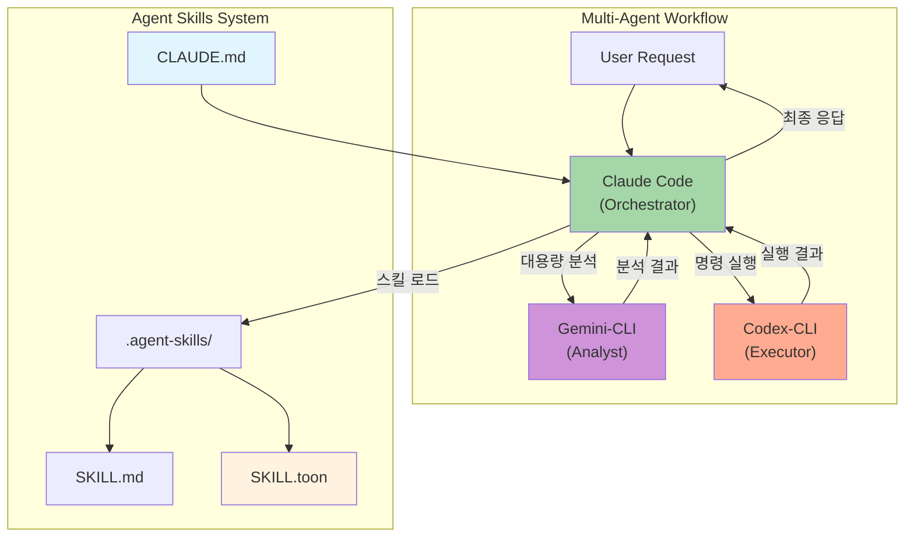
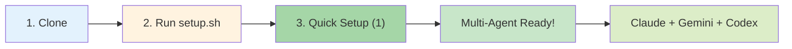
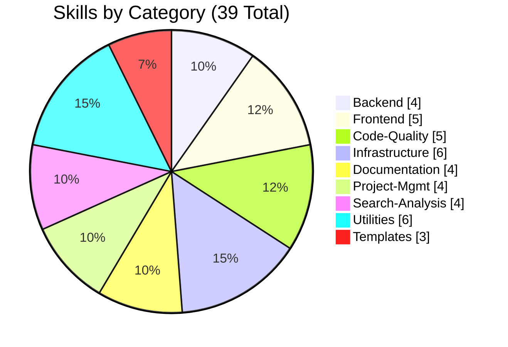
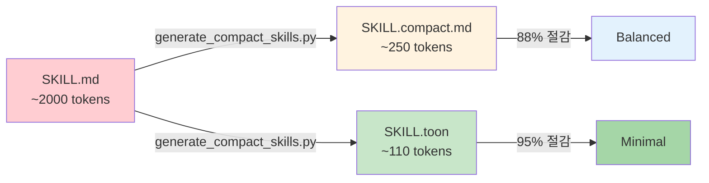
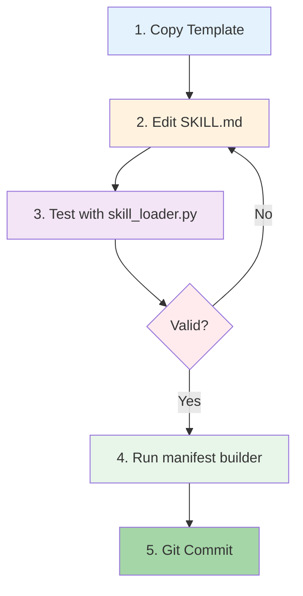
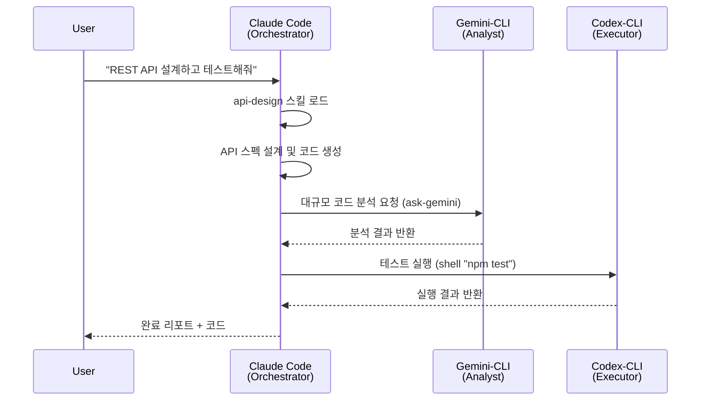

# Agent Skills

> Claude Code 중심의 Multi-Agent 워크플로우 시스템 (Gemini-CLI + Codex-CLI 통합)

[](LICENSE)
[](https://www.python.org/)
[](.agent-skills/)
[](CLAUDE.md)
[](.agent-skills/scripts/generate_compact_skills.py)

## Architecture



## Features

| Feature | Description | Status |
|---------|-------------|--------|
| **Multi-Agent Workflow** | Claude + Gemini + Codex 자동 오케스트레이션 | ✅ |
| **39 Skills** | 8개 카테고리의 실전 스킬 | ✅ |
| **Token Optimization** | 95% 토큰 절감 (toon 모드 기본) | ✅ |
| **Auto Orchestration** | CLAUDE.md 기반 에이전트 역할 자동 분배 | ✅ |
| **MCP Integration** | gemini-cli, codex-cli 원클릭 설정 | ✅ |
| **Smart Query Matching** | 사용자 쿼리 기반 스킬 자동 매칭 | ✅ |
| **Quick Setup** | `setup.sh` 7단계 통합 설정 | ✅ |
| **Open Standard** | Agent Skills 오픈 표준 준수 | ✅ |

## Quick Start



```bash
# 1. 저장소 클론
git clone https://github.com/your-org/skills-template.git
cd skills-template

# 2. Quick Setup 실행 (권장)
cd .agent-skills && ./setup.sh
# → 옵션 1 선택 (Multi-Agent workflow + Token optimization + MCP servers)

# 3. 셸 재시작
source ~/.zshrc  # or ~/.bashrc

# 4. Multi-Agent 워크플로우 테스트
claude  # Claude Code 실행 → "REST API 설계하고 테스트해줘"
```

### Quick Setup 7단계

| Step | Action | Result |
|------|--------|--------|
| 1 | Token optimization | SKILL.toon 생성 (95% 절감) |
| 2 | Claude skills | .claude/skills/ 복사 |
| 3 | MCP shell config | gemini-skill, codex-skill 함수 |
| 4 | Shell RC config | ~/.zshrc 자동 설정 |
| 5 | Multi-Agent orchestration | CLAUDE.md 생성 |
| 6 | MCP servers | gemini-cli, codex-cli 등록 |
| 7 | Verification | 설정 확인 |

## Skills Overview

### Categories



### Detailed Skills

| Category | Count | Skills |
|:---------|:-----:|:-------|
| **Backend** | 4 | `api-design` `database-schema-design` `authentication-setup` `backend-testing` |
| **Frontend** | 5 | `ui-component-patterns` `state-management` `responsive-design` `web-accessibility` `react-components` |
| **Code-Quality** | 5 | `code-review` `code-refactoring` `testing-strategies` `performance-optimization` `debugging` |
| **Infrastructure** | 6 | `system-environment-setup` `deployment-automation` `monitoring-observability` `security-best-practices` `docker-containerization` `firebase-ai-logic` |
| **Documentation** | 4 | `technical-writing` `api-documentation` `user-guide-writing` `changelog-maintenance` |
| **Project-Mgmt** | 4 | `task-planning` `task-estimation` `sprint-retrospective` `standup-meeting` |
| **Search-Analysis** | 4 | `codebase-search` `log-analysis` `data-analysis` `pattern-detection` |
| **Utilities** | 6 | `git-workflow` `environment-setup` `file-organization` `workflow-automation` `skill-standardization` `mcp-codex-integration` |

> **Total: 39 Skills** (including 3 templates)

## Token Optimization

스킬 로딩 시 토큰 사용량을 최적화하는 3가지 모드를 제공합니다.



### 모드 비교

| Mode | File | Avg Tokens | Reduction | Use Case |
|:-----|:-----|:-----------|:----------|:---------|
| **full** | SKILL.md | ~2,000 | - | 상세 예시 필요 시 |
| **compact** | SKILL.compact.md | ~250 | 88% | 일반 작업 (기본값) |
| **toon** | SKILL.toon | ~110 | 95% | 빠른 참조, 간단한 쿼리 |

### 토큰 최적화 실행

```bash
# setup.sh 옵션 7 사용 (권장)
cd .agent-skills && ./setup.sh  # 옵션 7 선택

# 또는 직접 실행
python3 scripts/generate_compact_skills.py

# 통계 확인
python3 skill-query-handler.py stats
```

### 모드별 사용

```bash
# 기본: compact 모드 (88% 토큰 절감)
gemini-skill "REST API 설계해줘"

# full 모드: 상세 예시 포함
gemini-skill "REST API 설계해줘" full

# toon 모드: 최소 토큰 (95% 절감)
gemini-skill "REST API 설계해줘" toon

# skill-query-handler 직접 사용
python3 skill-query-handler.py query "쿼리" --mode compact
python3 skill-query-handler.py query "쿼리" --mode toon
```

### TOON 포맷 예시

```
N:api-design
D:Design RESTful and GraphQL APIs following best practices...
G:api-design REST GraphQL OpenAPI
U[3]:
  REST API 설계 시
  GraphQL 스키마 작성 시
  API 버저닝 결정 시
S[4]{n,action}:
  1,Define resources and endpoints
  2,Design request/response schemas
  3,Add authentication and authorization
  4,Document with OpenAPI
R[5]:
  Use nouns for resources
  HTTP methods correctly
  Consistent error format
```

## Adding New Skills

### 자동 스킬 추가 (권장)

```bash
# 기본 템플릿
./scripts/add_new_skill.sh <category> <skill-name>

# 고급 템플릿 (REFERENCE.md, EXAMPLES.md 포함)
./scripts/add_new_skill.sh <category> <skill-name> --template advanced

# 예시
./scripts/add_new_skill.sh backend graphql-api --description "Design GraphQL APIs"
```

### 수동 스킬 추가



```bash
# 1. 템플릿 복사
cp -r templates/basic-skill-template backend/my-skill

# 2. SKILL.md 편집
# name, description 정의 및 상세 지침 작성

# 3. 테스트
python skill_loader.py show my-skill

# 4. 매니페스트 갱신
python scripts/skill_manifest_builder.py

# 5. Git 커밋
git add backend/my-skill && git commit -m "Add my-skill"
```

## Multi-Agent Workflow

> Claude Code가 오케스트레이터로서 Gemini-CLI와 Codex-CLI를 자동으로 활용합니다.



### Agent Roles

| Agent | Role | MCP Tool | Best For |
|-------|------|----------|----------|
| **Claude Code** | Orchestrator | Built-in | 계획 수립, 코드 생성, 스킬 해석 |
| **Gemini-CLI** | Analyst | `ask-gemini` | 대용량 분석 (1M+ 토큰), 리서치 |
| **Codex-CLI** | Executor | `shell` | 명령 실행, 빌드, 배포 |

### Orchestration Examples

```bash
# Example 1: API 설계 + 테스트
"REST API를 설계하고 테스트해줘"
# → Claude: 스킬 로드 → API 설계 → Codex: npm test → Claude: 리포트

# Example 2: 대규모 코드 리뷰
"전체 코드베이스를 분석해줘"
# → Claude: 파일 식별 → Gemini: 대용량 분석 → Claude: 개선점 도출

# Example 3: 인프라 배포
"Docker로 배포해줘"
# → Claude: 스킬 기반 계획 → Codex: docker-compose up → Claude: 결과 확인
```

### CLAUDE.md (Orchestration File)

Quick Setup 실행 시 프로젝트 루트에 `CLAUDE.md`가 생성됩니다. 이 파일은 Claude Code가 자동으로 읽어 multi-agent 워크플로우를 이해합니다.

## Platform Support

### Platform Comparison

| Platform | Setup | AI Response | Skill Loading | Shell Exec |
|:---------|:------|:-----------:|:--------------|:----------:|
| **Claude Code** | `setup.sh` → 1 | ✅ | Automatic | ✅ |
| **ChatGPT** | `setup.sh` → 2 | ✅ | Knowledge Upload | ❌ |
| **Gemini** | `setup.sh` → 3 | ✅ | Python API | ❌ |
| **Gemini-CLI** | `setup.sh` → 6 | ✅ | @file syntax | ❌ |
| **Codex-CLI** | `setup.sh` → 6 | ❌ | N/A | ✅ |

### Claude Code

```bash
# setup.sh 실행 후 자동 설정
# 스킬이 ~/.claude/skills/ 또는 .claude/skills/에 복사됨
claude  # Claude가 자동으로 스킬 감지
```

### ChatGPT

```bash
# setup.sh에서 옵션 2 선택
# 생성된 zip 파일을 Custom GPT Knowledge에 업로드
```

### Gemini

```python
from skill_loader import SkillLoader
import google.generativeai as genai

loader = SkillLoader('.agent-skills')
skill = loader.get_skill('api-design')

genai.configure(api_key='YOUR_API_KEY')
model = genai.GenerativeModel('gemini-2.0-flash')
response = model.generate_content(f"{skill['body']}\n\nDesign a REST API")
```

### MCP Integration (gemini-cli / codex-cli)

```bash
# 1. setup.sh에서 옵션 6 선택하여 MCP 설정
cd .agent-skills && ./setup.sh  # 옵션 6 선택

# 2. 스킬 쿼리 핸들러 사용 (자동 스킬 매칭)
python3 skill-query-handler.py list                    # 전체 스킬 목록
python3 skill-query-handler.py match "REST API 설계"   # 스킬 매칭
python3 skill-query-handler.py query "코드 리뷰해줘"   # 프롬프트 생성

# 3. Claude Code에서 MCP 도구 사용
# "gemini-cli를 사용해서 .agent-skills/backend/api-design/SKILL.md의
#  가이드라인을 따라 사용자 관리 API를 설계해줘"

# 4. Shell에서 직접 사용 (mcp-shell-config.sh 설정 후)
gemini-skill "Design a REST API for users"
codex-skill "Run tests and show results"
```

### Skill Query Handler

사용자 쿼리를 분석하여 자동으로 적합한 스킬을 매칭하고 MCP 도구용 프롬프트를 생성합니다.

```bash
# 사용 예시
python3 skill-query-handler.py query "데이터베이스 스키마 설계해줘" --tool gemini
# 출력: @/path/to/.agent-skills/backend/database-schema-design/SKILL.md
#       데이터베이스 스키마 설계해줘

python3 skill-query-handler.py match "보안 취약점"
# 출력: [3] infrastructure/security-best-practices
```

## Project Structure

```
skills-template/
├── .agent-skills/                  # 핵심 스킬 시스템
│   ├── setup.sh                    # 플랫폼별 설정 스크립트
│   ├── skill-query-handler.py      # 스킬 쿼리 핸들러 (MCP용)
│   ├── skill_loader.py             # Python 스킬 로더
│   ├── mcp-skill-loader.sh         # MCP 스킬 로더 (Shell)
│   ├── mcp-shell-config.sh         # Shell RC 설정 스니펫
│   ├── MCP_CONTEXT.md              # MCP 컨텍스트 문서
│   ├── scripts/
│   │   ├── add_new_skill.sh        # 스킬 자동 생성
│   │   ├── generate_compact_skills.py  # 토큰 최적화 (compact/toon 생성)
│   │   ├── convert_skills.py       # 스킬 표준화 스크립트
│   │   └── skill_manifest_builder.py
│   ├── backend/                    # 백엔드 스킬 (4)
│   ├── frontend/                   # 프론트엔드 스킬 (5)
│   ├── code-quality/               # 코드 품질 스킬 (5)
│   ├── infrastructure/             # 인프라 스킬 (6)
│   ├── documentation/              # 문서화 스킬 (4)
│   ├── project-management/         # 프로젝트 관리 스킬 (4)
│   ├── search-analysis/            # 검색/분석 스킬 (4)
│   ├── utilities/                  # 유틸리티 스킬 (6)
│   └── templates/                  # 스킬 템플릿 (3)
├── .claude/skills/                 # Claude Code 스킬 (setup.sh로 생성)
├── work/                           # 작업 문서
├── docs/                           # 문서
└── README.md
```

## CLI Tools

### skill_loader.py (스킬 로더)

| Command | Description | Example |
|:--------|:------------|:--------|
| `list` | 모든 스킬 목록 | `python skill_loader.py list` |
| `search` | 스킬 검색 | `python skill_loader.py search "api"` |
| `show` | 스킬 상세 보기 | `python skill_loader.py show api-design` |
| `prompt` | 프롬프트 생성 | `python skill_loader.py prompt --skills api-design` |

### skill-query-handler.py (MCP 쿼리 핸들러)

| Command | Description | Example |
|:--------|:------------|:--------|
| `list` | 인덱싱된 스킬 목록 | `python skill-query-handler.py list` |
| `match` | 쿼리에 맞는 스킬 찾기 | `python skill-query-handler.py match "REST API"` |
| `query` | MCP용 프롬프트 생성 | `python skill-query-handler.py query "API 설계"` |
| `prompt` | 특정 스킬로 프롬프트 | `python skill-query-handler.py prompt "쿼리" --skill backend/api-design` |
| `stats` | 토큰 사용량 통계 | `python skill-query-handler.py stats` |

**옵션:**
| Option | Description | Values |
|:-------|:------------|:-------|
| `--mode` | 토큰 최적화 모드 | `full`, `compact` (기본), `toon` |
| `--tool` | MCP 도구 선택 | `gemini`, `codex` |
| `--skill` | 특정 스킬 지정 | `backend/api-design` |

### generate_compact_skills.py (토큰 최적화)

| Command | Description | Example |
|:--------|:------------|:--------|
| (기본) | 전체 스킬 compact/toon 생성 | `python generate_compact_skills.py` |
| `--skill` | 특정 스킬만 처리 | `--skill backend/api-design` |
| `--stats` | 통계 표시 | `--stats` |
| `--clean` | 생성 파일 삭제 | `--clean` |

### Add New Skill

| Option | Description | Example |
|:-------|:------------|:--------|
| `--template` | 템플릿 선택 | `--template advanced` |
| `--description` | 스킬 설명 | `--description "API caching"` |
| `--tools` | 허용 도구 | `--tools "Read,Write"` |

## Contributing

| Topic | Description |
|:------|:------------|
| **Guide** | `CONTRIBUTING.md` 참조 |
| **Template** | `templates/basic-skill-template/` |
| **Frontmatter** | `name`, `description` 필수 |
| **Review** | PR 제출 후 코드 리뷰 |

## References

| Resource | Link |
|:---------|:-----|
| Agent Skills 공식 | [agentskills.io](https://agentskills.io/) |
| 사양 문서 | [Specification](https://agentskills.io/specification) |
| Claude Code Skills | [Documentation](https://docs.anthropic.com/en/docs/claude-code) |
| Quick Start | [QUICKSTART.md](.agent-skills/QUICKSTART.md) |
| Contributing | [CONTRIBUTING.md](.agent-skills/CONTRIBUTING.md) |
| Multi-Agent Test | [result.md](work/result.md) |

## License

MIT License - see [LICENSE](LICENSE) for details.

---

**Version**: 2.3.0 | **Updated**: 2026-01-06 | **Skills**: 39 | **Workflow**: Multi-Agent | **Token**: 95% Reduction
