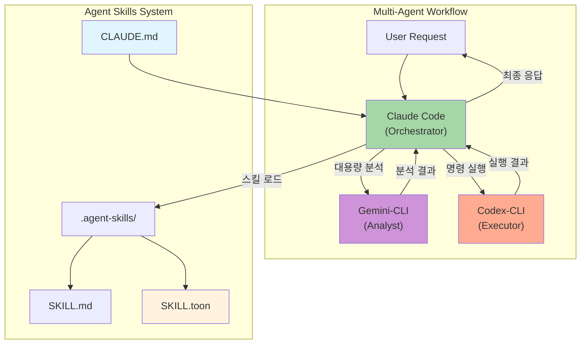
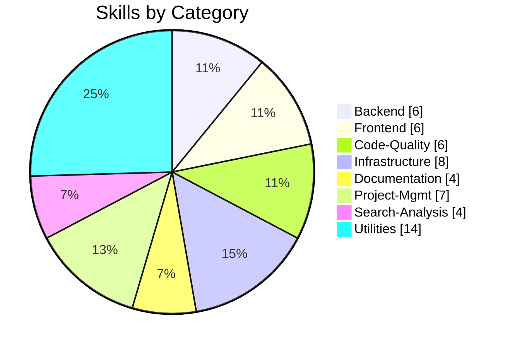
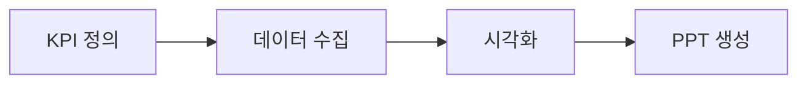

# Agent Skills

> Claude Code 중심의 Multi-Agent 워크플로우 시스템 (Gemini-CLI + Codex-CLI + OpenContext 통합)
> **Claude Code 완전 가이드 70가지 팁 적용** - 에이전틱 개발 정책 강화

[](LICENSE)
[](.agent-skills/)
[](CLAUDE.md)
[](.agent-skills/scripts/generate_compact_skills.py)
[](#-ai-agent-installation)


---

## AI Agent Installation

> **LLM 기반 설치를 지원합니다.** 원라이너 명령 또는 AI 에이전트 프롬프트로 설치하세요.

### 🚀 One-Liner 설치 (권장)

```bash
curl -fsSL https://raw.githubusercontent.com/supercent-io/skills-template/main/install.sh | bash
```

### 🤖 AI 에이전트용 프롬프트

Claude Code, Gemini, ChatGPT 등에게 아래 프롬프트를 **복사-붙여넣기**하세요:

#### 기본 설치 프롬프트
```
https://github.com/supercent-io/skills-template 저장소를 임시로 클론하고, .agent-skills 폴더를 현재 디렉토리로 복사해. 그 후 setup.sh를 --silent --install-mcp 모드로 실행하고, 임시 클론 폴더는 삭제해.
```

#### 사용 예제 프롬프트

| 목적 | 프롬프트 |
|------|----------|
| **스킬 검색** | `"API 설계" 관련 스킬을 찾아서 로드해줘` |
| **코드 리뷰** | `code-review 스킬을 사용해서 src/ 폴더를 리뷰해줘` |
| **DB 스키마 설계** | `database-schema-design 스킬로 사용자 관리 시스템 스키마를 설계해줘` |
| **PPT 작성** | `presentation-builder 스킬을 로드하고 투자자 발표 자료 10슬라이드로 만들어줘` |
| **이미지 프롬프트** | `image-generation 스킬로 Midjourney용 프롬프트를 작성해줘` |
| **Docker 배포** | `deployment-automation 스킬을 사용해서 Docker Compose 설정을 만들어줘` |

#### 스킬 호출 CLI 예시
```bash
# 자연어로 스킬 검색
python3 .agent-skills/skill-query-handler.py query "API 설계해줘"

# 특정 스킬 직접 로드 (토큰 절약)
python3 .agent-skills/skill-query-handler.py query "코드 리뷰" --mode toon

# 스킬 목록 확인
python3 .agent-skills/skill_loader.py list
```

<details>
<summary><strong>📦 설치 모드별 옵션 (클릭하여 펼치기)</strong></summary>

| 모드 | 명령어 | 설명 |
|------|--------|------|
| **Silent + MCP (권장)** | `setup.sh --silent --install-mcp` | 완전 자동화, MCP 서버 자동 설치 |
| **Silent** | `setup.sh --silent` | 자동 감지, 기본값 적용 |
| **Auto** | `setup.sh --auto` | 대화형 없이 전체 설정 |
| **Quick** | `setup.sh --quick` | 토큰 최적화 파일만 생성 |
| **Interactive** | `setup.sh` | 단계별 대화형 설정 |

**환경 변수 옵션:**
```bash
# MCP 서버 자동 설치 비활성화
INSTALL_MCP=false curl -fsSL ... | bash

# 기존 폴더 백업 건너뛰기
SKIP_BACKUP=true curl -fsSL ... | bash
```

</details>

<details>
<summary><strong>🔒 보안 중시 설치 (2단계)</strong></summary>

스크립트를 먼저 확인한 후 실행하고 싶다면:

```bash
# 1. 스크립트 다운로드
curl -fsSLO https://raw.githubusercontent.com/supercent-io/skills-template/main/install.sh

# 2. 스크립트 내용 확인 (선택)
cat install.sh

# 3. 실행
bash install.sh
```

</details>

<details>
<summary><strong>🔧 수동 설치 (개발자용)</strong></summary>

```bash
# 1. 저장소 클론
git clone https://github.com/supercent-io/skills-template.git /tmp/skills-template

# 2. .agent-skills 복사
cp -rf /tmp/skills-template/.agent-skills .

# 3. 설정 실행
chmod +x .agent-skills/setup.sh && .agent-skills/setup.sh --silent

# 4. 정리
rm -rf /tmp/skills-template
```

</details>

<details>
<summary><strong>🤖 AI Agent별 설치 가이드</strong></summary>

#### Claude Code
```bash
# 1. 프롬프트 입력 후 AI가 자동 설치
# 2. 설치 완료 후 확인
cd .agent-skills && ./setup.sh --diagnose
```

#### Gemini CLI
```bash
# Gemini에서 동일한 프롬프트 사용
# Shell 도구로 자동 설치 수행
```

#### ChatGPT (Code Interpreter)
```bash
# 프롬프트 입력 → ChatGPT가 shell 명령 실행
# Knowledge Base에 스킬 ZIP 업로드도 가능
```

</details>

<details>
<summary><strong>✅ 설치 후 검증</strong></summary>

```bash
# 시스템 진단
.agent-skills/setup.sh --diagnose

# 예상 출력:
# ✅ Python3
# ✅ Claude CLI
# ✅ gemini-cli MCP Server
# ✅ codex-cli MCP Server
# Workflow Type: full-multiagent
```

</details>

<details>
<summary><strong>🔌 MCP 서버 연동 (Claude Code 전용)</strong></summary>

```bash
# Gemini-CLI MCP 추가 (대용량 분석)
claude mcp add gemini-cli -s user -- npx -y @anthropic-ai/gemini-mcp

# Codex-CLI MCP 추가 (명령 실행)
claude mcp add codex-cli -s user -- npx -y @openai/codex-mcp

# OpenContext MCP 추가 (영구 메모리)
claude mcp add opencontext -s user -- oc mcp
```

</details>

<details>
<summary><strong>🆕 새로운 기능</strong></summary>

| 기능 | 설명 |
|------|------|
| `--install-mcp` | MCP 서버 자동 설치 (OpenContext 필수, Gemini/Codex 선택) |
| OpenContext 필수 | 영구 메모리 MCP가 기본 필수 설정으로 포함 |
| ralph-loop 자동 적용 | 경량 모델(haiku, flash, mini)에서 프롬프트 반복 자동 적용 |
| 설정 검증 | 설치 후 자동 검증 및 누락 설정 자동 적용 |

> **참고: Shell RC 설정은 개발자 편의 기능**
>
> `.zshrc`/`.bashrc` 수정은 **개발자가 터미널에서 직접 사용**할 때만 필요합니다.
> AI 에이전트는 MCP 등록 설정을 통해 도구에 접근하므로 Shell RC 수정이 불필요합니다.

</details>

---

## LLM CLI 설치 가이드

### Claude Code 설치

```bash
# macOS/Linux
curl -fsSL https://claude.ai/install.sh | sh

# npm (대안)
npm install -g @anthropic-ai/claude-code

# 설치 확인
claude --version
```

### Gemini CLI 설치

```bash
# npm으로 설치 (Google 공식)
npm install -g @google/gemini-cli

# 설치 확인
gemini --version

# API 키 설정
export GEMINI_API_KEY=your_api_key
```

### Codex CLI 설치

```bash
# npm으로 설치 (OpenAI 공식)
npm install -g @openai/codex

# 설치 확인
codex --version

# API 키 설정
export OPENAI_API_KEY=your_api_key
```

### OpenContext CLI 설치 (AI 영구 메모리)

```bash
# npm으로 설치
npm install -g @aicontextlab/cli

# 프로젝트 초기화
cd your-project && oc init
```

**OpenContext 핵심 명령어:**
```bash
/opencontext-context    # 작업 전 배경 로드 (권장)
/opencontext-search     # 기존 문서 검색
/opencontext-create     # 새 문서 작성
/opencontext-iterate    # 결론 저장
```

---

## Architecture



### Agent Roles

| Agent | Role | Model | Best For |
|-------|------|-------|----------|
| **Claude Code** | Orchestrator | `claude-opus-4-5` | 계획 수립, 코드 생성, 스킬 해석 |
| **Gemini CLI** | Analyst | `gemini-2.5-pro` | 대용량 분석 (2M+ 토큰), 리서치 |
| **Codex CLI** | Executor | `gpt-5.2-codex` | 명령 실행, 빌드, 배포 |

### Workflow Types (Auto-Detected)

| Type | 조건 | 설명 |
|------|------|------|
| `standalone` | CLI 없음 | 기본 스킬만 사용 |
| `claude-only` | Claude만 있음 | 내장 Bash 사용 |
| `claude-gemini` | +Gemini | 대용량 분석/리서치 |
| `claude-codex` | +Codex | 실행/배포 자동화 |
| `full-multiagent` | 모두 있음 | 풀 오케스트레이션 |

---

## Skills Overview (55 Total)



| Category | Count | Skills |
|:---------|:-----:|:-------|
| **Backend** | 6 | `api-design` `database-schema-design` `authentication-setup` `backend-testing` `kling-ai` `cs-tool-dashboard` |
| **Frontend** | 6 | `ui-component-patterns` `state-management` `responsive-design` `web-accessibility` `web-design-guidelines` `react-best-practices` |
| **Code-Quality** | 6 | `code-review` `code-refactoring` `testing-strategies` `performance-optimization` `debugging` `agent-evaluation` |
| **Infrastructure** | 8 | `system-environment-setup` `deployment-automation` `monitoring-observability` `security-best-practices` `firebase-ai-logic` `looker-studio-bigquery` `agent-configuration` `vercel-deploy` |
| **Documentation** | 4 | `technical-writing` `api-documentation` `user-guide-writing` `changelog-maintenance` |
| **Project-Mgmt** | 7 | `task-planning` `task-estimation` `sprint-retrospective` `standup-meeting` `ultrathink-multiagent-workflow` `subagent-creation` `agentic-principles` |
| **Search-Analysis** | 4 | `codebase-search` `log-analysis` `data-analysis` `pattern-detection` |
| **Utilities** | 14 | `git-workflow` `git-submodule` `environment-setup` `file-organization` `workflow-automation` `skill-standardization` `mcp-codex-integration` `opencode-authentication` `npm-git-install` `project-init-memory` `agentic-workflow` `opencontext` `prompt-repetition` `agentic-development-principles` |

---

## Token Optimization

스킬 로딩 시 토큰 사용량을 최적화하는 3가지 모드:

| Mode | File | Avg Tokens | Reduction | Use Case |
|:-----|:-----|:-----------|:----------|:---------|
| **full** | SKILL.md | ~2,198 | - | 상세 예시 필요 시 |
| **compact** | SKILL.compact.md | ~270 | 87.7% | 일반 작업 |
| **toon** | SKILL.toon | ~112 | 94.9% | 빠른 참조 (기본값) |

```bash
# 토큰 최적화 파일 생성
python3 .agent-skills/scripts/generate_compact_skills.py

# 토큰 통계 확인
python3 .agent-skills/skill-query-handler.py stats
```

---

## Claude Code 정책

> 70가지 팁 기반의 에이전틱 개발 정책 (ykdojo + Ado Kukic 검증)

### 핵심 6대 원칙

| 원칙 | 핵심 내용 | 적용 방법 |
|------|----------|----------|
| **1. 분해정복** | 큰 문제 → 작은 단계 | 각 단계 독립 검증 가능하게 분할 |
| **2. 컨텍스트 관리** | 신선하게 유지 | 단일 목적 대화, HANDOFF.md, `/clear` |
| **3. 추상화 선택** | 상황별 깊이 조절 | Vibe Coding ↔ Deep Dive |
| **4. 자동화²** | 반복 → 자동화 | 3회 반복 시 자동화 방법 탐색 |
| **5. 계획/YOLO** | 기본 계획 모드 | 계획 90%, YOLO는 컨테이너에서만 |
| **6. 검증 회고** | 출력 검증 필수 | 테스트, Draft PR, 자기 검증 |

### 필수 명령어

```bash
# 세션 시작 시
/usage          # 토큰 한도 확인

# 작업 중
/context        # 컨텍스트 상태 확인
Esc Esc         # 잘못된 작업 즉시 취소

# 컨텍스트 관리 (50k 토큰 초과 시)
/clear          # 컨텍스트 초기화
```

### 보안 정책

#### ❌ 절대 금지
```
- --dangerously-skip-permissions 사용
- rm -rf /, sudo rm 등 위험 명령어
- .env, credentials.json 시크릿 커밋
- API 키 하드코딩
```

#### ✅ 권장 사항
```bash
/sandbox "npm test"
/sandbox "npm run lint"
npx cc-safe .  # 정기적 보안 감사
```

---

## Quick Reference

### 필수 단축키

```
Esc Esc         작업 즉시 취소 (가장 중요!)
Ctrl+R          히스토리 검색
Shift+Tab ×2    계획 모드 토글
Ctrl+B          백그라운드 실행
```

### CLI 플래그

```bash
claude --continue       마지막 대화 이어가기
claude --resume <name>  특정 세션 복구
claude -p "prompt"      Headless 모드
```

### 별칭 설정

```bash
# ~/.zshrc 또는 ~/.bashrc
alias c='claude'
alias cc='claude --continue'
alias cr='claude --resume'
```

---

## Multi-Agent Workflow Guide

멀티에이전트 조합으로 작업 효율을 극대화하세요.

### Agent 역할 분담

| Agent | 강점 | 맡길 작업 |
|-------|------|----------|
| **Claude** | 창의적 코드 생성, 아키텍처 설계 | 복잡한 로직 구현, 리팩토링, 설계 문서 |
| **Gemini** | 대용량 분석, 빠른 검색 | 코드베이스 분석, API 조사, 프로토타이핑 |
| **Codex** | 정형화된 실행, 명령 처리 | 빌드, 테스트, 배포, 스크립트 실행 |

### 워크플로우 예시: API 개발

```
1. [Claude] "사용자 인증 API 설계해줘" → 아키텍처 + 스펙 생성
2. [Gemini] "기존 auth 코드 패턴 분석해줘" → 대용량 코드 분석
3. [Claude] 분석 결과 반영하여 코드 구현
4. [Codex] "npm test && npm run build" → 테스트 및 빌드
5. [Claude] 결과 종합 및 문서화
```

### 스킬 호출 예시

```bash
# 자연어로 스킬 쿼리
python3 .agent-skills/skill-query-handler.py query "API 설계해줘"

# 특정 스킬 직접 로드 (토큰 절약)
python3 .agent-skills/skill-query-handler.py query "코드 리뷰" --mode toon

# 스킬 매칭 확인
python3 .agent-skills/skill-query-handler.py match "데이터베이스"
```

---

## 실전 예제 시나리오 (Practical Scenarios)

> 스킬을 조합하여 실제 프로젝트에 적용하는 3가지 워크플로우 예시

### 시나리오 1: Full-Stack 프로젝트 구축

**목표**: 디자인 레이아웃 → 백엔드 DB 스키마 → Docker 배포 → Git 관리까지 완전한 개발 파이프라인 구축


| 단계 | 스킬 | Agent | 핵심 산출물 |
|------|------|-------|-------------|
| **1. 디자인 레이아웃** | `frontend/design-system` `frontend/responsive-design` | Claude | 컴포넌트 구조도, 반응형 브레이크포인트 정의 |
| **2. 구조 설계 원칙** | `frontend/ui-component-patterns` `frontend/web-design-guidelines` | Claude | Atomic Design 패턴, Vercel 디자인 가이드라인 준수 |
| **3. DB 스키마 설계** | `backend/database-schema-design` `backend/api-design` | Claude | ERD, 테이블 정의서, REST/GraphQL 스펙 |
| **4. Docker 연동** | `infrastructure/deployment-automation` `infrastructure/vercel-deploy` | Codex | Dockerfile, docker-compose.yml, CI/CD 파이프라인 |
| **5. Git 관리** | `utilities/git-workflow` `utilities/git-submodule` | Codex | 브랜치 전략, PR 템플릿, 서브모듈 구성 |

**실행 예시:**
```bash
# Step 1: 디자인 시스템 스킬 로드
python3 .agent-skills/skill-query-handler.py query "디자인 시스템 설계해줘"

# Step 2: DB 스키마 설계
python3 .agent-skills/skill-query-handler.py query "PostgreSQL 스키마 설계"

# Step 3: Docker 배포 설정
python3 .agent-skills/skill-query-handler.py query "Docker Compose 설정"
```

---

### 시나리오 2: 마케팅 데이터 분석 및 보고서 작성

**목표**: KPI 정의 → 데이터 시각화 → PPT 보고서 자동 생성



| 단계 | 스킬 | Agent | 핵심 산출물 |
|------|------|-------|-------------|
| **1. 평가지표 설계** | `marketing/marketing-automation` | Gemini | KPI 프레임워크, 퍼널 분석 구조 |
| **2. 데이터 분석** | `search-analysis/data-analysis` | Gemini | SQL 쿼리, 통계 분석 리포트 |
| **3. 데이터 시각화** | `infrastructure/looker-studio-bigquery` | Claude | Looker Studio 대시보드, BigQuery 연동 |
| **4. PPT 작성** | `documentation/presentation-builder` | Claude | 브랜드 가이드라인 준수 슬라이드 덱 |

**실행 예시:**
```bash
# Step 1: 마케팅 KPI 분석 요청
python3 .agent-skills/skill-query-handler.py query "마케팅 퍼널 분석"

# Step 2: BigQuery 데이터 시각화
python3 .agent-skills/skill-query-handler.py query "Looker Studio 대시보드"

# Step 3: PPT 보고서 생성
python3 .agent-skills/skill-query-handler.py query "투자자 발표 PPT 만들어줘"
```

**Agent 조합 패턴:**
```
1. [Gemini] 대용량 마케팅 데이터 분석 (2M+ 토큰 처리)
2. [Claude] 인사이트 도출 및 시각화 설계
3. [Claude] PPT 스크립트 및 레이아웃 생성
```

---

### 시나리오 3: AI 이미지/영상 프롬프트 및 디자인 가이드 문서화

**목표**: 이미지 생성 프롬프트 작성 → 영상 프로덕션 가이드 → 디자인 시스템 문서화


| 단계 | 스킬 | Agent | 핵심 산출물 |
|------|------|-------|-------------|
| **1. 이미지 생성 프롬프트** | `creative-media/image-generation` | Claude | Midjourney/DALL-E/Flux 최적화 프롬프트, 네거티브 프롬프트 |
| **2. 영상 프로덕션 가이드** | `creative-media/video-production` | Claude | 스토리보드, 컷 구성, 모션 그래픽 지침 |
| **3. 디자인 가이드 문서** | `frontend/web-design-guidelines` `documentation/technical-writing` | Claude | 브랜드 스타일 가이드, 컬러/타이포그래피 규격 |
| **4. API 문서화** | `documentation/api-documentation` | Claude | 프롬프트 API 레퍼런스, 파라미터 가이드 |

**실행 예시:**
```bash
# Step 1: 이미지 생성 프롬프트 작성
python3 .agent-skills/skill-query-handler.py query "Midjourney 프롬프트 작성"

# Step 2: 영상 프로덕션 가이드
python3 .agent-skills/skill-query-handler.py query "영상 스토리보드 작성"

# Step 3: 디자인 가이드 문서화
python3 .agent-skills/skill-query-handler.py query "브랜드 스타일 가이드 문서"
```

**프롬프트 엔지니어링 팁:**
```
[이미지 생성 프롬프트 구조]
1. 주제(Subject): 핵심 대상 명시
2. 스타일(Style): 예술 사조, 렌더링 방식
3. 조명(Lighting): 광원 방향, 분위기
4. 카메라(Camera): 앵글, 렌즈 효과
5. 품질(Quality): 해상도, 디테일 수준
6. 네거티브(Negative): 제외할 요소
```

---

## Troubleshooting

### 시스템 진단

```bash
cd .agent-skills && ./setup.sh --diagnose
```

> **참고**: `--diagnose`의 Configuration Files 섹션이 ❌로 표시되더라도, 설정 파일은 정상적으로 생성됩니다. 다음 명령으로 직접 확인하세요:
> ```bash
> ls -la .agent-skills/model-config.env .agent-skills/agent-routing.yaml
> ```

### 스킬 쿼리 테스트

```bash
# 스킬 매칭 테스트
python3 .agent-skills/skill-query-handler.py match "API 설계"
# 출력: [3] backend/api-design

# 스킬 목록
python3 .agent-skills/skill_loader.py list

# 토큰 통계 확인
python3 .agent-skills/skill-query-handler.py stats
```

### MCP 서버 문제

```bash
claude mcp list            # 상태 확인
claude mcp remove <name>   # 제거
claude mcp add <name> ...  # 재설치
```

### 설정 파일 수동 확인

```bash
# 생성된 설정 파일 확인
cat .agent-skills/model-config.env    # 모델 설정
cat .agent-skills/agent-routing.yaml  # 라우팅 규칙
cat CLAUDE.md                         # 프로젝트 가이드
```

---

## References

| Resource | Link |
|:---------|:-----|
| Claude Code 공식 | [docs.anthropic.com](https://docs.anthropic.com/en/docs/claude-code) |
| Claude Code Best Practices | [Anthropic Engineering](https://www.anthropic.com/engineering/claude-code-best-practices) |
| ykdojo claude-code-tips | [GitHub](https://github.com/ykdojo/claude-code-tips) |
| Agent Skills 공식 | [agentskills.io](https://agentskills.io/) |

---

## License

MIT License - see [LICENSE](LICENSE) for details.

---

**Version**: 3.15.0 | **Updated**: 2026-01-22 | **Skills**: 55 | **Workflow**: Multi-Agent (Auto-Detect) | **Token**: 95% Reduction

**Changelog v3.15.0**:
- **신규 스킬 3종 추가**: agent-skills-main에서 검증된 스킬 병합
  - `frontend/web-design-guidelines` - Vercel Web Interface Guidelines 준수 리뷰
  - `frontend/react-best-practices` - React/Next.js 성능 최적화 45규칙 (Vercel)
  - `infrastructure/vercel-deploy` - 인증 불필요 Vercel 즉시 배포
- **스킬 총 수**: 52 → 55개

**Changelog v3.14.0**:
- **Shell RC 설정 문서화 개선**: `.zshrc`/`.bashrc` 수정이 개발자 편의 기능임을 명확히 문서화
- **AI 에이전트 vs 개발자 구분 명확화**: `--silent` 모드가 AI 에이전트에 권장되는 이유 설명
- **setup.sh 주석 개선**: Shell RC 설정이 MCP 워크플로우에 불필요함을 코드 주석에 명시
- **2회 검증 기반 개선**: Gemini 분석을 통한 반대 논거 검토 후 결론 도출

**Changelog v3.13.0**:
- **원라이너 설치 스크립트 추가**: `curl -fsSL ... | bash` 형태로 완전 자동화 설치
- **`--install-mcp` 플래그 추가**: MCP 서버 자동 설치 (OpenContext/Gemini/Codex)
- **OpenContext 필수 설정**: 영구 메모리 MCP가 기본 필수 설정으로 포함
- **ralph-loop (prompt-repetition) 기본 적용**: 경량 모델에서 자동으로 프롬프트 반복 적용
- **설정 검증 기능 추가**: 설치 후 자동 검증 및 누락 설정 자동 적용
- **agent-routing.yaml 개선**: performance_tweaks 섹션 추가

**Changelog v3.12.0**:
- **Multi-Agent Workflow Guide 추가**: Claude/Gemini/Codex 역할 분담 가이드
- 워크플로우 예시 시나리오 추가 (API 개발)
- `--diagnose` 버그 문서화 및 수동 확인 방법 안내
- 스킬 호출 예시 보강
- 설정 파일 수동 확인 섹션 추가

**Changelog v3.11.0**:
- **README 재구성**: AI Agent 설치 방법을 최상단으로 이동
- 설치 모드별 옵션 테이블 추가 (Silent, Auto, Quick, Interactive)
- 토큰 최적화 통계 실측값 반영 (87.7% / 94.9%)
