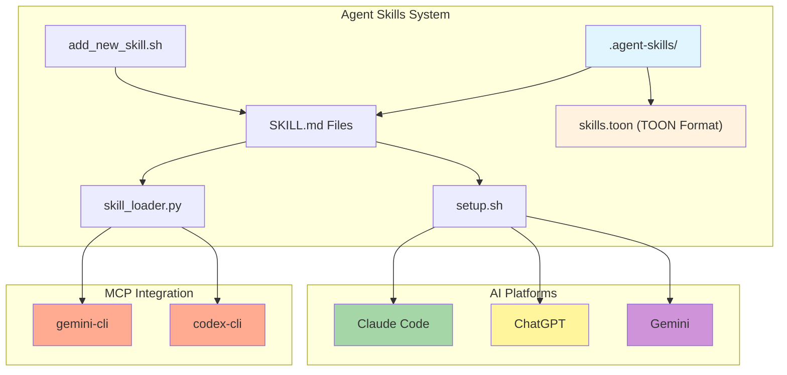
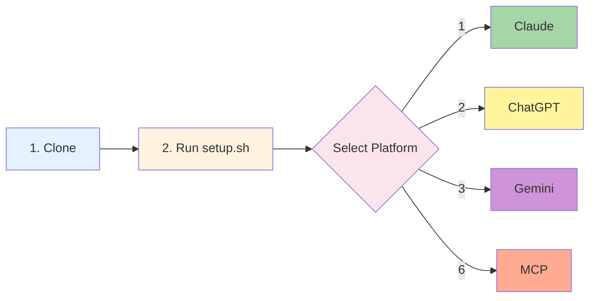
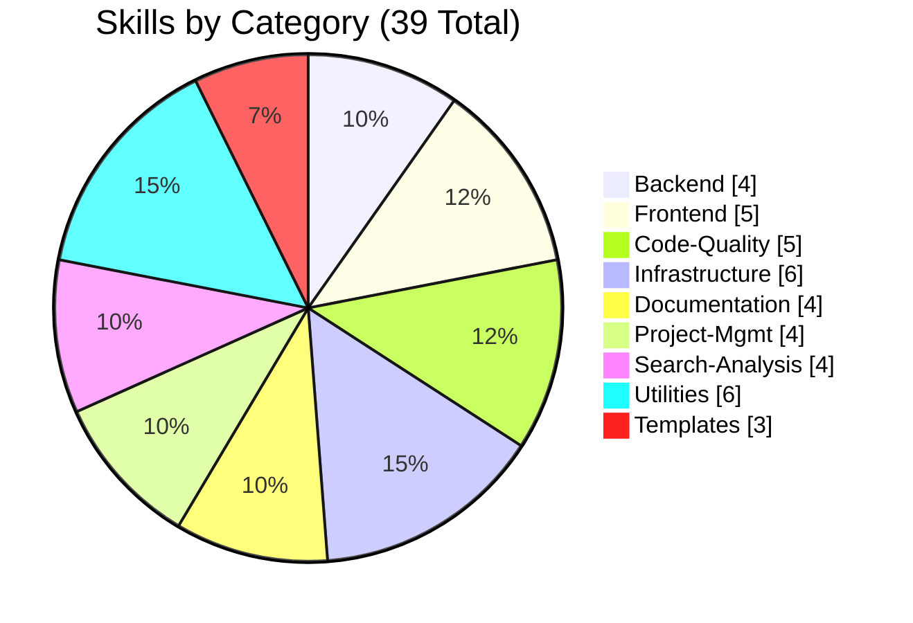
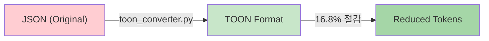
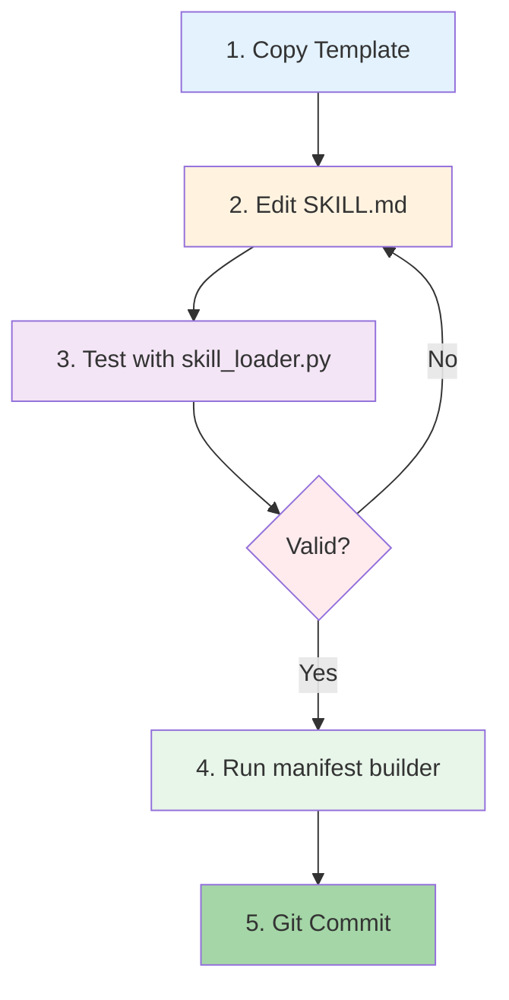
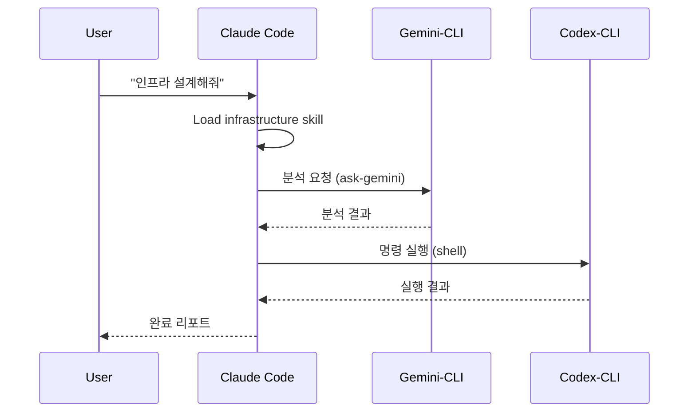

# Agent Skills

> Claude, ChatGPT, Gemini, MCP 기반 CLI에서 사용 가능한 범용 AI 에이전트 스킬 시스템

[](LICENSE)
[](https://www.python.org/)
[](.agent-skills/)
[](https://agentskills.io/)
[](.agent-skills/skill-query-handler.py)

## Architecture



## Features

| Feature | Description | Status |
|---------|-------------|--------|
| **Multi-Platform** | Claude, ChatGPT, Gemini, MCP 지원 | ✅ |
| **39 Skills** | 8개 카테고리의 실전 스킬 | ✅ |
| **Smart Query Matching** | 사용자 쿼리 기반 스킬 자동 매칭 | ✅ |
| **MCP Integration** | gemini-cli, codex-cli 완벽 연동 | ✅ |
| **Open Standard** | Agent Skills 오픈 표준 준수 | ✅ |
| **Easy Setup** | `setup.sh` 원클릭 설정 | ✅ |
| **Auto Add Skill** | `add_new_skill.sh` 자동 스킬 생성 | ✅ |

## Quick Start



```bash
# 1. 저장소 클론
git clone https://github.com/your-org/skills-template.git
cd skills-template

# 2. 설정 스크립트 실행
cd .agent-skills && ./setup.sh

# 3. 플랫폼 선택 (1: Claude, 2: ChatGPT, 3: Gemini, 6: MCP Integration)
```

## Skills Overview

### Categories



### Detailed Skills

| Category | Count | Skills |
|:---------|:-----:|:-------|
| **Backend** | 4 | `api-design` `database-schema-design` `authentication-setup` `backend-testing` |
| **Frontend** | 5 | `ui-component-patterns` `state-management` `responsive-design` `web-accessibility` `react-components` |
| **Code-Quality** | 5 | `code-review` `code-refactoring` `testing-strategies` `performance-optimization` `debugging` |
| **Infrastructure** | 6 | `system-environment-setup` `deployment-automation` `monitoring-observability` `security-best-practices` `docker-containerization` `firebase-ai-logic` |
| **Documentation** | 4 | `technical-writing` `api-documentation` `user-guide-writing` `changelog-maintenance` |
| **Project-Mgmt** | 4 | `task-planning` `task-estimation` `sprint-retrospective` `standup-meeting` |
| **Search-Analysis** | 4 | `codebase-search` `log-analysis` `data-analysis` `pattern-detection` |
| **Utilities** | 6 | `git-workflow` `environment-setup` `file-organization` `workflow-automation` `skill-standardization` `mcp-codex-integration` |

> **Total: 39 Skills** (including 3 templates)

## Token Optimization (TOON Format)

TOON (Token-Oriented Object Notation)은 LLM 토큰 사용량을 최적화하는 직렬화 포맷입니다.



### TOON 변환 예시

**Before (JSON)**:
```json
{"name": "api-design", "category": "backend", "description": "Design RESTful APIs"}
```

**After (TOON)**:
```
N:api-design C:backend D:Design RESTful APIs
```

### TOON CLI 사용

```bash
# 전체 스킬 TOON 변환
python3 scripts/toon_converter.py convert-all

# 통계 확인
python3 scripts/toon_converter.py stats skills.json

# 결과: 16.8% 토큰 절감
```

## Adding New Skills

### 자동 스킬 추가 (권장)

```bash
# 기본 템플릿
./scripts/add_new_skill.sh <category> <skill-name>

# 고급 템플릿 (REFERENCE.md, EXAMPLES.md 포함)
./scripts/add_new_skill.sh <category> <skill-name> --template advanced

# 예시
./scripts/add_new_skill.sh backend graphql-api --description "Design GraphQL APIs"
```

### 수동 스킬 추가



```bash
# 1. 템플릿 복사
cp -r templates/basic-skill-template backend/my-skill

# 2. SKILL.md 편집
# name, description 정의 및 상세 지침 작성

# 3. 테스트
python skill_loader.py show my-skill

# 4. 매니페스트 갱신
python scripts/skill_manifest_builder.py

# 5. Git 커밋
git add backend/my-skill && git commit -m "Add my-skill"
```

## Platform Support

### Multi-Agent Workflow



### Platform Comparison

| Platform | Setup | AI Response | Skill Loading | Shell Exec |
|:---------|:------|:-----------:|:--------------|:----------:|
| **Claude Code** | `setup.sh` → 1 | ✅ | Automatic | ✅ |
| **ChatGPT** | `setup.sh` → 2 | ✅ | Knowledge Upload | ❌ |
| **Gemini** | `setup.sh` → 3 | ✅ | Python API | ❌ |
| **Gemini-CLI** | `setup.sh` → 6 | ✅ | @file syntax | ❌ |
| **Codex-CLI** | `setup.sh` → 6 | ❌ | N/A | ✅ |

### Claude Code

```bash
# setup.sh 실행 후 자동 설정
# 스킬이 ~/.claude/skills/ 또는 .claude/skills/에 복사됨
claude  # Claude가 자동으로 스킬 감지
```

### ChatGPT

```bash
# setup.sh에서 옵션 2 선택
# 생성된 zip 파일을 Custom GPT Knowledge에 업로드
```

### Gemini

```python
from skill_loader import SkillLoader
import google.generativeai as genai

loader = SkillLoader('.agent-skills')
skill = loader.get_skill('api-design')

genai.configure(api_key='YOUR_API_KEY')
model = genai.GenerativeModel('gemini-2.0-flash')
response = model.generate_content(f"{skill['body']}\n\nDesign a REST API")
```

### MCP Integration (gemini-cli / codex-cli)

```bash
# 1. setup.sh에서 옵션 6 선택하여 MCP 설정
cd .agent-skills && ./setup.sh  # 옵션 6 선택

# 2. 스킬 쿼리 핸들러 사용 (자동 스킬 매칭)
python3 skill-query-handler.py list                    # 전체 스킬 목록
python3 skill-query-handler.py match "REST API 설계"   # 스킬 매칭
python3 skill-query-handler.py query "코드 리뷰해줘"   # 프롬프트 생성

# 3. Claude Code에서 MCP 도구 사용
# "gemini-cli를 사용해서 .agent-skills/backend/api-design/SKILL.md의
#  가이드라인을 따라 사용자 관리 API를 설계해줘"

# 4. Shell에서 직접 사용 (mcp-shell-config.sh 설정 후)
gemini-skill "Design a REST API for users"
codex-skill "Run tests and show results"
```

### Skill Query Handler

사용자 쿼리를 분석하여 자동으로 적합한 스킬을 매칭하고 MCP 도구용 프롬프트를 생성합니다.

```bash
# 사용 예시
python3 skill-query-handler.py query "데이터베이스 스키마 설계해줘" --tool gemini
# 출력: @/path/to/.agent-skills/backend/database-schema-design/SKILL.md
#       데이터베이스 스키마 설계해줘

python3 skill-query-handler.py match "보안 취약점"
# 출력: [3] infrastructure/security-best-practices
```

## Project Structure

```
skills-template/
├── .agent-skills/                  # 핵심 스킬 시스템
│   ├── setup.sh                    # 플랫폼별 설정 스크립트
│   ├── skill-query-handler.py      # 스킬 쿼리 핸들러 (MCP용)
│   ├── skill_loader.py             # Python 스킬 로더
│   ├── mcp-skill-loader.sh         # MCP 스킬 로더 (Shell)
│   ├── mcp-shell-config.sh         # Shell RC 설정 스니펫
│   ├── MCP_CONTEXT.md              # MCP 컨텍스트 문서
│   ├── scripts/
│   │   ├── add_new_skill.sh        # 스킬 자동 생성
│   │   ├── convert_skills.py       # 스킬 표준화 스크립트
│   │   └── skill_manifest_builder.py
│   ├── backend/                    # 백엔드 스킬 (4)
│   ├── frontend/                   # 프론트엔드 스킬 (5)
│   ├── code-quality/               # 코드 품질 스킬 (5)
│   ├── infrastructure/             # 인프라 스킬 (6)
│   ├── documentation/              # 문서화 스킬 (4)
│   ├── project-management/         # 프로젝트 관리 스킬 (4)
│   ├── search-analysis/            # 검색/분석 스킬 (4)
│   ├── utilities/                  # 유틸리티 스킬 (6)
│   └── templates/                  # 스킬 템플릿 (3)
├── .claude/skills/                 # Claude Code 스킬 (setup.sh로 생성)
├── work/                           # 작업 문서
├── docs/                           # 문서
└── README.md
```

## CLI Tools

### skill_loader.py (스킬 로더)

| Command | Description | Example |
|:--------|:------------|:--------|
| `list` | 모든 스킬 목록 | `python skill_loader.py list` |
| `search` | 스킬 검색 | `python skill_loader.py search "api"` |
| `show` | 스킬 상세 보기 | `python skill_loader.py show api-design` |
| `prompt` | 프롬프트 생성 | `python skill_loader.py prompt --skills api-design` |

### skill-query-handler.py (MCP 쿼리 핸들러)

| Command | Description | Example |
|:--------|:------------|:--------|
| `list` | 인덱싱된 스킬 목록 | `python skill-query-handler.py list` |
| `match` | 쿼리에 맞는 스킬 찾기 | `python skill-query-handler.py match "REST API"` |
| `query` | MCP용 프롬프트 생성 | `python skill-query-handler.py query "API 설계"` |
| `prompt` | 특정 스킬로 프롬프트 | `python skill-query-handler.py prompt "쿼리" --skill backend/api-design` |

### TOON Converter

| Command | Description | Example |
|:--------|:------------|:--------|
| `convert-all` | 전체 스킬 TOON 변환 | `python toon_converter.py convert-all` |
| `encode` | JSON → TOON | `python toon_converter.py encode skills.json` |
| `decode` | TOON → JSON | `python toon_converter.py decode skills.toon` |
| `stats` | 토큰 절감 통계 | `python toon_converter.py stats skills.json` |

### Add New Skill

| Option | Description | Example |
|:-------|:------------|:--------|
| `--template` | 템플릿 선택 | `--template advanced` |
| `--description` | 스킬 설명 | `--description "API caching"` |
| `--tools` | 허용 도구 | `--tools "Read,Write"` |

## Contributing

| Topic | Description |
|:------|:------------|
| **Guide** | `CONTRIBUTING.md` 참조 |
| **Template** | `templates/basic-skill-template/` |
| **Frontmatter** | `name`, `description` 필수 |
| **Review** | PR 제출 후 코드 리뷰 |

## References

| Resource | Link |
|:---------|:-----|
| Agent Skills 공식 | [agentskills.io](https://agentskills.io/) |
| 사양 문서 | [Specification](https://agentskills.io/specification) |
| Claude Code Skills | [Documentation](https://docs.anthropic.com/en/docs/claude-code) |
| Quick Start | [QUICKSTART.md](.agent-skills/QUICKSTART.md) |
| Contributing | [CONTRIBUTING.md](.agent-skills/CONTRIBUTING.md) |
| Multi-Agent Test | [result.md](work/result.md) |

## License

MIT License - see [LICENSE](LICENSE) for details.

---

**Version**: 2.1.0 | **Updated**: 2026-01-06 | **Skills**: 39 | **Status**: Active
