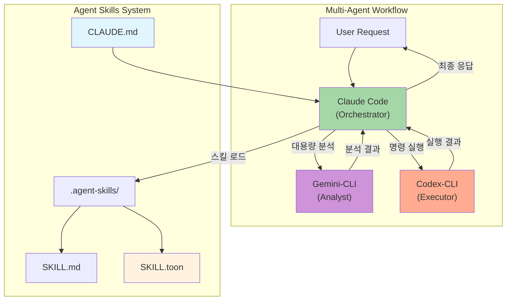
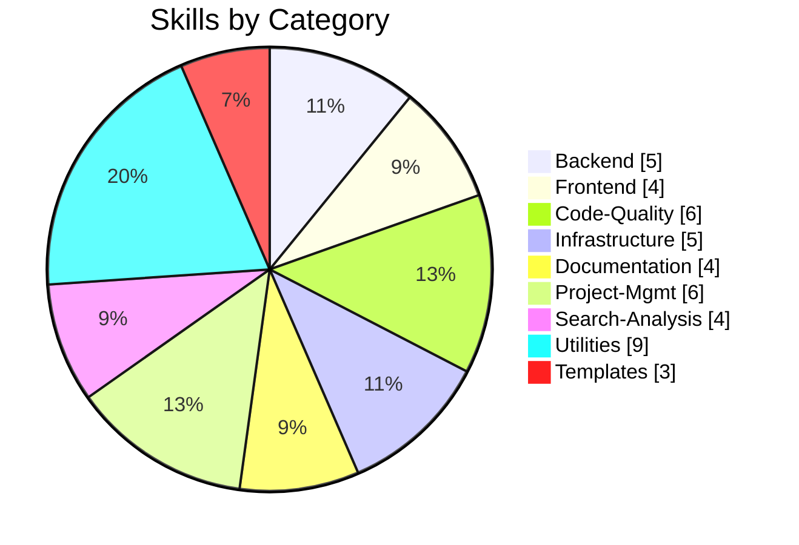
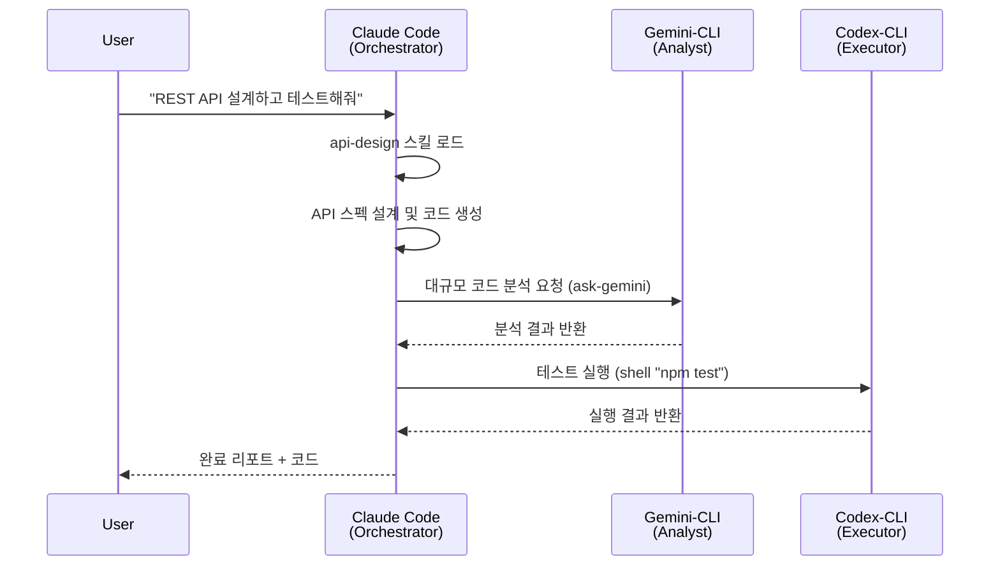

# Agent Skills

> Claude Code 중심의 Multi-Agent 워크플로우 시스템 (Gemini-CLI + Codex-CLI 통합)

[](LICENSE)
[](.agent-skills/)
[](CLAUDE.md)
[](.agent-skills/scripts/generate_compact_skills.py)
[](#-quick-start)

Agent Skills는 Claude, Gemini, ChatGPT 등 AI 에이전트의 능력을 극대화하는 표준화된 기능 확장 시스템입니다. 46개의 실전 스킬과 Multi-Agent 오케스트레이션으로 개발 워크플로우를 자동화합니다.

---

## For AI Agents (AI 에이전트용 설정)

> **Claude Code를 실행한 후 아래 프롬프트를 복사해서 입력하세요.**

### 방법 1: One-Line 프롬프트 (권장)

```
skills-template 저장소에서 .agent-skills 폴더를 현재 디렉토리로 복사하고 setup.sh를 silent 모드로 실행해. 설정 완료 후 클론한 임시 폴더는 삭제해.
```

### 방법 2: 상세 프롬프트

```
1. https://github.com/supercent-io/skills-template.git 저장소를 임시 폴더(_tmp_skills)로 클론
2. .agent-skills 폴더만 현재 작업 디렉토리로 복사
3. 임시 폴더 삭제
4. cd .agent-skills && ./setup.sh --silent 실행
```

### 방법 3: 수동 명령어 (터미널에서 직접 실행)

```bash
git clone https://github.com/supercent-io/skills-template.git _tmp_skills && \
mv _tmp_skills/.agent-skills . && rm -rf _tmp_skills && \
cd .agent-skills && chmod +x setup.sh && ./setup.sh --silent
```

| AI Agent | 설정 방법 | 상태 |
|----------|----------|------|
| **Claude Code** | 위 프롬프트 실행 → 자동 설치 | ✅ 자동 |
| **Gemini-CLI** | `claude mcp add gemini-cli -s user -- npx -y gemini-mcp-tool` | ⚡ MCP 연동 |
| **Codex-CLI** | `claude mcp add codex-cli -s user -- npx -y @openai/codex-mcp` | ⚡ MCP 연동 |

### 비대화형 자동 설정

```bash
# AI 에이전트용 (권장) - 출력 없음, shell RC 수정 안함
cd .agent-skills && ./setup.sh --silent

# 개발자용 - shell RC 자동 설정 포함
cd .agent-skills && ./setup.sh --auto

# 문제 해결 - 시스템 진단 실행
cd .agent-skills && ./setup.sh --diagnose
```

**옵션 설명:**
- `--silent`: 무출력 모드, `~/.zshrc` 수정 안함 (AI 에이전트에 권장)
- `--auto`: 자동 설정, `~/.zshrc`에 스킬 로더 추가
- `--diagnose`: MCP 서버 헬스 체크 및 시스템 진단
- `--no-shell-rc`: shell RC 수정만 건너뛰기 (`--auto --no-shell-rc` 조합 가능)

---

## Quick Start (개발자용 수동 설치)

### One-Liner 설치 (권장)

터미널에서 한 줄로 설치:

```bash
git clone https://github.com/supercent-io/skills-template.git _tmp_skills && mv _tmp_skills/.agent-skills . && rm -rf _tmp_skills && cd .agent-skills && chmod +x setup.sh && ./setup.sh
```

**설치 과정:**
1. `skills-template` 저장소를 임시 폴더로 클론
2. `.agent-skills` 폴더만 현재 위치로 이동
3. 임시 폴더 삭제
4. 자동 설정 스크립트 실행

### 단계별 설치

```bash
# 1. 저장소 클론
git clone https://github.com/supercent-io/skills-template.git

# 2. .agent-skills 폴더를 원하는 위치로 복사
cp -r skills-template/.agent-skills ~/  # 홈 디렉토리
# 또는
cp -r skills-template/.agent-skills .   # 현재 프로젝트

# 3. 클론한 폴더 삭제
rm -rf skills-template

# 4. 설정 실행
cd .agent-skills && ./setup.sh
```

### 셸 설정 적용

설치 완료 후 터미널 재시작 또는:

```bash
source ~/.zshrc   # Zsh
source ~/.bashrc  # Bash
```

---

## 설치 후 관리

### 스킬 업데이트

**방법 1: 간편 업데이트 (재설치)**

```bash
# 기존 삭제 후 재설치
rm -rf .agent-skills
git clone https://github.com/supercent-io/skills-template.git _tmp && mv _tmp/.agent-skills . && rm -rf _tmp
cd .agent-skills && ./setup.sh
```

**방법 2: Git으로 관리 (권장)**

처음 설치 시 전체 저장소를 유지하면 업데이트가 간편합니다:

```bash
# 초기 설치
git clone https://github.com/supercent-io/skills-template.git my-agent-skills

# 이후 업데이트
cd my-agent-skills && git pull origin main
```

### 커스텀 스킬 추가

```bash
# 스킬 생성 스크립트 사용
cd .agent-skills
./scripts/add_new_skill.sh <category> <skill-name>

# 예시
./scripts/add_new_skill.sh backend graphql-api
./scripts/add_new_skill.sh utilities my-workflow
```

생성된 `SKILL.md` 파일을 편집하여 스킬 내용을 작성하세요.

### 팀 공유 워크플로우


1. **조직 저장소 Fork**: `skills-template`을 조직 GitHub에 Fork
2. **커스텀 스킬 추가**: 팀 전용 스킬 추가 및 기존 스킬 커스터마이징
3. **팀원 배포**:
   ```bash
   git clone https://github.com/YOUR-ORG/skills-template.git
   cd skills-template/.agent-skills && ./setup.sh
   ```
4. **동기화**: `git pull`로 최신 스킬 유지

---

## Architecture



### Agent Roles

| Agent | Role | Model | Best For |
|-------|------|-------|----------|
| **Claude Code** | Orchestrator | `claude-opus-4-5` | 계획 수립, 코드 생성, 스킬 해석 |
| **Gemini-CLI** | Analyst | `gemini-2.5-pro` | 대용량 분석 (1M+ 토큰), 리서치 |
| **Codex-CLI** | Executor | `gpt-4.1` | 명령 실행, 빌드, 배포 |

### Workflow Types (자동 감지)

| Type | 조건 | 설명 |
|------|------|------|
| `standalone` | Claude CLI 없음 | 기본 스킬만 사용 |
| `claude-only` | Claude만 있음 | 내장 Bash 사용 |
| `claude-gemini` | +Gemini | 대용량 분석 강화 |
| `claude-codex` | +Codex | 실행/배포 자동화 |
| `full-multiagent` | 모두 있음 | 풀 오케스트레이션 |

---

## Features

| Feature | Description | Status |
|---------|-------------|--------|
| **Multi-Agent Workflow** | Claude + Gemini + Codex 자동 오케스트레이션 | ✅ |
| **46 Skills** | 9개 카테고리의 실전 스킬 | ✅ |
| **Token Optimization** | 95% 토큰 절감 (toon 모드 기본) | ✅ |
| **One-Liner Setup** | 한 줄 명령어로 설치 및 정리 | ✅ |
| **Auto-Configure** | MCP 환경 자동 감지 + 점진적 설정 | ✅ |
| **Dynamic CLAUDE.md** | 환경별 워크플로우 문서 자동 생성 | ✅ |

---

## Skills Overview (46 Total)



| Category | Count | Skills |
|:---------|:-----:|:-------|
| **Backend** | 5 | `api-design` `database-schema-design` `authentication-setup` `backend-testing` `kling-ai` |
| **Frontend** | 4 | `ui-component-patterns` `state-management` `responsive-design` `web-accessibility` |
| **Code-Quality** | 6 | `code-review` `code-refactoring` `testing-strategies` `performance-optimization` `debugging` `agent-evaluation` |
| **Infrastructure** | 5 | `system-environment-setup` `deployment-automation` `monitoring-observability` `security-best-practices` `firebase-ai-logic` |
| **Documentation** | 4 | `technical-writing` `api-documentation` `user-guide-writing` `changelog-maintenance` |
| **Project-Mgmt** | 6 | `task-planning` `task-estimation` `sprint-retrospective` `standup-meeting` `ultrathink-multiagent-workflow` `subagent-creation` |
| **Search-Analysis** | 4 | `codebase-search` `log-analysis` `data-analysis` `pattern-detection` |
| **Utilities** | 9 | `git-workflow` `git-submodule` `environment-setup` `file-organization` `workflow-automation` `skill-standardization` `mcp-codex-integration` `opencode-authentication` `npm-git-install` |
| **Templates** | 3 | `basic` `advanced` `multiplatform` |

---

## Token Optimization

스킬 로딩 시 토큰 사용량을 최적화하는 3가지 모드:

| Mode | File | Avg Tokens | Reduction | Use Case |
|:-----|:-----|:-----------|:----------|:---------|
| **full** | SKILL.md | ~2,000 | - | 상세 예시 필요 시 |
| **compact** | SKILL.compact.md | ~250 | 88% | 일반 작업 |
| **toon** | SKILL.toon | ~110 | 95% | 빠른 참조 (기본값) |

```bash
# 토큰 최적화 파일 생성
python3 .agent-skills/scripts/generate_compact_skills.py
```

---

## Multi-Agent 워크플로우 예시



### MCP Tools 사용법

```bash
# Gemini: 대용량 분석
ask-gemini "전체 코드베이스 구조 분석해줘"
ask-gemini "@src/ @tests/ 테스트 커버리지 분석"

# Codex: 명령 실행
shell "docker-compose up -d"
shell "npm test && npm run build"
```

---

## Troubleshooting

### 시스템 진단 실행 (권장)

문제 발생 시 먼저 진단을 실행하세요:

```bash
cd .agent-skills && ./setup.sh --diagnose
```

진단 항목:
- 의존성 체크 (Python3, Node.js, Git)
- MCP 환경 감지 (Claude CLI, Gemini, Codex)
- MCP 서버 헬스 체크
- 설정 파일 확인
- 권장 사항 제안

### 권한 오류

```bash
chmod +x .agent-skills/setup.sh
chmod +x .agent-skills/scripts/*.sh
```

### 명령어가 인식되지 않음

```bash
# 셸 설정 재로드
source ~/.zshrc   # Zsh
source ~/.bashrc  # Bash
```

### MCP 서버 연결 문제

```bash
# MCP 서버 상태 확인
claude mcp list

# Gemini MCP 재설치
claude mcp remove gemini-cli
claude mcp add gemini-cli -s user -- npx -y gemini-mcp-tool

# Codex MCP 재설치
claude mcp remove codex-cli
claude mcp add codex-cli -s user -- npx -y @openai/codex-mcp
```

### 스킬이 작동하지 않음

```bash
# 스킬 위치 확인
ls -la ~/.claude/skills/
ls -la .claude/skills/

# setup.sh 재실행
cd .agent-skills && ./setup.sh
```

### YAML 파싱 오류

```bash
python3 -c "
import yaml
content = open('.agent-skills/backend/api-design/SKILL.md').read()
frontmatter = content.split('---')[1]
yaml.safe_load(frontmatter)
print('Valid!')
"
```

---

## Project Structure

```
.agent-skills/
├── setup.sh                    # 자동 설정 스크립트 (v3.3)
├── skill-query-handler.py      # 스킬 쿼리 핸들러 (MCP용)
├── skill_loader.py             # Python 스킬 로더
├── mcp-shell-config.sh         # MCP 쉘 설정
├── model-config.env            # 모델 설정
├── agent-routing.yaml          # 에이전트 라우팅 설정 (NEW)
├── scripts/                    # 유틸리티 스크립트
├── backend/                    # 백엔드 스킬 (5)
├── frontend/                   # 프론트엔드 스킬 (4)
├── code-quality/               # 코드 품질 스킬 (6)
├── infrastructure/             # 인프라 스킬 (6)
├── documentation/              # 문서화 스킬 (4)
├── project-management/         # 프로젝트 관리 스킬 (6)
├── search-analysis/            # 검색/분석 스킬 (4)
├── utilities/                  # 유틸리티 스킬 (9)
└── templates/                  # 스킬 템플릿 (3)
```

---

## References

| Resource | Link |
|:---------|:-----|
| Agent Skills 공식 | [agentskills.io](https://agentskills.io/) |
| Claude Code Skills | [Documentation](https://docs.anthropic.com/en/docs/claude-code) |
| Quick Start | [QUICKSTART.md](.agent-skills/QUICKSTART.md) |
| Contributing | [CONTRIBUTING.md](.agent-skills/CONTRIBUTING.md) |

## License

MIT License - see [LICENSE](LICENSE) for details.

---

**Version**: 3.3.0 | **Updated**: 2026-01-14 | **Skills**: 46 | **Workflow**: Multi-Agent (Auto-Detect) | **Token**: 95% Reduction
