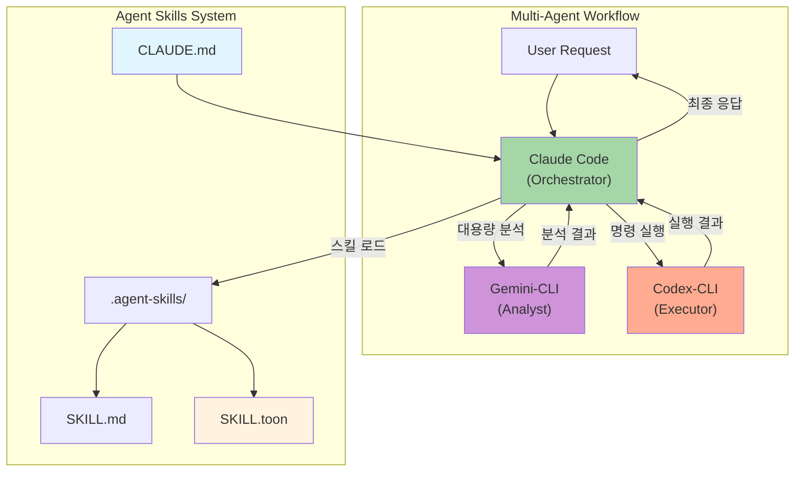
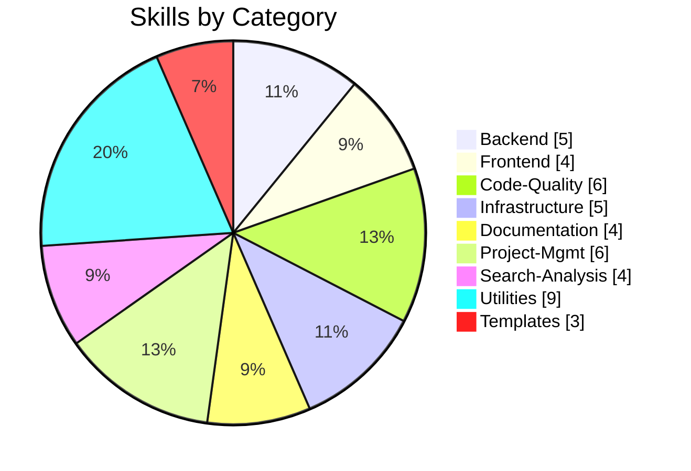
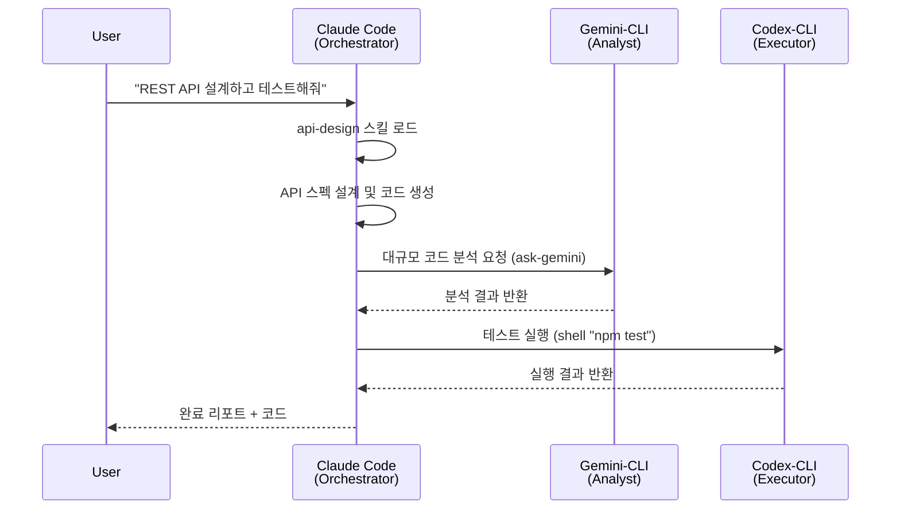

# Agent Skills

> Claude Code 중심의 Multi-Agent 워크플로우 시스템 (Gemini-CLI + Codex-CLI 통합)

[](LICENSE)
[](https://www.python.org/)
[](.agent-skills/)
[](CLAUDE.md)
[](.agent-skills/scripts/generate_compact_skills.py)
[](.agent-skills/setup.sh)

---

## For AI Agents (LLM Setup)

> **AI 에이전트용 설정 명령** - 아래 명령어를 실행하세요.

```bash
.agent-skills/setup.sh 실행하고 skill 설정해줘
```

| Agent Type | Setup Method |
|------------|--------------|
| **Claude Code** | `.agent-skills/setup.sh` → 옵션 1 (Auto-configure) |
| **Gemini-CLI** | MCP 서버로 자동 통합 |
| **Codex-CLI** | MCP 서버로 자동 통합 |

### Non-Interactive Setup (권장)

```bash
cd .agent-skills && echo -e "1\n1\n" | bash setup.sh
```

---

## Architecture



## Features

| Feature | Description | Status |
|---------|-------------|--------|
| **Multi-Agent Workflow** | Claude + Gemini + Codex 자동 오케스트레이션 | ✅ |
| **46 Skills** | 9개 카테고리의 실전 스킬 | ✅ |
| **Token Optimization** | 95% 토큰 절감 (toon 모드 기본) | ✅ |
| **Auto Orchestration** | CLAUDE.md 기반 에이전트 역할 자동 분배 | ✅ |
| **MCP Integration** | gemini-cli, codex-cli 원클릭 설정 | ✅ |
| **Smart Query Matching** | 사용자 쿼리 기반 스킬 자동 매칭 | ✅ |
| **Auto-Configure (v3.1)** | MCP 환경 자동 감지 + 점진적 설정 | ✅ |
| **Model Configuration** | 역할별 모델 자동 매핑 (Orchestrator/Analyst/Executor) | ✅ |
| **Dynamic CLAUDE.md** | 환경별 워크플로우 문서 자동 생성 | ✅ |

## Skills Overview (46 Total)



### Detailed Skills

| Category | Count | Skills |
|:---------|:-----:|:-------|
| **Backend** | 5 | `api-design` `database-schema-design` `authentication-setup` `backend-testing` `kling-ai` |
| **Frontend** | 4 | `ui-component-patterns` `state-management` `responsive-design` `web-accessibility` |
| **Code-Quality** | 6 | `code-review` `code-refactoring` `testing-strategies` `performance-optimization` `debugging` `agent-evaluation` |
| **Infrastructure** | 5 | `system-environment-setup` `deployment-automation` `monitoring-observability` `security-best-practices` `firebase-ai-logic` |
| **Documentation** | 4 | `technical-writing` `api-documentation` `user-guide-writing` `changelog-maintenance` |
| **Project-Mgmt** | 6 | `task-planning` `task-estimation` `sprint-retrospective` `standup-meeting` `ultrathink-multiagent-workflow` `subagent-creation` |
| **Search-Analysis** | 4 | `codebase-search` `log-analysis` `data-analysis` `pattern-detection` |
| **Utilities** | 9 | `git-workflow` `git-submodule` `environment-setup` `file-organization` `workflow-automation` `skill-standardization` `mcp-codex-integration` `opencode-authentication` `npm-git-install` |
| **Templates** | 3 | `basic` `advanced` `toon` |

## Token Optimization

스킬 로딩 시 토큰 사용량을 최적화하는 3가지 모드:

| Mode | File | Avg Tokens | Reduction | Use Case |
|:-----|:-----|:-----------|:----------|:---------|
| **full** | SKILL.md | ~2,000 | - | 상세 예시 필요 시 |
| **compact** | SKILL.compact.md | ~250 | 88% | 일반 작업 |
| **toon** | SKILL.toon | ~110 | 95% | 빠른 참조 (기본값) |

```bash
# 토큰 최적화 실행
python3 .agent-skills/scripts/generate_compact_skills.py
```

## Multi-Agent Workflow



### Agent Roles & Model Configuration

| Agent | Role | Provider | Model | Best For |
|-------|------|----------|-------|----------|
| **Claude Code** | Orchestrator | claude | `claude-opus-4-5` | 계획 수립, 코드 생성, 스킬 해석 |
| **Gemini-CLI** | Analyst | gemini | `gemini-3-pro` | 대용량 분석 (1M+ 토큰), 리서치 |
| **Codex-CLI** | Executor | openai | `gpt-5.2-codex` | 명령 실행, 빌드, 배포 |

### Workflow Types (Auto-Detected)

| Type | 조건 | 설명 |
|------|------|------|
| `standalone` | Claude CLI 없음 | 기본 스킬만 사용 |
| `claude-only` | Claude만 있음 | 내장 Bash 사용 |
| `claude-gemini` | +Gemini | 대용량 분석/리서치 강화 |
| `claude-codex` | +Codex | 실행/배포 자동화 강화 |
| `full-multiagent` | 모두 있음 | 풀 오케스트레이션 |

## Adding New Skills

```bash
# 자동 스킬 추가
./scripts/add_new_skill.sh <category> <skill-name>

# 예시
./scripts/add_new_skill.sh backend graphql-api --description "Design GraphQL APIs"
```

## Project Structure

```
skills-template/
├── .agent-skills/                  # 핵심 스킬 시스템
│   ├── setup.sh                    # 플랫폼별 설정 스크립트 (v3.1)
│   ├── skill-query-handler.py      # 스킬 쿼리 핸들러 (MCP용)
│   ├── skill_loader.py             # Python 스킬 로더
│   ├── scripts/                    # 유틸리티 스크립트
│   ├── backend/                    # 백엔드 스킬 (5)
│   ├── frontend/                   # 프론트엔드 스킬 (4)
│   ├── code-quality/               # 코드 품질 스킬 (6)
│   ├── infrastructure/             # 인프라 스킬 (5)
│   ├── documentation/              # 문서화 스킬 (4)
│   ├── project-management/         # 프로젝트 관리 스킬 (6)
│   ├── search-analysis/            # 검색/분석 스킬 (4)
│   ├── utilities/                  # 유틸리티 스킬 (9)
│   └── templates/                  # 스킬 템플릿 (3)
├── .claude/skills/                 # Claude Code 스킬 (setup.sh로 생성)
├── CLAUDE.md                       # Multi-Agent 오케스트레이션 (자동 생성)
└── README.md
```

## References

| Resource | Link |
|:---------|:-----|
| Agent Skills 공식 | [agentskills.io](https://agentskills.io/) |
| 사양 문서 | [Specification](https://agentskills.io/specification) |
| Claude Code Skills | [Documentation](https://docs.anthropic.com/en/docs/claude-code) |
| Quick Start | [QUICKSTART.md](.agent-skills/QUICKSTART.md) |
| Contributing | [CONTRIBUTING.md](.agent-skills/CONTRIBUTING.md) |

## License

MIT License - see [LICENSE](LICENSE) for details.

---

**Version**: 3.1.0 | **Updated**: 2026-01-13 | **Skills**: 46 | **Workflow**: Multi-Agent (Auto-Detect) | **Token**: 95% Reduction
