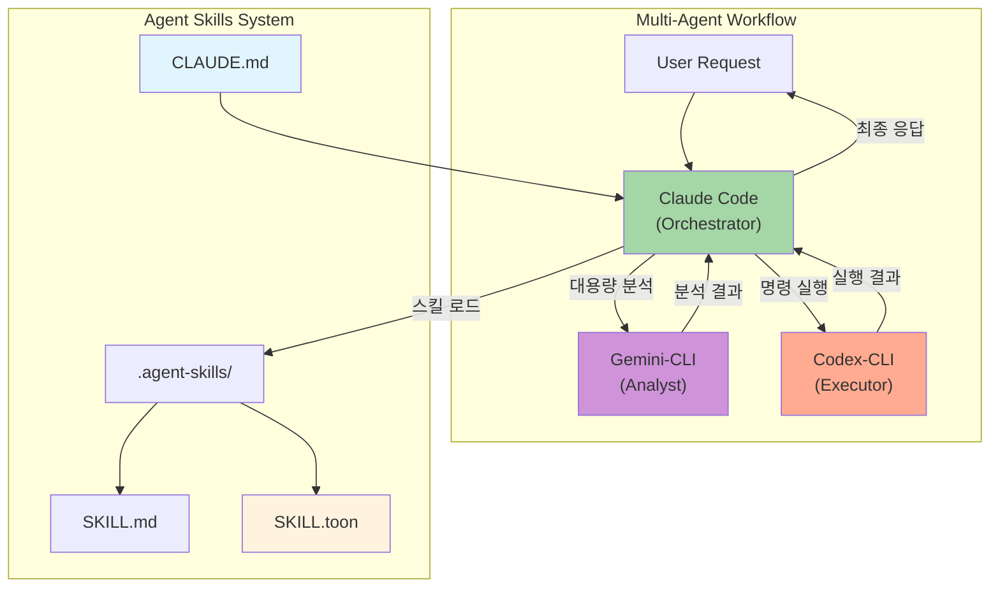
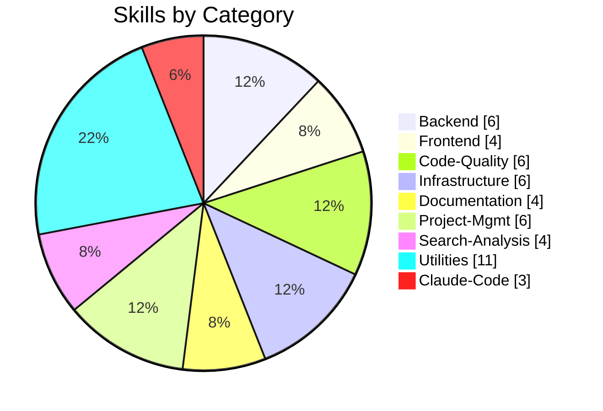

# Agent Skills

> Claude Code 중심의 Multi-Agent 워크플로우 시스템 (Gemini-CLI + Codex-CLI 통합)
> **Claude Code 완전 가이드 70가지 팁 적용** - 에이전틱 개발 정책 강화

[](LICENSE)
[](.agent-skills/)
[](CLAUDE.md)
[](.agent-skills/scripts/generate_compact_skills.py)
[](#-quick-start)

---

## LLM CLI 설치 가이드

### Claude Code 설치

```bash
# macOS/Linux
curl -fsSL https://claude.ai/install.sh | sh

# npm (대안)
npm install -g @anthropic-ai/claude-code

# 설치 확인
claude --version
```

### Gemini CLI 설치 (2026)

```bash
# npm으로 설치 (Google 공식)
npm install -g @google/gemini-cli

# 설치 확인
gemini --version

# API 키 설정
export GEMINI_API_KEY=your_api_key

# Claude Code MCP 연동 (선택)
claude mcp add gemini-cli -s user -- npx -y @anthropic-ai/gemini-mcp
```

### Codex CLI 설치 (2026)

```bash
# npm으로 설치 (OpenAI 공식)
npm install -g @openai/codex

# 설치 확인
codex --version

# API 키 설정
export OPENAI_API_KEY=your_api_key

# Claude Code MCP 연동 (선택)
claude mcp add codex-cli -s user -- npx -y @openai/codex-mcp
```

---

## Claude Code 완전 정복 정책

> 70가지 팁 기반의 에이전틱 개발 정책 (ykdojo + Ado Kukic 검증)

### 핵심 6대 원칙

| 원칙 | 핵심 내용 | 적용 방법 |
|------|----------|----------|
| **1. 분해정복** | 큰 문제 → 작은 단계 | 각 단계 독립 검증 가능하게 분할 |
| **2. 컨텍스트 관리** | 신선하게 유지 | 단일 목적 대화, HANDOFF.md, `/clear` |
| **3. 추상화 선택** | 상황별 깊이 조절 | Vibe Coding ↔ Deep Dive |
| **4. 자동화²** | 반복 → 자동화 | 3회 반복 시 자동화 방법 탐색 |
| **5. 계획/YOLO** | 기본 계획 모드 | 계획 90%, YOLO는 컨테이너에서만 |
| **6. 검증 회고** | 출력 검증 필수 | 테스트, Draft PR, 자기 검증 |

### 필수 명령어 정책

```bash
# 세션 시작 시 (필수)
/usage          # 토큰 한도 확인

# 작업 중 (상시)
/context        # 컨텍스트 상태 확인 (성능 저하 시)
Esc Esc         # 잘못된 작업 즉시 취소

# 컨텍스트 관리 (50k 토큰 초과 시)
/clear          # 컨텍스트 초기화
# 또는 HANDOFF.md 생성 후 새 세션
```

### 보안 정책 (필수 준수)

#### ❌ 절대 금지
```
- 호스트 시스템에서 --dangerously-skip-permissions 사용
- rm -rf /, sudo rm 등 위험 명령어 자동 승인
- .env, credentials.json 등 시크릿 파일 커밋
- API 키 하드코딩
```

#### ⚠️ 주의 필요
```
- curl | sh 형태의 스크립트 실행
- chmod 777 과도한 권한 설정
- 알 수 없는 MCP 서버 연결
```

#### ✅ 권장 사항
```bash
# 안전한 자동 승인만 설정
/sandbox "npm test"
/sandbox "npm run lint"
/sandbox "git status"

# 정기적 보안 감사
npx cc-safe .
```

### 컨텍스트 최적화 지표

| 지표 | 권장 값 | 조치 |
|------|---------|------|
| MCP 서버 | < 10개 | 불필요한 MCP 비활성화 |
| 활성 도구 | < 80개 | `/mcp`로 관리 |
| 대화 토큰 | < 50k | HANDOFF.md 또는 `/clear` |
| 계획 모드 비율 | 90% | 기본값으로 사용 |

---

## For AI Agents (AI 에이전트용 설정)

> **LLM 기반 설치만 지원합니다.** Claude Code, Gemini, ChatGPT 등 AI 에이전트에게 아래 프롬프트를 입력하세요.

### LLM 설치 프롬프트 (권장)

```
https://github.com/supercent-io/skills-template 저장소를 임시로 클론하고, .agent-skills 폴더를 현재 디렉토리로 복사해 (기존 폴더가 있으면 덮어쓰기). 그 후 setup.sh를 --silent 모드로 실행하고, 임시 클론 폴더는 삭제해.
```

### AI Agent 예상 실행 단계

```bash
# 1. 저장소 클론
git clone https://github.com/supercent-io/skills-template.git _tmp_skills

# 2. 기존 폴더 있으면 삭제 후 복사
rm -rf .agent-skills 2>/dev/null; cp -r _tmp_skills/.agent-skills .

# 3. setup.sh 실행 (silent 모드)
cd .agent-skills && chmod +x setup.sh && ./setup.sh --silent

# 4. 임시 폴더 삭제
cd .. && rm -rf _tmp_skills
```

### AI Agent별 설치 상태

| AI Agent | 설치 방법 | 상태 |
|----------|----------|------|
| **Claude Code** | 위 프롬프트 입력 → AI가 자동 설치 | ✅ 자동 |
| **Gemini** | 위 프롬프트 입력 → AI가 자동 설치 | ✅ 자동 |
| **ChatGPT** | 위 프롬프트 입력 → AI가 자동 설치 | ✅ 자동 |

### MCP 서버 연동 (Claude Code 전용)

```bash
# Gemini-CLI MCP 추가 (대용량 분석)
claude mcp add gemini-cli -s user -- npx -y @anthropic-ai/gemini-mcp

# Codex-CLI MCP 추가 (명령 실행)
claude mcp add codex-cli -s user -- npx -y @openai/codex-mcp
```

---

## Architecture



### Agent Roles (2026 Models)

| Agent | Role | Model | Best For |
|-------|------|-------|----------|
| **Claude Code** | Orchestrator | `claude-opus-4-5-20251101` | 계획 수립, 코드 생성, 스킬 해석 |
| **Gemini CLI** | Analyst | `gemini-3-pro` | 대용량 분석 (2M+ 토큰), 리서치 |
| **Codex CLI** | Executor | `gpt-5.2-codex` | 명령 실행, 빌드, 배포 |

---

## Skills Overview (50 Total)



| Category | Count | Skills |
|:---------|:-----:|:-------|
| **Claude-Code** | 3 | `claude-code-principles` `claude-code-workflow` `claude-code-configuration` |
| **Backend** | 6 | `api-design` `database-schema-design` `authentication-setup` `backend-testing` `kling-ai` `cs-tool-dashboard` |
| **Frontend** | 4 | `ui-component-patterns` `state-management` `responsive-design` `web-accessibility` |
| **Code-Quality** | 6 | `code-review` `code-refactoring` `testing-strategies` `performance-optimization` `debugging` `agent-evaluation` |
| **Infrastructure** | 6 | `system-environment-setup` `deployment-automation` `monitoring-observability` `security-best-practices` `firebase-ai-logic` `looker-studio-bigquery` |
| **Documentation** | 4 | `technical-writing` `api-documentation` `user-guide-writing` `changelog-maintenance` |
| **Project-Mgmt** | 6 | `task-planning` `task-estimation` `sprint-retrospective` `standup-meeting` `ultrathink-multiagent-workflow` `subagent-creation` |
| **Search-Analysis** | 4 | `codebase-search` `log-analysis` `data-analysis` `pattern-detection` |
| **Utilities** | 11 | `agentic-development-principles` `git-workflow` `git-submodule` `environment-setup` `file-organization` `workflow-automation` `skill-standardization` `mcp-codex-integration` `opencode-authentication` `npm-git-install` `project-init-memory` |

---

## Token Optimization

스킬 로딩 시 토큰 사용량을 최적화하는 3가지 모드:

| Mode | File | Avg Tokens | Reduction | Use Case |
|:-----|:-----|:-----------|:----------|:---------|
| **full** | SKILL.md | ~2,000 | - | 상세 예시 필요 시 |
| **compact** | SKILL.compact.md | ~250 | 88% | 일반 작업 |
| **toon** | SKILL.toon | ~110 | 95% | 빠른 참조 (기본값) |

```bash
# 토큰 최적화 파일 생성
python3 .agent-skills/scripts/generate_compact_skills.py
```

---

## Quick Reference Card

### Claude Code 필수 명령어

```bash
# 세션 관리
/usage          토큰 사용량 확인
/context        컨텍스트 X-Ray
/clear          컨텍스트 초기화
/init           CLAUDE.md 생성

# 대화 관리
/clone          대화 복제
/rename         세션 이름 변경
/export         마크다운 내보내기

# 즉시 실행
!git status     Claude 처리 없이 즉시 실행
```

### 필수 단축키

```
Esc Esc         작업 즉시 취소 (가장 중요!)
Ctrl+R          히스토리 검색
Shift+Tab ×2    계획 모드 토글
Ctrl+B          백그라운드 실행
```

### CLI 플래그

```bash
claude --continue       마지막 대화 이어가기
claude --resume <name>  특정 세션 복구
claude -p "prompt"      Headless 모드
```

### 별칭 설정

```bash
# ~/.zshrc 또는 ~/.bashrc
alias c='claude'
alias cc='claude --continue'
alias cr='claude --resume'
alias ch='claude --chrome'
```

---

## Troubleshooting

### 시스템 진단 실행

```bash
cd .agent-skills && ./setup.sh --diagnose
```

### 컨텍스트 과다

```bash
/context  # 사용량 확인
/clear    # 컨텍스트 초기화
# 또는 HANDOFF.md 생성 후 새 세션
```

### 보안 감사

```bash
# 위험한 승인 명령어 검사
npx cc-safe .
```

### MCP 서버 문제

```bash
claude mcp list  # 상태 확인
claude mcp remove <name>  # 제거
claude mcp add <name> ...  # 재설치
```

---

## References

| Resource | Link |
|:---------|:-----|
| Claude Code 공식 | [docs.anthropic.com](https://docs.anthropic.com/en/docs/claude-code) |
| Claude Code Best Practices | [Anthropic Engineering](https://www.anthropic.com/engineering/claude-code-best-practices) |
| ykdojo claude-code-tips | [GitHub](https://github.com/ykdojo/claude-code-tips) |
| Ado's Advent of Claude | [adocomplete.com](https://adocomplete.com/advent-of-claude-2025/) |
| Agent Skills 공식 | [agentskills.io](https://agentskills.io/) |

---

## License

MIT License - see [LICENSE](LICENSE) for details.

---

**Version**: 3.7.0 | **Updated**: 2026-01-20 | **Skills**: 50 | **Workflow**: Multi-Agent (Auto-Detect) | **Token**: 95% Reduction

**Changelog v3.7.0**:
- LLM 설치 프롬프트 개선 (기존 폴더 덮어쓰기 지원)
- AI Agent 예상 실행 단계 명시
- MCP 연동 명령어 표준화
