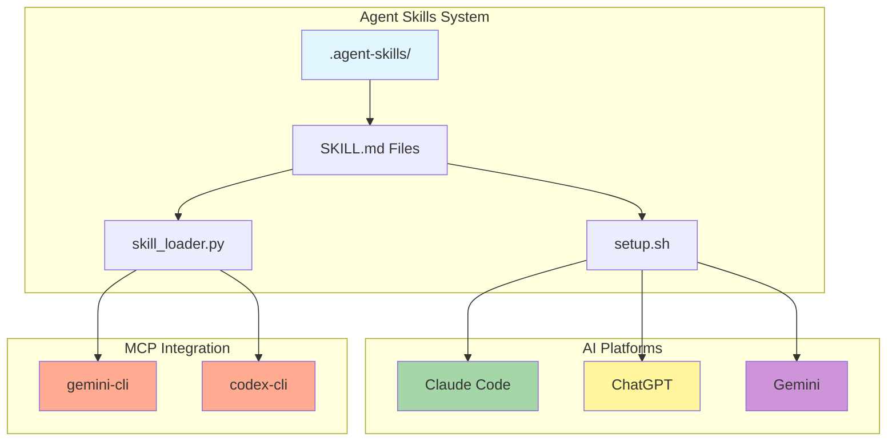
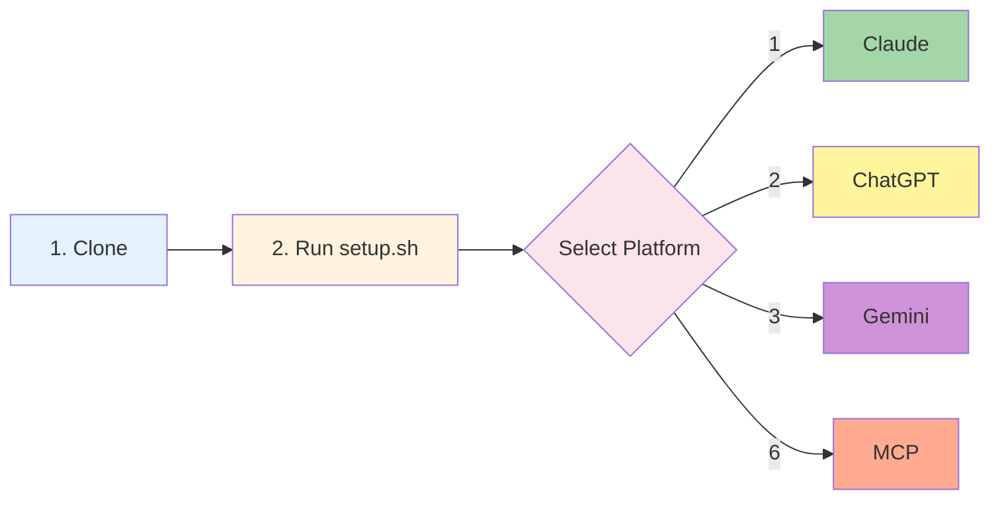
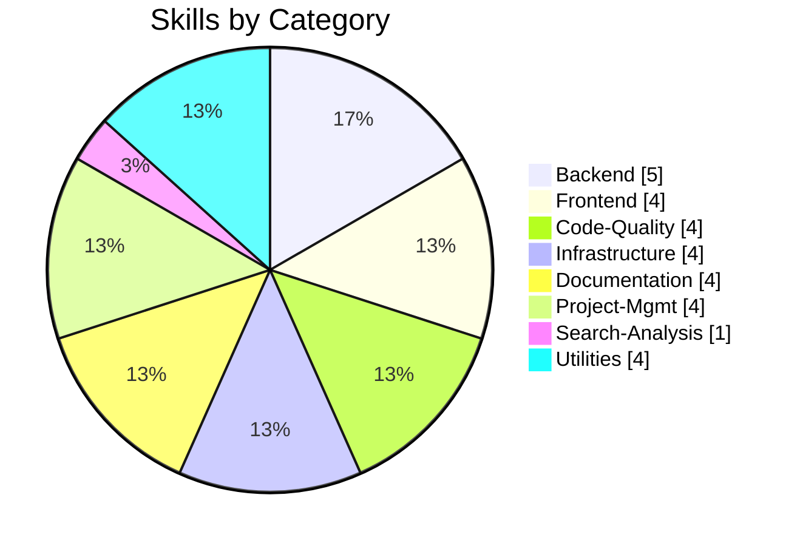
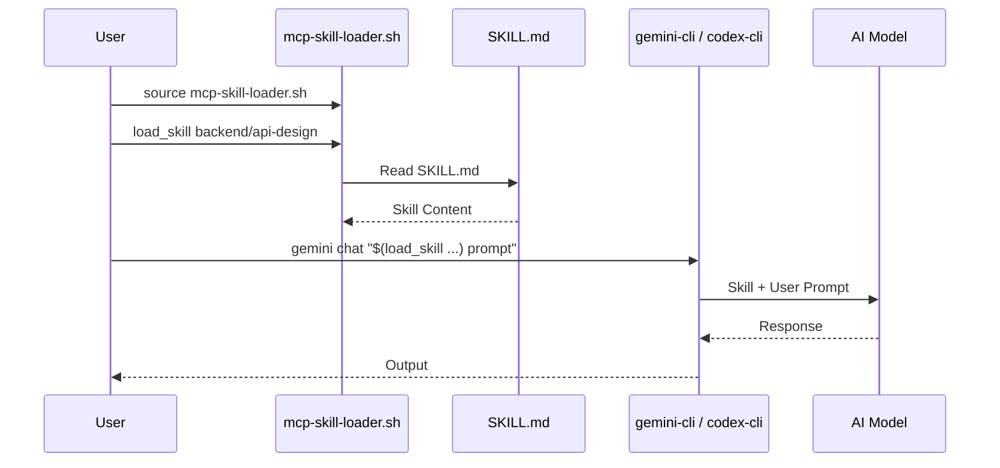
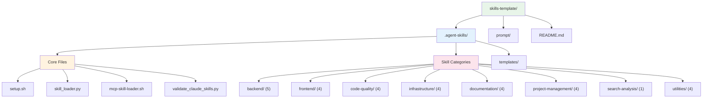
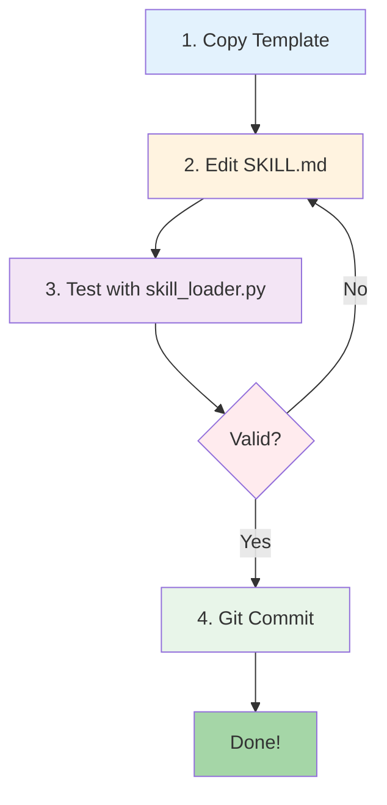

# Agent Skills

> Claude, ChatGPT, Gemini, MCP 기반 CLI에서 사용 가능한 범용 AI 에이전트 스킬 시스템

[](LICENSE)
[](https://www.python.org/)
[](.agent-skills/)
[](https://agentskills.io/)

## Architecture



## Features

| Feature | Description | Status |
|---------|-------------|--------|
| **Multi-Platform** | Claude, ChatGPT, Gemini, MCP 지원 | ✅ |
| **30+ Skills** | 8개 카테고리의 실전 스킬 | ✅ |
| **Open Standard** | Agent Skills 오픈 표준 준수 | ✅ |
| **Easy Setup** | `setup.sh` 원클릭 설정 | ✅ |
| **Extensible** | 템플릿 기반 스킬 추가 | ✅ |
| **MCP Integration** | gemini-cli, codex-cli 연동 | ✅ |

## Quick Start



```bash
# 1. 저장소 클론
git clone https://github.com/your-org/skills-template.git
cd skills-template

# 2. 설정 스크립트 실행
cd .agent-skills && ./setup.sh

# 3. 플랫폼 선택 (1: Claude, 2: ChatGPT, 3: Gemini, 6: MCP Integration)
```

## Skills Overview

### Categories



### Detailed Skills

| Category | Count | Skills |
|:---------|:-----:|:-------|
| **Backend** | 5 | `api-design` `database-schema` `authentication` `backend-testing` `error-handling` |
| **Frontend** | 4 | `ui-components` `state-management` `responsive-design` `accessibility` |
| **Code-Quality** | 4 | `code-review` `refactoring` `testing-strategies` `performance-optimization` |
| **Infrastructure** | 4 | `system-setup` `deployment` `monitoring` `security` |
| **Documentation** | 4 | `technical-writing` `api-docs` `user-guides` `changelog` |
| **Project-Mgmt** | 4 | `task-planning` `estimation` `retrospective` `standup` |
| **Search-Analysis** | 1 | `codebase-search` |
| **Utilities** | 4 | `git-workflow` `environment-setup` `file-organization` `automation` |

> **Total: 30 Skills**

## Platform Support

### Comparison Table

| Platform | Setup Method | Auto-Detection | Skill Loading |
|:---------|:-------------|:--------------:|:--------------|
| **Claude Code** | `setup.sh` → Option 1 | ✅ | Automatic |
| **ChatGPT** | `setup.sh` → Option 2 | ❌ | Knowledge Upload |
| **Gemini** | `setup.sh` → Option 3 | ❌ | Python API |
| **MCP CLI** | `setup.sh` → Option 6 | ✅ | Shell Script |

### Claude Code

```bash
# setup.sh 실행 후 자동 설정
# 스킬이 ~/.claude/skills/ 또는 .claude/skills/에 복사됨
claude  # Claude가 자동으로 스킬 감지
```

### ChatGPT

```bash
# setup.sh에서 옵션 2 선택
# 생성된 zip 파일을 Custom GPT Knowledge에 업로드
```

### Gemini

```python
from skill_loader import SkillLoader
import google.generativeai as genai

loader = SkillLoader('.agent-skills')
skill = loader.get_skill('api-design')

genai.configure(api_key='YOUR_API_KEY')
model = genai.GenerativeModel('gemini-pro')
response = model.generate_content(f"{skill['body']}\n\nDesign a REST API")
```

### MCP Integration (gemini-cli / codex-cli)



```bash
# setup.sh에서 옵션 6 선택하여 MCP 설정

# 스킬 로더 활성화
source .agent-skills/mcp-skill-loader.sh

# 스킬 목록 확인
list_skills

# 스킬 사용 예시
gemini chat "$(load_skill backend/api-design) 사용자 관리 API 설계해줘"
codex-cli shell "$(load_skill code-quality/code-review) 이 코드 리뷰해줘"
```

## Project Structure



## Adding New Skills



```bash
# 1. 템플릿 복사
cp -r .agent-skills/templates/basic-skill-template .agent-skills/backend/my-skill

# 2. SKILL.md 작성
# name, description 정의 및 상세 지침 작성

# 3. 테스트
python .agent-skills/skill_loader.py show my-skill

# 4. Git 커밋
git add .agent-skills/backend/my-skill && git commit -m "Add my-skill"
```

## CLI Tools

| Command | Description | Example |
|:--------|:------------|:--------|
| `list` | 모든 스킬 목록 | `python skill_loader.py list` |
| `search` | 스킬 검색 | `python skill_loader.py search "api"` |
| `show` | 스킬 상세 보기 | `python skill_loader.py show api-design` |
| `prompt` | 프롬프트 생성 | `python skill_loader.py prompt --skills api-design --format xml` |

## Contributing

| Topic | Description |
|:------|:------------|
| **Guide** | `CONTRIBUTING.md` 참조 |
| **Template** | `templates/basic-skill-template/` |
| **Frontmatter** | `name`, `description` 필수 |
| **Review** | PR 제출 후 코드 리뷰 |

## References

| Resource | Link |
|:---------|:-----|
| Agent Skills 공식 | [agentskills.io](https://agentskills.io/) |
| 사양 문서 | [Specification](https://agentskills.io/specification) |
| Claude Code Skills | [Documentation](https://code.claude.com/docs/ko/skills) |
| Quick Start | [QUICKSTART.md](.agent-skills/QUICKSTART.md) |
| Contributing | [CONTRIBUTING.md](.agent-skills/CONTRIBUTING.md) |

## License

MIT License - see [LICENSE](LICENSE) for details.

---

**Version**: 1.2.0 | **Updated**: 2026-01-05 | **Status**: Active
