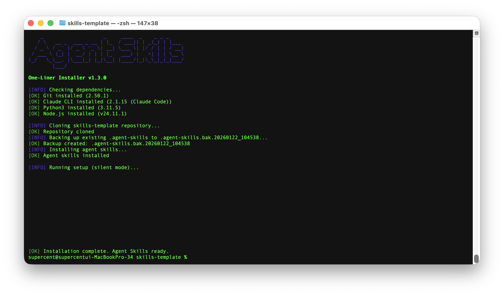

# Agent Skills

> Modular skill system for AI agents.
> **64 Skills** · **TOON Format** · **Flat Skill Layout**

[](https://github.com/supercent-io/skills-template/releases)
[](docs/bmad/README.md)



---

## Quick install

```bash
# Install all skills
npx skills add https://github.com/supercent-io/skills-template

# Install one skill
npx skills add https://github.com/supercent-io/skills-template --skill plannotator
npx skills add https://github.com/supercent-io/skills-template --skill oh-my-codex
```

## Release Deploy Version

Use GitHub Releases as the deployment baseline when you need reproducible installs.

- Release page: `https://github.com/supercent-io/skills-template/releases`
- BMAD deploy version in this repo: `1.0.0` (`.agent-skills/bmad-orchestrator/SKILL.md`)
- Current main includes previously validated plannotator integration updates (Approve/Send Feedback flow reflected in docs and setup scripts)

---

## Repository summary

This repository stores the `agentskills` package used by this workspace.

- `64` skills under `.agent-skills/`
- TOON format is the default output mode
- Flat skill layout (`.agent-skills/<skill-name>/`)

---

## Skills list (64 total)

### Orchestration & Workflow
`agent-browser`, `agent-configuration`, `agentic-development-principles`, `agentic-principles`, `agentic-workflow`, `bmad-orchestrator`, `changelog-maintenance`, `copilot-coding-agent`, `environment-setup`, `file-organization`, `git-submodule`, `git-workflow`, `npm-git-install`, `oh-my-codex`, `ohmg`, `omc`, `opencontext`, `plannotator`, `prompt-repetition`, `ralph`, `skill-standardization`, `vibe-kanban`, `workflow-automation`

### API / Backend
`api-design`, `api-documentation`, `authentication-setup`, `backend-testing`, `database-schema-design`

### Frontend
`design-system`, `react-best-practices`, `responsive-design`, `state-management`, `ui-component-patterns`, `web-accessibility`, `web-design-guidelines`

### Code quality
`agent-evaluation`, `code-refactoring`, `code-review`, `debugging`, `performance-optimization`, `testing-strategies`

### Search & analysis
`codebase-search`, `data-analysis`, `log-analysis`, `pattern-detection`

### Documentation
`presentation-builder`, `technical-writing`, `user-guide-writing`

### Project management
`sprint-retrospective`, `standup-meeting`, `task-estimation`, `task-planning`

### Infrastructure
`deployment-automation`, `firebase-ai-logic`, `genkit`, `looker-studio-bigquery`, `monitoring-observability`, `security-best-practices`, `system-environment-setup`, `vercel-deploy`

### Creative
`image-generation`, `pollinations-ai`, `video-production`

### Marketing
`marketing-automation`

> Full manifest + descriptions are in `.agent-skills/skills.json` and each folder's `SKILL.md`.

---

## Featured Tools

These tools have full documentation in `docs/` and dedicated skills in `.agent-skills/`.

### plannotator — Interactive Plan & Diff Review
> Keyword: `plan`, `계획` (alias: `planno`) | [Docs](docs/plannotator/README.md) | [GitHub](https://github.com/backnotprop/plannotator)
Visual browser UI for annotating AI agent plans before coding. Works with **Claude Code**, **OpenCode**, **Gemini CLI**, and **Codex CLI**. Approve plans or send structured feedback in one click.

Validated in-session with Playwright: Approve + feedback loops confirmed across all four platforms. See `docs/plannotator/README.md` for the verified python3 stdin pattern (avoid raw `echo`/heredoc for plan submission).
```bash
bash scripts/install.sh --all   # Install + configure all AI tools at once
```
| Feature | Description |
|---------|-------------|
| Plan Review | Opens browser UI when agent exits plan mode — annotate, approve, or send feedback |
| Diff Review | `/plannotator-review` for inline line annotations on git diffs |
| **Obsidian Integration** | Auto-save approved plans to Obsidian vault with YAML frontmatter, tags, and backlinks |
| Bear Notes | Alternative auto-save to Bear Notes (macOS) |
| Share | Share plan review sessions with teammates via link |
#### Obsidian Setup (3 steps)
1. Install Obsidian → https://obsidian.md/download
2. Create/open a vault in Obsidian
3. In plannotator UI: Settings (⚙️) → Saving → Enable "Obsidian Integration" → Select vault

> **Note**: Configure settings in the **system browser** that plannotator auto-opens. Settings configured in automated/Playwright browser sessions are isolated and will not persist. See [Pattern 9: Obsidian Integration Setup](.agent-skills/plannotator/SKILL.md#pattern-9-obsidian-integration-setup) for detailed instructions and folder organization.

#### Obsidian Folder Organization
Plans can be organized into subfolders within the vault:
```
vault/plannotator/
├── approved/    ← approved plans
├── denied/      ← rejected plans
└── 2026-02/     ← monthly archive
```

---

### vibe-kanban — AI Agent Kanban Board
> Keyword: `kanbanview` | [Docs](docs/vibe-kanban/README.md) | [GitHub](https://github.com/BloopAI/vibe-kanban)

Visual Kanban board (To Do → In Progress → Review → Done) with parallel AI agents (Claude, Codex, OpenCode, Gemini) isolated per card via git worktrees. Auto-creates PRs on completion.

Codex integration is supported via `pluggable` MCP/tooling setup (see `docs/vibe-kanban/README.md`).

```bash
npx vibe-kanban          # Launch board at http://localhost:3000
```

| Feature | Description |
|---------|-------------|
| Parallel agents | Multiple agents run concurrently on different cards without file conflicts |
| Git worktree isolation | Each card gets its own `vk/<hash>-<slug>` branch and worktree |
| MCP support | Agents control the board programmatically via `vk_*` tools |
| Docker deploy | `docker run -p 3000:3000 vibekanban/vibe-kanban` for remote teams |

---

### ralph — Completion Loop
> Keyword: `ralph` | [Docs](docs/ralph/README.md) | [GitHub](https://github.com/gemini-cli-extensions/ralph)

Self-referential loop that re-runs the agent on the same task across turns (with fresh context each iteration) until a `<promise>DONE</promise>` tag is detected or max iterations is reached.

```bash
/ralph "Fix all TypeScript errors" --completion-promise="0 errors" --max-iterations=100
```

Available in: Gemini CLI, OpenCode, Claude Code, Codex.

For Codex, use the local setup script first when you want loop continuity hints:

```bash
bash <your-agent-skills>/ralph/scripts/setup-codex-hook.sh
```

---

### omc — oh-my-claudecode
> Keyword: `omc` / `autopilot` / `ralph` / `ulw` | [Docs](docs/omc/README.md) | [GitHub](https://github.com/Yeachan-Heo/oh-my-claudecode)

Teams-first multi-agent orchestration layer for Claude Code. 32 specialized agents, smart model routing, and a staged pipeline (`team-plan → team-prd → team-exec → team-verify → team-fix`).

```bash
/plugin marketplace add https://github.com/Yeachan-Heo/oh-my-claudecode
/omc:omc-setup
```

| Mode | Use For |
|------|---------|
| **Team** (canonical) | Coordinated agents on shared task list |
| **Autopilot** | End-to-end feature work |
| **Ralph** | Tasks that must fully complete |
| **Ultrawork** | Burst parallel fixes/refactors |

---

### bmad-orchestrator — AI-Driven Development Harness
> Keyword: `bmad` | [Docs](docs/bmad/README.md)

Phase-based workflow (Analysis → Planning → Solutioning → Implementation) for disciplined AI-assisted development. Automatically adapts to project scope (Level 0–4).

> Note: This is primarily a Claude Code native workflow. For Codex/OpenCode-based use, combine with `omx`/`ohmg` orchestration.

```bash
npx skills add https://github.com/supercent-io/skills-template --skill bmad-orchestrator
# Then in Claude Code:
# bmad 스킬을 설정하고 사용해줘. 기억해.
# /workflow-init
```

| Phase | Purpose |
|-------|---------|
| 1 Analysis | Market research, product vision |
| 2 Planning | PRD or Tech Spec |
| 3 Solutioning | Architecture design |
| 4 Implementation | Sprint planning, dev, code review |

| Feature | Description |
|---------|-------------|
| Phase Gate Review | plannotator review UI at each phase transition |
| Obsidian Archive | Auto-save approved docs with YAML frontmatter |
| Team Visibility | Share review link for stakeholder annotation |

---

## Structure

```text
.
├── .agent-skills/
│   ├── README.md
│   ├── skill_loader.py
│   ├── skill-query-handler.py
│   ├── skills.json
│   ├── skills.toon
│   └── [64 skill folders]
├── docs/
│   ├── bmad/           ← bmad-orchestrator harness guide
│   ├── omc/            ← oh-my-claudecode guide
│   ├── plannotator/    ← plan & diff review (v0.9.0, multi-tool)
│   ├── ralph/          ← completion loop guide
│   └── vibe-kanban/    ← AI Kanban board guide
├── install.sh / flatten_skills.py
└── README.md
```

---

## Related docs

| Tool | Keyword | Doc |
|------|---------|-----|
| plannotator | `plan`, `계획` | [docs/plannotator/README.md](docs/plannotator/README.md) |
| vibe-kanban | `kanbanview` | [docs/vibe-kanban/README.md](docs/vibe-kanban/README.md) |
| ralph | `ralph` | [docs/ralph/README.md](docs/ralph/README.md) |
| omc | `omc` | [docs/omc/README.md](docs/omc/README.md) |
| bmad-orchestrator | `bmad` | [docs/bmad/README.md](docs/bmad/README.md) |

---

**Version**: Local repository sync | **Updated**: 2026-02-23

**Changelog v2026-02-23 (latest)**:
- **plannotator/Obsidian**: Verified Obsidian integration (2026-02-23); added automated browser limitation note (Playwright/Puppeteer cannot open obsidian:// URI); added folder organization guide (approved/, denied/, YYYY-MM/); added direct filesystem fallback pattern (SKILL.md, docs/plannotator/README.md, README.md)

**Changelog v2026-02-23**:
- **ralph**: Default `--max-iterations` changed from `5` → `100` (SKILL.md, SKILL.toon, docs/ralph/README.md)
- **plannotator**: Primary keyword changed from `planno` → `plan`, `계획` for natural design-phase activation; `planno` retained as backward-compatible alias in tags
- **vibe-kanban**: OpenCode MCP 설정 섹션 추가 (SKILL.md, docs/vibe-kanban/README.md); OpenCode + ulw 병렬 위임 사용 케이스 추가 (SKILL.toon v1.2.0)
