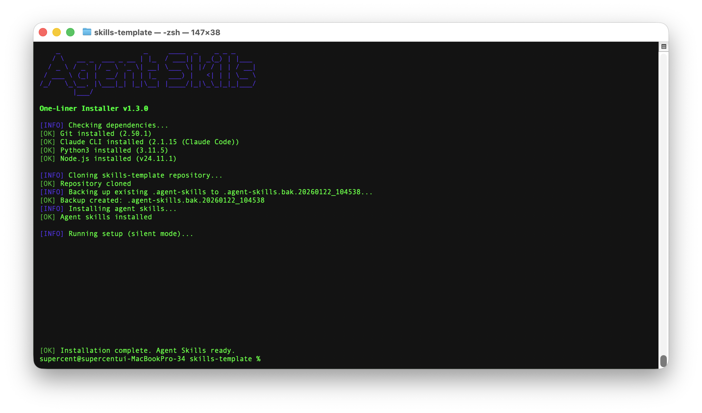

# Agent Skills

> v2026-02-25 · **65 Skills** · **TOON Format** · **Flat Skill Layout**

[](https://github.com/supercent-io/skills-template/releases)
[](#skills-list-65-total)
[](docs/bmad/README.md)



> Skill configuration and detailed list: [.agent-skills/README.md](.agent-skills/README.md)

---

## Contents

- [Quick Start](#quick-start)
- [What's New](#whats-new-in-v2026-02-25)
- [Install](#install)
- [Execution Guide](#execution-guide)
- [Skills List (65)](#skills-list-65-total)
- [Featured Tools](#featured-tools)
- [Structure](#structure)
- [Related docs](#related-docs)
- [Changelog](#changelog)

---

## Quick Start (For LLM Agents)

```bash
# Pass to LLM: Read the guide below and proceed with installation
curl -s https://raw.githubusercontent.com/supercent-io/skills-template/main/setup-all-skills-prompt.md
```

> More skills installation → [Install](#install) | Platform-specific execution → [Execution Guide](#execution-guide)

---

## What's New in v2026-02-25

| Change | Description |
|--------|-------------|
| **New `jeo` skill** | Complete automation: ralph+plannotator → team/bmad → agent-browser verify → worktree cleanup |
| **Skills list reorganization** | 11 categories, 65 skills table format restructured |
| **New `copilot-coding-agent`** | GitHub Copilot Issue → Draft PR automation |
| **`agent-browser` enhancement** | Added deterministic workflow + verification/diff + security hardening + references/templates |

---

## Install

### For LLM Agents

If an LLM agent is helping with installation, follow these steps.

```bash
# Pass to LLM: Read the guide below and proceed with installation
curl -s https://raw.githubusercontent.com/supercent-io/skills-template/main/setup-all-skills-prompt.md
```
---

### For Humans

#### Step 1: Install jeo (Recommended — includes all core features)

`jeo` enables the entire plan·execute·track·cleanup workflow.

```bash
npx skills add https://github.com/supercent-io/skills-template --skill jeo
```

#### When using Gemini CLI

```bash
gemini extensions install https://github.com/supercent-io/skills-template
```

> [Hooks Official Guide](https://developers.googleblog.com/tailor-gemini-cli-to-your-workflow-with-hooks/)

---

## Execution Guide

### Getting Started with jeo (Recommended)

`jeo` automatically connects the entire workflow below:

| Phase | Tool | Role |
|-------|------|------|
| Plan | ralph + plannotator | AI creates the plan, you approve/provide feedback |
| Execute | omc team / bmad | Parallel agents write code |
| Verify | agent-browser | Browser behavior verification (default) |
| Cleanup | worktree-cleanup | Automatic cleanup after completion |

```bash
# Run in Claude Code
jeo "Describe your desired task here"
```

---

### Choose Based on Desired Features

#### Claude Code Multi-Agent Orchestration → `omc`

```bash
npx skills add https://github.com/supercent-io/skills-template --skill omc
# Usage: /omc:team "task description"
```

> Details: [docs/omc/README.md](docs/omc/README.md)

#### OpenAI Codex CLI Multi-Agent → `oh-my-codex` (omx)

```bash
npx skills add https://github.com/supercent-io/skills-template --skill oh-my-codex
```

> Details: [.agent-skills/oh-my-codex/SKILL.md](.agent-skills/oh-my-codex/SKILL.md)

#### Gemini / Antigravity Workflow → `ohmg`

```bash
npx skills add https://github.com/supercent-io/skills-template --skill ohmg
```

> Details: [.agent-skills/ohmg/SKILL.md](.agent-skills/ohmg/SKILL.md)

#### Phase-Based Structured Development (Analysis→Planning→Solutioning→Implementation) → `bmad-orchestrator`

```bash
npx skills add https://github.com/supercent-io/skills-template --skill bmad-orchestrator
# Usage: Set up and use bmad skill. /workflow-init
```

> Details: [docs/bmad/README.md](docs/bmad/README.md)

#### Repeat Until Task Completion → `ralph`

```bash
npx skills add https://github.com/supercent-io/skills-template --skill ralph
# Usage: /ralph "Fix all TypeScript errors" --max-iterations=100
```

> Details: [docs/ralph/README.md](docs/ralph/README.md)

#### Visual Plan Review + Feedback Loop → `plannotator`

```bash
npx skills add https://github.com/supercent-io/skills-template --skill plannotator
# Usage: Browser UI automatically opens when planning → Approve or send feedback
```

> Details: [docs/plannotator/README.md](docs/plannotator/README.md)

#### Browser Automation (Headless) → `agent-browser`

```bash
npx skills add https://github.com/supercent-io/skills-template --skill agent-browser
```

> Details: [.agent-skills/agent-browser/SKILL.md](.agent-skills/agent-browser/SKILL.md)

#### Playwright-Based Browser Control → `playwriter`

```bash
npx skills add https://github.com/supercent-io/skills-template --skill playwriter
```

> Details: [.agent-skills/playwriter/SKILL.md](.agent-skills/playwriter/SKILL.md)

---

## Skills List (65 total)

> Full manifest + descriptions: `.agent-skills/skills.json` · each folder's `SKILL.md`

### Agent Development (7)

| Skill | Description | Platforms |
|-------|-------------|-----------|
| `agent-configuration` | AI agent configuration & security policies | All platforms |
| `agent-evaluation` | AI agent evaluation systems | All platforms |
| `agentic-development-principles` | Universal agentic development principles | All platforms |
| `agentic-principles` | Core AI agent collaboration principles | All platforms |
| `agentic-workflow` | Practical AI agent workflows & productivity | All platforms |
| `bmad-orchestrator` | BMAD workflow orchestration *(in development)* | Claude |
| `prompt-repetition` | Prompt repetition for LLM accuracy | All platforms |

### Backend (5)

| Skill | Description | Platforms |
|-------|-------------|-----------|
| `api-design` | REST/GraphQL API design | All platforms |
| `api-documentation` | API documentation generation | All platforms |
| `authentication-setup` | Authentication & authorization setup | All platforms |
| `backend-testing` | Backend testing strategies | All platforms |
| `database-schema-design` | Database schema design | All platforms |

### Frontend (7)

| Skill | Description | Platforms |
|-------|-------------|-----------|
| `design-system` | Design system implementation *(in development)* | All platforms |
| `react-best-practices` | React & Next.js best practices | All platforms |
| `responsive-design` | Responsive web design | All platforms |
| `state-management` | State management patterns | All platforms |
| `ui-component-patterns` | UI component patterns | All platforms |
| `web-accessibility` | Web accessibility (a11y) | All platforms |
| `web-design-guidelines` | Web design guidelines | All platforms |

### Code Quality (5)

| Skill | Description | Platforms |
|-------|-------------|-----------|
| `code-refactoring` | Code refactoring strategies | All platforms |
| `code-review` | Code review practices | All platforms |
| `debugging` | Systematic debugging | All platforms |
| `performance-optimization` | Performance optimization | All platforms |
| `testing-strategies` | Testing strategies | All platforms |

### Infrastructure (8)

| Skill | Description | Platforms |
|-------|-------------|-----------|
| `deployment-automation` | CI/CD & deployment automation | All platforms |
| `firebase-ai-logic` | Firebase AI Logic integration | Claude · Gemini |
| `genkit` | Firebase Genkit AI workflows | Claude · Gemini |
| `looker-studio-bigquery` | Looker Studio + BigQuery | All platforms |
| `monitoring-observability` | Monitoring & observability | All platforms |
| `security-best-practices` | Security best practices | All platforms |
| `system-environment-setup` | Environment configuration | All platforms |
| `vercel-deploy` | Vercel deployment | All platforms |

### Documentation (4)

| Skill | Description | Platforms |
|-------|-------------|-----------|
| `changelog-maintenance` | Changelog management | All platforms |
| `presentation-builder` | Presentation builder *(in development)* | All platforms |
| `technical-writing` | Technical documentation | All platforms |
| `user-guide-writing` | User guides & tutorials | All platforms |

### Project Management (4)

| Skill | Description | Platforms |
|-------|-------------|-----------|
| `sprint-retrospective` | Sprint retrospective facilitation | All platforms |
| `standup-meeting` | Daily standup management | All platforms |
| `task-estimation` | Task estimation techniques | All platforms |
| `task-planning` | Task planning & organization | All platforms |

### Search & Analysis (4)

| Skill | Description | Platforms |
|-------|-------------|-----------|
| `codebase-search` | Codebase search & navigation | All platforms |
| `data-analysis` | Data analysis & insights | All platforms |
| `log-analysis` | Log analysis & debugging | All platforms |
| `pattern-detection` | Pattern detection | All platforms |

### Creative Media (3)

| Skill | Description | Platforms |
|-------|-------------|-----------|
| `image-generation` | AI image generation *(in development)* | Claude · Gemini |
| `pollinations-ai` | Free image generation via Pollinations.ai *(in development)* | All platforms |
| `video-production` | Video production workflows *(in development)* | All platforms |

### Marketing (1)

| Skill | Description | Platforms |
|-------|-------------|-----------|
| `marketing-automation` | Marketing automation *(in development)* | All platforms |

### Utilities (17)

| Skill | Description | Platforms |
|-------|-------------|-----------|
| `agent-browser` | Fast headless browser CLI for AI agents | All platforms |
| `copilot-coding-agent` | GitHub Copilot Coding Agent — Issue → Draft PR automation | Claude · Codex |
| `environment-setup` | Environment setup | All platforms |
| `file-organization` | File & folder organization | All platforms |
| `git-submodule` | Git submodule management | All platforms |
| `git-workflow` | Git workflow management | All platforms |
| `jeo` | Integrated AI orchestration: ralph+plannotator → team/bmad → agent-browser verify → worktree cleanup | Claude · Codex · Gemini · OpenCode |
| `npm-git-install` | Install npm from GitHub | All platforms |
| `ohmg` | Multi-agent orchestration for Antigravity workflows | Claude · Gemini |
| `oh-my-codex` | Multi-agent orchestration for OpenAI Codex CLI *(in development)* | Codex |
| `omc` | oh-my-claudecode — Teams-first multi-agent orchestration | Claude |
| `opencontext` | AI agent persistent memory | All platforms |
| `plannotator` | Visual plan and diff review — annotate, approve, or request changes | Claude |
| `ralph` | Self-referential completion loop for multi-turn agents | Claude |
| `skill-standardization` | SKILL.md standardization | All platforms |
| `vibe-kanban` | Kanban board for AI coding agents with git worktree automation | All platforms |
| `workflow-automation` | Workflow automation | All platforms |

---

## Featured Tools

These tools have full documentation in `docs/` and dedicated skills in `.agent-skills/`.

### plannotator — Interactive Plan & Diff Review
> **Purpose**: Visual plan review before execution and feedback loop | **Platforms**: Claude · Codex · Gemini · OpenCode | **Status**: v0.9.0
> Keyword: `plan`, `계획` (alias: `planno`) | [Docs](docs/plannotator/README.md) | [GitHub](https://github.com/backnotprop/plannotator)

Visual browser UI for annotating AI agent plans before coding. Works with **Claude Code**, **OpenCode**, **Gemini CLI**, and **Codex CLI**. Approve plans or send structured feedback in one click.

Validated in-session with Playwright: Approve + feedback loops confirmed across all four platforms. See `docs/plannotator/README.md` for the verified python3 stdin pattern (avoid raw `echo`/heredoc for plan submission).

```bash
bash scripts/install.sh --all   # Install + configure all AI tools at once
```

Path resolution behavior for skill loading:
- Absolute skill paths are used directly (for example, `/Users/me/.agent-skills/plannotator`)
- Relative skill paths are resolved in this order: configured skills directory -> global `~/.agent-skills`

| Feature | Description |
|---------|-------------|
| Plan Review | Opens browser UI when agent exits plan mode — annotate, approve, or send feedback |
| Diff Review | `/plannotator-review` for inline line annotations on git diffs |
| **Obsidian Integration** | Auto-save approved plans to Obsidian vault with YAML frontmatter, tags, and backlinks |
| Bear Notes | Alternative auto-save to Bear Notes (macOS) |
| Share | Share plan review sessions with teammates via link |

#### Obsidian Setup (3 steps)
1. Install Obsidian → https://obsidian.md/download
2. Create/open a vault in Obsidian
3. In plannotator UI: Settings (⚙️) → Saving → Enable "Obsidian Integration" → Select vault

> **Note**: Configure settings in the **system browser** that plannotator auto-opens. Settings configured in automated/Playwright browser sessions are isolated and will not persist. See [Pattern 9: Obsidian Integration Setup](.agent-skills/plannotator/SKILL.md#pattern-9-obsidian-integration-setup) for detailed instructions and folder organization.

#### Obsidian Folder Organization
Plans can be organized into subfolders within the vault:
```
vault/plannotator/
├── approved/    ← approved plans
├── denied/      ← rejected plans
└── 2026-02/     ← monthly archive
```

#### Bear Quick Check (macOS)
```bash
open "bear://x-callback-url/create?title=Plannotator%20Check&text=Bear%20callback%20OK"
```

#### Known Issues

| Symptom | Cause | Solution |
|---------|-------|----------|
| Browser opens twice | Duplicate `open` call in `plannotator-launch.sh` | Remove `open` from port detection loop in hook script — plannotator opens browser itself |
| Feedback not received (Codex/Gemini/OpenCode) | Agent doesn't wait for results due to `&` background execution | Run blocking without `&`, then read `/tmp/plannotator_feedback.txt` |
| Codex startup fails (`invalid type: map, expected a string`) | `developer_instructions` declared as table (`[developer_instructions]`) in `~/.codex/config.toml` | Re-run `bash .agent-skills/jeo/scripts/setup-codex.sh` and verify `developer_instructions = "..."` is top-level string format |

---

### vibe-kanban — AI Agent Kanban Board
> **Purpose**: Visual tracking of parallel agent progress | **Platforms**: All | **Status**: stable
> Keyword: `kanbanview` | [Docs](docs/vibe-kanban/README.md) | [GitHub](https://github.com/BloopAI/vibe-kanban)

Visual Kanban board (To Do → In Progress → Review → Done) with parallel AI agents (Claude, Codex, OpenCode, Gemini) isolated per card via git worktrees. Auto-creates PRs on completion.

Codex integration is supported via `pluggable` MCP/tooling setup (see `docs/vibe-kanban/README.md`).

```bash
npx vibe-kanban          # Launch board at http://localhost:3000
```

| Feature | Description |
|---------|-------------|
| Parallel agents | Multiple agents run concurrently on different cards without file conflicts |
| Git worktree isolation | Each card gets its own `vk/<hash>-<slug>` branch and worktree |
| MCP support | Agents control the board programmatically via `vk_*` tools |
| Docker deploy | `docker run -p 3000:3000 vibekanban/vibe-kanban` for remote teams |

---

### ralph — Completion Loop
> **Purpose**: Auto-repeat execution until task completion | **Platforms**: Claude · Gemini · Codex · OpenCode | **Status**: stable
> Keyword: `ralph` | [Docs](docs/ralph/README.md) | [GitHub](https://github.com/gemini-cli-extensions/ralph)

Self-referential loop that re-runs the agent on the same task across turns (with fresh context each iteration) until a `<promise>DONE</promise>` tag is detected or max iterations is reached.

```bash
/ralph "Fix all TypeScript errors" --completion-promise="0 errors" --max-iterations=100
```

Available in: Gemini CLI, OpenCode, Claude Code, Codex.

For Codex, use the local setup script first when you want loop continuity hints:

```bash
bash <your-agent-skills>/ralph/scripts/setup-codex-hook.sh
```

---

### omc — oh-my-claudecode
> **Purpose**: Claude Code multi-agent team orchestration | **Platforms**: Claude | **Status**: stable
> Keyword: `omc` / `autopilot` / `ralph` / `ulw` | [Docs](docs/omc/README.md) | [GitHub](https://github.com/Yeachan-Heo/oh-my-claudecode)

Teams-first multi-agent orchestration layer for Claude Code. 32 specialized agents, smart model routing, and a staged pipeline (`team-plan → team-prd → team-exec → team-verify → team-fix`).

```bash
/plugin marketplace add https://github.com/Yeachan-Heo/oh-my-claudecode
/omc:omc-setup
```

| Mode | Use For |
|------|---------|
| **Team** (canonical) | Coordinated agents on shared task list |
| **Autopilot** | End-to-end feature work |
| **Ralph** | Tasks that must fully complete |
| **Ultrawork** | Burst parallel fixes/refactors |

---

### bmad-orchestrator — AI-Driven Development Harness
> **Purpose**: Phase-based AI development (Analysis→Planning→Solutioning→Implementation) | **Platforms**: Claude | **Status**: in development
> Keyword: `bmad` | [Docs](docs/bmad/README.md)

Phase-based workflow (Analysis → Planning → Solutioning → Implementation) for disciplined AI-assisted development. Automatically adapts to project scope (Level 0–4).

> Note: This is primarily a Claude Code native workflow. For Codex/OpenCode-based use, combine with `omx`/`ohmg` orchestration.

```bash
npx skills add https://github.com/supercent-io/skills-template --skill bmad-orchestrator
# Then in Claude Code:
# Set up and use bmad skill. Remember.
# /workflow-init
```

| Phase | Purpose |
|-------|---------|
| 1 Analysis | Market research, product vision |
| 2 Planning | PRD or Tech Spec |
| 3 Solutioning | Architecture design |
| 4 Implementation | Sprint planning, dev, code review |

| Feature | Description |
|---------|-------------|
| Phase Gate Review | plannotator review UI at each phase transition |
| Obsidian Archive | Auto-save approved docs with YAML frontmatter |
| Team Visibility | Share review link for stakeholder annotation |

---

### jeo — Integrated Agent Orchestration
> **Purpose**: Complete workflow integration automation | **Platforms**: Claude · Codex · Gemini · OpenCode | **Status**: stable
> Keyword: `jeo` | Platforms: Claude Code · Codex CLI · Gemini CLI · OpenCode

Fully automated orchestration flow: Plan (ralph+plannotator) → Execute (team/bmad) → Verify (agent-browser) → Cleanup (worktree cleanup).

```bash
bash scripts/install.sh --all   # Full installation
```

| Phase | Tool | Description |
|-------|------|-------------|
| Plan | ralph + plannotator | Visual plan review → Approve/Feedback |
| Execute | omc team / bmad | Parallel agent execution |
| Verify | agent-browser | Browser behavior verification (default) |
| Cleanup | worktree-cleanup.sh | Automatic worktree cleanup after completion |

---

## Structure

```text
.
├── .agent-skills/
│   ├── README.md
│   ├── skill_loader.py
│   ├── skill-query-handler.py
│   ├── skills.json
│   ├── skills.toon
│   └── [65 skill folders]
├── docs/
│   ├── bmad/           ← bmad-orchestrator harness guide
│   ├── omc/            ← oh-my-claudecode guide
│   ├── plannotator/    ← plan & diff review (v0.9.0, multi-tool)
│   ├── ralph/          ← completion loop guide
│   └── vibe-kanban/    ← AI Kanban board guide
├── install.sh / flatten_skills.py
└── README.md
```

---

## Related docs

| Tool | Keyword | Doc |
|------|---------|-----|
| plannotator | `plan`, `계획` | [docs/plannotator/README.md](docs/plannotator/README.md) |
| vibe-kanban | `kanbanview` | [docs/vibe-kanban/README.md](docs/vibe-kanban/README.md) |
| ralph | `ralph` | [docs/ralph/README.md](docs/ralph/README.md) |
| omc | `omc` | [docs/omc/README.md](docs/omc/README.md) |
| bmad-orchestrator | `bmad` | [docs/bmad/README.md](docs/bmad/README.md) |
| jeo | `jeo` | [.agent-skills/jeo/SKILL.md](.agent-skills/jeo/SKILL.md) |

---

## Changelog

**v2026-02-26**:
- **agent-browser**: Expanded SKILL.md to operational structure (core workflow, verification, safeguards, troubleshooting)
- **agent-browser**: Synchronized SKILL.toon (snapshot-interact-resnapshot + verify phase reflection)
- **agent-browser**: Added 4 reference types and 2 templates

**v2026-02-26**:
- **jeo (codex setup)**: Modified `setup-codex.sh` to force sync `developer_instructions` to top-level string matching Codex schema
- **jeo (status check)**: Enhanced Codex config validation to accurately detect and guide on incorrect `developer_instructions` format

**v2026-02-25 (latest)**:
- **jeo**: New skill added — Integrated Agent Orchestration (ralph+plannotator → team/bmad → agent-browser verify → worktree cleanup); registered in skills.json under utilities
- Restructured skills list table format (category reorganization, all 65 skills)

**v2026-02-23**:
- **plannotator/Obsidian**: Verified Obsidian integration (2026-02-23); added automated browser limitation note (Playwright/Puppeteer cannot open obsidian:// URI); added folder organization guide (approved/, denied/, YYYY-MM/); added direct filesystem fallback pattern (SKILL.md, docs/plannotator/README.md, README.md)

**v2026-02-23**:
- **ralph**: Default `--max-iterations` changed from `5` → `100` (SKILL.md, SKILL.toon, docs/ralph/README.md)
- **plannotator**: Primary keyword changed from `planno` → `plan`, `계획` for natural design-phase activation; `planno` retained as backward-compatible alias in tags
- **vibe-kanban**: Added OpenCode MCP configuration section (SKILL.md, docs/vibe-kanban/README.md); added OpenCode + ulw parallel delegation use case (SKILL.toon v1.2.0)
