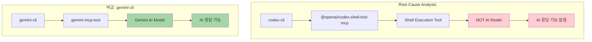
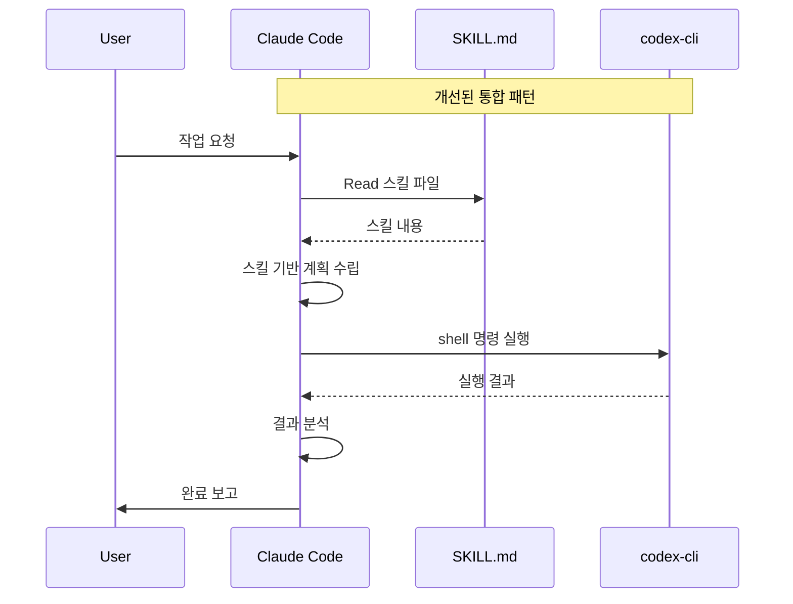
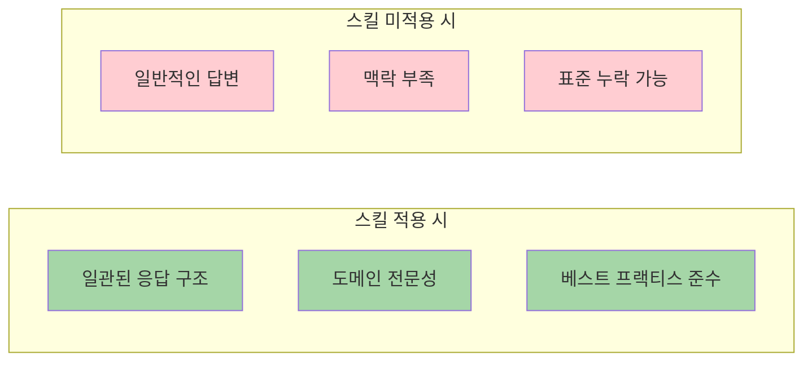
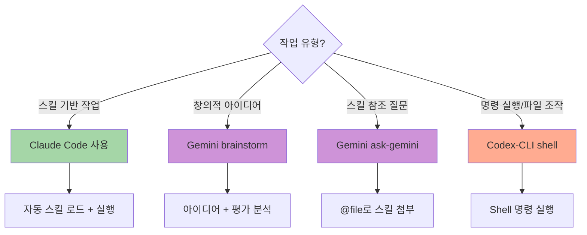

# 인프라 설계 원칙 - Multi-Agent 비교 분석

> 동일한 프롬프트를 Claude Code, Gemini-CLI, Codex-CLI에 전달하여 스킬 적용 여부와 응답 차이를 비교 분석

**작성일**: 2026-01-05
**프롬프트**: "인프라 구축에 필요한 주요 설계 원칙과 방법에 대해 설명해줘"

---

## 테스트 환경

| Agent | Type | Skill Access | Response Method |
|-------|------|--------------|-----------------|
| **Claude Code** | AI Assistant | `.claude/skills/` 자동 로드 | Direct Context |
| **Gemini-CLI** | MCP Server | `@file` 문법으로 스킬 첨부 | `ask-gemini`, `brainstorm` |
| **Codex-CLI** | MCP Server | Shell 실행만 지원 | Shell Command Only |

---

## 스킬 적용 방식 비교

```mermaid
flowchart TB
    subgraph "Claude Code"
        CC[Claude Code] --> CS[".claude/skills/"]
        CS --> CA[자동 스킬 로드]
        CA --> CR[컨텍스트 기반 응답]
    end

    subgraph "Gemini-CLI"
        GC[gemini-cli] --> GS["@file 스킬 첨부"]
        GS --> GA[ask-gemini / brainstorm]
        GA --> GR[스킬 참조 응답]
    end

    subgraph "Codex-CLI"
        XC[codex-cli] --> XS[Shell 명령 실행]
        XS --> XA[파일 읽기/쓰기]
        XA --> XR[AI 응답 불가]
    end

    style CC fill:#a5d6a7
    style GC fill:#ce93d8
    style XC fill:#ffab91
```



---

## 1. Claude Code 응답

### 스킬 적용 상태
- **자동 로드**: `.claude/skills/infrastructure/` 폴더에서 자동 감지
- **컨텍스트 통합**: 대화 컨텍스트에 스킬 내용 자동 포함

### 핵심 설계 원칙 (5가지)

| 원칙 | 설명 |
|------|------|
| **1. 일관성 & 재현성** | Docker, Dev Container로 동일 환경 보장 |
| **2. Infrastructure as Code** | Terraform으로 인프라를 코드로 관리 |
| **3. 설정의 분리** | 환경변수(.env)로 설정과 코드 분리 |
| **4. 보안 우선** | Secrets 절대 커밋 금지, gitignore 필수 |
| **5. 자동화** | Makefile, docker-compose로 명령어 추상화 |

### 방법론
1. **Docker Compose**: 로컬 개발 환경 표준화
2. **환경변수 관리**: `.env.example` 제공, `.env` gitignore
3. **Dev Container**: VS Code 개발환경 통일
4. **Makefile**: 빈번한 명령어 자동화
5. **Terraform**: 클라우드 인프라 코드화

### 베스트 프랙티스
- 로컬 개발은 Docker Compose로 통일
- Volume Mount로 코드 변경 즉시 반영
- Health Check로 서비스 상태 확인
- README.md에 설치/실행 방법 문서화

---

## 2. Gemini-CLI 응답 (ask-gemini)

### 스킬 적용 상태
- **명시적 첨부**: `@/path/to/SKILL.md` 문법 사용
- **프롬프트 통합**: 스킬 파일 내용이 프롬프트에 포함됨

### 핵심 설계 원칙 (5가지)

| 원칙 | 설명 |
|------|------|
| **1. 일관성 및 재현성** | Docker, Dev Container로 "제 컴퓨터에서는 됐는데" 방지 |
| **2. 코드형 인프라 (IaC)** | Terraform으로 인프라 변경 이력 추적 및 자동화 |
| **3. 설정의 분리** | 환경변수로 코드 변경 없이 환경 전환 |
| **4. 보안 우선** | `.gitignore`로 `.env` 커밋 방지, sensitive 변수 관리 |
| **5. 자동화 및 추상화** | `make dev`로 복잡한 명령어 단순화 |

### 방법론
1. **1단계**: Docker Compose로 서비스 오케스트레이션
2. **2단계**: `.env.example`로 환경변수 관리
3. **3단계**: Dev Container로 개발환경 표준화
4. **4단계**: Makefile로 명령어 자동화
5. **5단계**: Terraform으로 IaC 배포

### 주의사항
- 비밀 정보 커밋 절대 금지
- 설정 하드코딩 금지
- `.env.example` 필수 제공
- README 최신화 유지

---

## 3. Gemini-CLI 응답 (brainstorm)

### 스킬 적용 상태
- **도메인 컨텍스트**: `domain: software` 파라미터로 분야 지정
- **창의적 모드**: 아이디어 생성 및 평가 분석 포함

### 핵심 설계 원칙 (5가지)

| 원칙 | Feasibility | Impact | Innovation |
|------|:-----------:|:------:|:----------:|
| **Infrastructure as Code (IaC)** | 5 | 5 | 3 |
| **Immutable Infrastructure** | 4 | 5 | 4 |
| **Security by Design (Zero Trust)** | 3 | 5 | 4 |
| **Design for Failure (Self-Healing)** | 4 | 5 | 3 |
| **Observability First** | 4 | 4 | 4 |

### 방법론 (5가지)

| 방법론 | Feasibility | Impact | Innovation |
|--------|:-----------:|:------:|:----------:|
| **GitOps** | 4 | 5 | 5 |
| **Chaos Engineering** | 2 | 4 | 5 |
| **Golden Image Pipeline** | 5 | 4 | 3 |
| **FinOps** | 4 | 5 | 4 |
| **Blue/Green Deployment** | 3 | 4 | 3 |

---

## 4. Codex-CLI 분석

### 스킬 미적용 원인 분석



### MCP 서버 설정 비교

| 설정 항목 | gemini-cli | codex-cli |
|----------|-----------|-----------|
| **Package** | `gemini-mcp-tool` | `@openai/codex-shell-tool-mcp` |
| **Type** | AI Model MCP | Shell Tool MCP |
| **Functions** | `ask-gemini`, `brainstorm`, `ping` | `shell` only |
| **AI Capability** | ✅ | ❌ |
| **Skill Processing** | 자체 처리 | 불가능 |

### 원인 요약

```
codex-cli는 Shell 실행 도구이며, AI 모델이 아닙니다.
├── 프롬프트 처리: ❌ 불가능
├── 스킬 해석: ❌ 불가능
├── 명령 실행: ✅ 가능
└── 파일 조작: ✅ 가능
```

### 개선 방안: Claude + Codex-CLI 통합

**새로운 스킬 생성**: `utilities/mcp-codex-integration/SKILL.md`



### 통합 사용 예시

```bash
# 사용자 요청
"infrastructure 스킬을 참조해서 Docker 환경 세팅해줘"

# Claude Code 처리
1. Read: .agent-skills/infrastructure/system-environment-setup/SKILL.md
2. 스킬 내용 분석 및 docker-compose.yml 생성
3. codex-cli: docker-compose up -d
4. codex-cli: docker-compose ps (상태 확인)
5. 결과 보고
```

### 활용 방식 (개선)

| 작업 | 담당 | 도구 |
|------|------|------|
| 스킬 로드 | Claude | Read tool |
| 스킬 해석 | Claude | 컨텍스트 분석 |
| 계획 수립 | Claude | 작업 계획 |
| 명령 실행 | codex-cli | shell |
| 결과 분석 | Claude | 응답 처리 |

---

## 비교 분석

### 공통점

| 항목 | Claude Code | Gemini-CLI | 비고 |
|------|:-----------:|:----------:|------|
| IaC 원칙 강조 | ✅ | ✅ | 핵심 원칙으로 공통 언급 |
| 환경변수 분리 | ✅ | ✅ | .env 관리 패턴 동일 |
| 보안 우선 | ✅ | ✅ | Secrets 커밋 금지 |
| Docker 활용 | ✅ | ✅ | 로컬 환경 표준화 |
| 자동화 강조 | ✅ | ✅ | Makefile, CI/CD |

### 차이점

| 항목 | Claude Code | Gemini-CLI (ask) | Gemini-CLI (brainstorm) |
|------|-------------|------------------|-------------------------|
| **스킬 로드** | 자동 | 명시적 (@file) | 도메인 컨텍스트 |
| **응답 스타일** | 구조화된 설명 | 단계별 가이드 | 아이디어 + 평가 점수 |
| **고급 원칙** | 스킬 기반 | 스킬 기반 | Zero Trust, Chaos Eng |
| **정량적 분석** | ❌ | ❌ | ✅ (Feasibility/Impact) |
| **창의성** | 보수적 | 보수적 | 혁신적 |

### 스킬 적용 효과



---

## 결론

### 1. 스킬 적용 효과
- **Claude Code**: 자동 스킬 로드로 가장 seamless한 경험
- **Gemini-CLI**: 명시적 첨부로 유연한 스킬 선택 가능
- **Codex-CLI**: AI 응답 불가, 실행 도구로만 활용

### 2. 응답 품질
| Agent | 스킬 기반 응답 | 창의적 응답 | 실행 능력 |
|-------|:-------------:|:-----------:|:---------:|
| Claude Code | ⭐⭐⭐⭐⭐ | ⭐⭐⭐⭐ | ⭐⭐⭐⭐⭐ |
| Gemini-CLI (ask) | ⭐⭐⭐⭐⭐ | ⭐⭐⭐ | ❌ |
| Gemini-CLI (brainstorm) | ⭐⭐⭐ | ⭐⭐⭐⭐⭐ | ❌ |
| Codex-CLI | ❌ | ❌ | ⭐⭐⭐⭐⭐ |

### 3. 권장 사용 패턴



---

---

## 부록: 새로 생성된 스킬

### mcp-codex-integration

codex-cli의 한계를 해결하기 위해 Claude 스킬을 생성했습니다.

**경로**: `.agent-skills/utilities/mcp-codex-integration/SKILL.md`

**핵심 기능**:
- Claude가 스킬을 로드하고 해석
- codex-cli로 명령 실행 위임
- 결과를 Claude가 분석하여 응답

**사용 패턴**:
```
스킬 로드 (Claude) → 작업 계획 (Claude) → 명령 실행 (codex-cli) → 결과 분석 (Claude)
```

---

**Version**: 1.1.0 | **Updated**: 2026-01-05 | **Generated by**: Claude Code with Multi-Agent Collaboration
