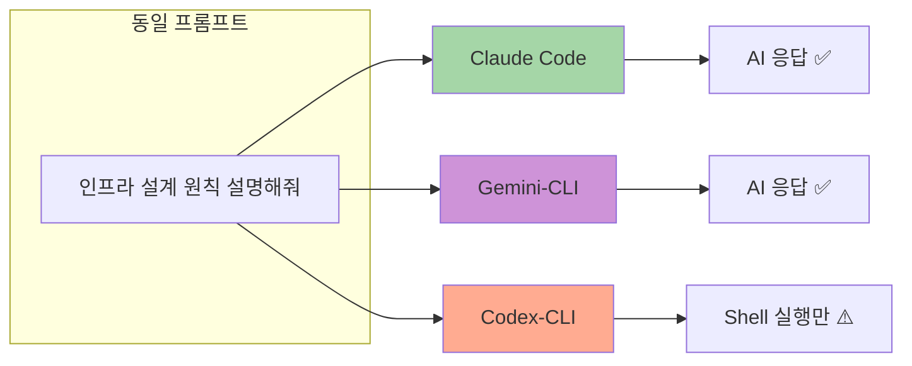
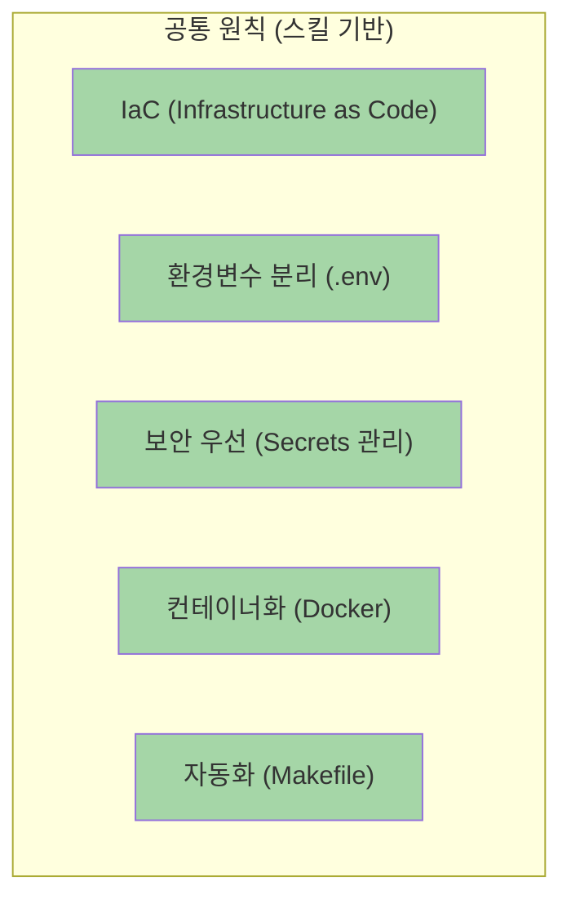
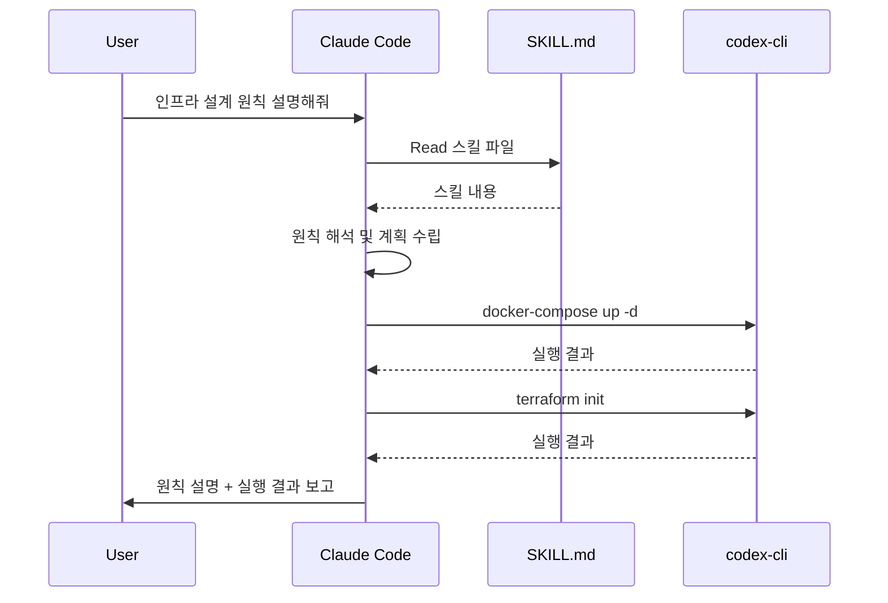
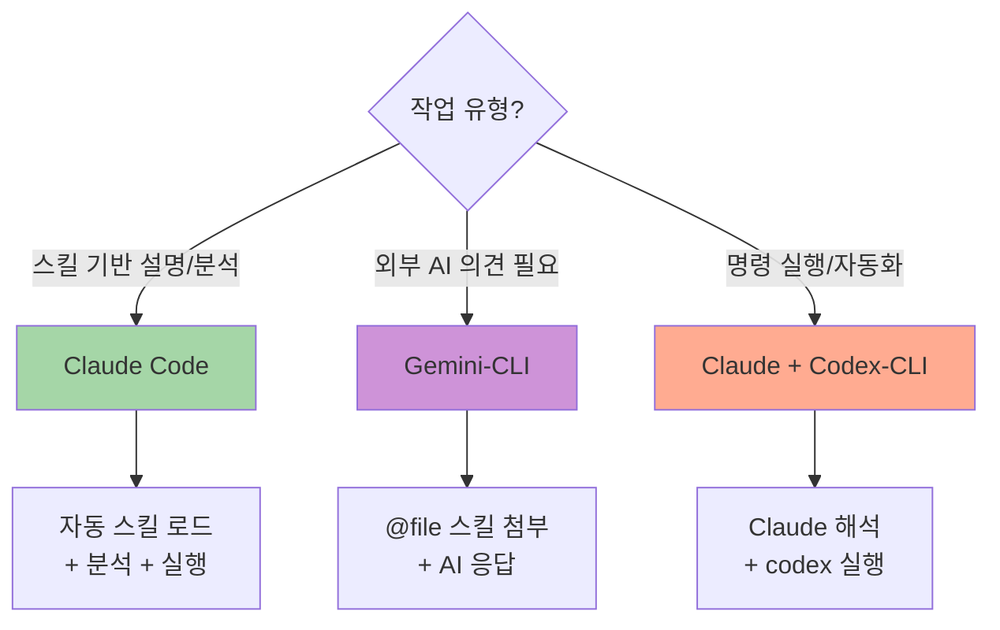

# Multi-Agent 인프라 설계 원칙 비교 분석

> 동일한 프롬프트를 Claude Code, Gemini-CLI, Codex-CLI에 전달하여 응답 결과를 테이블로 비교

**작성일**: 2026-01-05
**프롬프트**: "인프라 구축에 필요한 주요 설계 원칙과 방법에 대해 설명해줘"
**참조 스킬**: `.agent-skills/infrastructure/system-environment-setup/SKILL.md`

---

## 테스트 환경 및 스킬 적용 방식



| Agent | Package | Type | 스킬 적용 방식 | AI 응답 |
|-------|---------|------|---------------|:-------:|
| **Claude Code** | Built-in | AI Assistant | `.claude/skills/` 자동 로드 | ✅ |
| **Gemini-CLI** | `gemini-mcp-tool` | AI Model MCP | `@file` 문법으로 첨부 | ✅ |
| **Codex-CLI** | `@openai/codex-shell-tool-mcp` | Shell Tool | Claude 통합 패턴 필요 | ❌ |

---

## 응답 결과 비교

### 1. 핵심 설계 원칙 (5가지)

| # | Claude Code | Gemini-CLI | Codex-CLI (Claude 통합) |
|:-:|-------------|-----------|-------------------------|
| 1 | **일관성 & 재현성**: Docker, Dev Container로 동일 환경 보장 | 모든 환경은 일관되고 재현 가능하도록 구성 | 스킬 로드 → Claude 해석 → 동일 원칙 적용 |
| 2 | **Infrastructure as Code**: Terraform으로 인프라를 코드로 관리 | 인프라는 코드로 정의하고 관리(IaC) | `terraform plan/apply` 명령 실행 |
| 3 | **설정의 분리**: 환경변수(.env)로 설정과 코드 분리 | 설정 정보는 환경 변수로 외부 주입 | `.env` 파일 생성/관리 |
| 4 | **보안 우선**: Secrets 절대 커밋 금지, gitignore 필수 | 비밀 정보는 버전 관리에 절대 커밋 금지 | `.gitignore` 검증 실행 |
| 5 | **자동화**: Makefile, docker-compose로 명령어 추상화 | 각 서비스는 컨테이너로 격리 | `make` 명령 실행 |

### 2. 주요 구축 방법론 (3가지)

| # | Claude Code | Gemini-CLI | Codex-CLI (Claude 통합) |
|:-:|-------------|-----------|-------------------------|
| 1 | **Docker Compose**: 로컬 개발 환경 표준화 | 컨테이너 기반 로컬 환경 구축 | `docker-compose up -d` 실행 |
| 2 | **Makefile**: 빈번한 명령어 자동화 | 편의 명령어를 통한 작업 자동화 | `make install`, `make dev` 실행 |
| 3 | **Terraform**: 클라우드 인프라 코드화 | 선언적 인프라 프로비저닝 | `terraform init/apply` 실행 |

### 3. 필수 도구/기술 목록

| Category | Claude Code | Gemini-CLI | Codex-CLI |
|----------|-------------|-----------|-----------|
| **컨테이너** | Docker, Docker Compose | Docker, Docker Compose | 실행 가능 ✅ |
| **IaC** | Terraform | Terraform | 실행 가능 ✅ |
| **환경변수** | .env, dotenv | .env, dotenv | 파일 생성 ✅ |
| **개발환경** | VS Code Dev Containers | VS Code Dev Containers | 설정 파일 생성 ✅ |
| **자동화** | Makefile | Makefile | 실행 가능 ✅ |
| **버전관리** | Git | Git | 실행 가능 ✅ |

### 4. 주의사항 (3가지)

| # | Claude Code | Gemini-CLI | Codex-CLI (Claude 통합) |
|:-:|-------------|-----------|-------------------------|
| 1 | `.env` 파일 gitignore 필수 | 민감 정보 `.gitignore` 확인, 커밋 금지 | `grep -r "\.env" .gitignore` 검증 |
| 2 | README.md에 설치/실행 방법 문서화 | README.md에 설치 및 실행 방법 문서화 | README 존재 여부 확인 |
| 3 | 환경별 설정 분리 (.env.dev, .env.prod) | 환경별 구성 명확히 분리 | 환경 파일 생성/검증 |

---

## 스킬 적용 분석

### 공통점



| 공통 항목 | Claude Code | Gemini-CLI | 비고 |
|----------|:-----------:|:----------:|------|
| IaC 원칙 | ✅ | ✅ | Terraform 언급 |
| 환경변수 분리 | ✅ | ✅ | .env 패턴 동일 |
| 보안 강조 | ✅ | ✅ | gitignore 필수 |
| Docker 활용 | ✅ | ✅ | Compose 패턴 |
| 자동화 | ✅ | ✅ | Makefile 권장 |

### 차이점

| 항목 | Claude Code | Gemini-CLI | Codex-CLI |
|------|-------------|-----------|-----------|
| **스킬 로드** | 자동 (`.claude/skills/`) | 명시적 (`@file`) | 불가 (Claude 위임) |
| **응답 형식** | 구조화된 설명 | 번호 목록 형식 | Shell 출력만 |
| **실행 능력** | ✅ 직접 실행 | ❌ 응답만 | ✅ 명령 실행 |
| **스킬 해석** | ✅ 자체 해석 | ✅ 자체 해석 | ❌ Claude 필요 |
| **창의성** | 컨텍스트 기반 | 스킬 충실 | N/A |

---

## 에이전트별 상세 응답

### Claude Code 응답

**스킬 적용**: `.claude/skills/infrastructure/` 자동 로드

#### 핵심 설계 원칙
1. **일관성 & 재현성** - Docker, Dev Container로 "제 컴퓨터에서는 됐는데" 방지
2. **Infrastructure as Code** - Terraform으로 인프라 변경 이력 추적
3. **설정의 분리** - 환경변수로 코드 변경 없이 환경 전환
4. **보안 우선** - `.gitignore`로 `.env` 커밋 방지
5. **자동화** - `make dev`로 복잡한 명령어 단순화

#### 방법론
- Docker Compose로 로컬 서비스 오케스트레이션
- Makefile로 명령어 표준화
- Terraform으로 클라우드 리소스 관리

---

### Gemini-CLI 응답

**스킬 적용**: `@/path/to/SKILL.md` 명시적 첨부

#### 핵심 설계 원칙
1. 모든 환경은 **일관되고 재현 가능**하도록 구성
2. 설정 정보는 **환경 변수**를 통해 외부 주입
3. 서비스는 **컨테이너 기술**로 격리
4. 인프라는 **코드로 정의**하고 관리(IaC)
5. 비밀 정보는 **버전 관리에 절대 커밋 금지**

#### 방법론
- 컨테이너 기반 로컬 환경 구축 (docker-compose)
- 선언적 인프라 프로비저닝 (Terraform)
- Makefile 작업 자동화

---

### Codex-CLI 응답 (Claude 통합 패턴)

**스킬 적용**: Claude가 스킬 로드 → codex-cli로 실행



#### 실행 가능한 명령
```bash
# 스킬 기반 인프라 명령 실행
codex-cli shell "docker-compose up -d"
codex-cli shell "terraform init && terraform plan"
codex-cli shell "make install && make dev"
codex-cli shell "cat .env.example"
```

---

## 종합 평가

### 응답 품질 비교

| 평가 항목 | Claude Code | Gemini-CLI | Codex-CLI |
|----------|:-----------:|:----------:|:---------:|
| 스킬 기반 응답 | ⭐⭐⭐⭐⭐ | ⭐⭐⭐⭐⭐ | ❌ |
| 응답 정확성 | ⭐⭐⭐⭐⭐ | ⭐⭐⭐⭐⭐ | N/A |
| 구조화 수준 | ⭐⭐⭐⭐⭐ | ⭐⭐⭐⭐ | N/A |
| 실행 능력 | ⭐⭐⭐⭐⭐ | ❌ | ⭐⭐⭐⭐⭐ |
| 통합 활용 | ⭐⭐⭐⭐⭐ | ⭐⭐⭐ | ⭐⭐⭐⭐ |

### 권장 사용 패턴



| 사용 케이스 | 권장 에이전트 | 이유 |
|------------|-------------|------|
| 스킬 기반 작업 전체 | **Claude Code** | 자동 로드 + 해석 + 실행 |
| 외부 AI 관점 필요 | **Gemini-CLI** | 다른 모델의 의견 |
| 명령 실행만 필요 | **Codex-CLI** | 빠른 shell 실행 |
| 창의적 아이디어 | **Gemini brainstorm** | 평가 점수 포함 |
| 복합 작업 | **Claude + Codex** | 해석 + 실행 분리 |

---

## 결론

### 스킬 적용 효과 요약

| 에이전트 | 스킬 적용 | 장점 | 한계 |
|----------|:--------:|------|------|
| **Claude Code** | ✅ 자동 | Seamless 통합, 실행까지 가능 | 없음 |
| **Gemini-CLI** | ✅ 명시적 | 외부 AI 관점, 유연한 선택 | 실행 불가 |
| **Codex-CLI** | ⚠️ Claude 통합 | 빠른 명령 실행 | AI 응답 불가 |

### 핵심 인사이트

1. **동일한 스킬 → 일관된 응답**: Claude와 Gemini 모두 스킬 기반으로 유사한 원칙 제시
2. **도구 특성에 따른 역할 분리**: AI 응답(Claude/Gemini) vs 실행(Codex)
3. **통합 패턴의 중요성**: Codex-CLI는 Claude와 통합해야 스킬 활용 가능

---

**Version**: 1.0.0 | **Generated by**: Claude Code + Gemini-CLI + Codex-CLI Multi-Agent Collaboration
